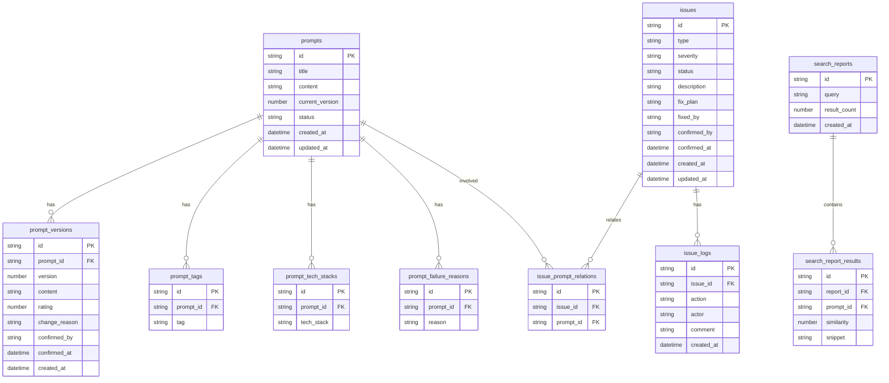

## 1. 架构设计

```mermaid
flowchart TB
    subgraph "前端层"
        "React 18 + TypeScript"
        "Tailwind CSS"
        "Zustand 状态管理"
        "Recharts 图表库"
    end
    subgraph "后端层"
        "Express.js + TypeScript"
        "RESTful API"
    end
    subgraph "数据层"
        "SQLite (better-sqlite3)"
        "全文搜索 FTS5"
    end
    "前端层" -->|"HTTP/JSON"| "后端层"
    "后端层" -->|"SQL"| "数据层"
```

## 2. 技术说明

- **前端**：React@18 + tailwindcss@3 + vite + recharts + zustand
- **初始化工具**：vite-init
- **后端**：Express@4 + TypeScript (ESM)
- **数据库**：SQLite (better-sqlite3)，FTS5 全文搜索
- **导出**：前端生成 CSV/JSON，无需后端文件服务

## 3. 路由定义

| 路由 | 用途 |
|------|------|
| `/` | 重定向到 `/archive` |
| `/archive` | 提示词归档页 - 列表与筛选 |
| `/archive/new` | 提示词归档页 - 新增录入 |
| `/archive/:id` | 提示词归档页 - 详情查看 |
| `/search` | 相似检索页 |
| `/compare` | 版本对比页 |
| `/issues` | 问题追踪页 |
| `/dashboard` | 数据看板页 |
| `/export` | 报告导出页 |

## 4. API 定义

### 4.1 提示词管理

```
GET    /api/prompts              - 获取提示词列表（支持筛选、分页、排序）
GET    /api/prompts/:id          - 获取提示词详情（含版本历史）
POST   /api/prompts              - 创建提示词（含重复检测）
PUT    /api/prompts/:id          - 更新提示词（生成新版本）
DELETE /api/prompts/:id          - 删除提示词
GET    /api/prompts/:id/versions - 获取提示词版本列表
GET    /api/prompts/duplicates   - 重复检测接口
```

### 4.2 相似检索

```
POST   /api/search/similar       - 相似提示词检索
GET    /api/search/fulltext      - 全文搜索
```

### 4.3 问题追踪

```
GET    /api/issues               - 获取问题列表（支持按类型/状态筛选）
POST   /api/issues               - 创建问题
PUT    /api/issues/:id           - 更新问题（提交修正/确认）
GET    /api/issues/:id/log       - 获取问题操作日志
```

### 4.4 数据看板

```
GET    /api/stats/overview       - 总览统计
GET    /api/stats/tech-stack     - 技术栈分布
GET    /api/stats/rating         - 评分分布
GET    /api/stats/failures       - 失败原因统计
GET    /api/stats/trend          - 数量趋势
```

### 4.5 标签

```
GET    /api/tags                 - 获取所有标签
POST   /api/tags                 - 创建标签
```

### 4.6 TypeScript 类型定义

```typescript
interface Prompt {
  id: string
  title: string
  content: string
  techStacks: string[]
  rating: number
  failureReasons: string[]
  tags: string[]
  currentVersion: number
  status: 'active' | 'deprecated' | 'archived'
  createdAt: string
  updatedAt: string
}

interface PromptVersion {
  id: string
  promptId: string
  version: number
  content: string
  rating: number
  changeReason: string
  confirmedBy: string | null
  confirmedAt: string | null
  createdAt: string
}

interface Issue {
  id: string
  type: 'duplicate' | 'rating_inconsistency' | 'deprecated_usage'
  severity: 'low' | 'medium' | 'high'
  status: 'open' | 'fixing' | 'confirmed' | 'closed'
  description: string
  relatedPromptIds: string[]
  fixPlan: string | null
  fixedBy: string | null
  confirmedBy: string | null
  confirmedAt: string | null
  createdAt: string
  updatedAt: string
}

interface IssueLog {
  id: string
  issueId: string
  action: 'created' | 'fix_submitted' | 'fix_confirmed' | 'fix_rejected' | 'closed'
  actor: string
  comment: string
  createdAt: string
}

interface SearchReport {
  id: string
  query: string
  techStacks: string[]
  resultCount: number
  results: { promptId: string; similarity: number; snippet: string }[]
  createdAt: string
}
```

## 5. 服务端架构图

```mermaid
flowchart LR
    subgraph "Controller 层"
        "promptController"
        "searchController"
        "issueController"
        "statsController"
        "tagController"
    end
    subgraph "Service 层"
        "promptService"
        "searchService"
        "issueService"
        "statsService"
    end
    subgraph "Repository 层"
        "promptRepo"
        "searchRepo"
        "issueRepo"
        "statsRepo"
    end
    subgraph "数据库"
        "SQLite + FTS5"
    end
    "Controller 层" --> "Service 层"
    "Service 层" --> "Repository 层"
    "Repository 层" --> "数据库"
```

## 6. 数据模型

### 6.1 数据模型定义



### 6.2 数据定义语言

```sql
CREATE TABLE prompts (
  id TEXT PRIMARY KEY,
  title TEXT NOT NULL,
  content TEXT NOT NULL,
  current_version INTEGER NOT NULL DEFAULT 1,
  status TEXT NOT NULL DEFAULT 'active' CHECK(status IN ('active', 'deprecated', 'archived')),
  created_at TEXT NOT NULL DEFAULT (datetime('now')),
  updated_at TEXT NOT NULL DEFAULT (datetime('now'))
);

CREATE TABLE prompt_versions (
  id TEXT PRIMARY KEY,
  prompt_id TEXT NOT NULL REFERENCES prompts(id) ON DELETE CASCADE,
  version INTEGER NOT NULL,
  content TEXT NOT NULL,
  rating INTEGER NOT NULL CHECK(rating >= 0 AND rating <= 10),
  change_reason TEXT NOT NULL DEFAULT '',
  confirmed_by TEXT,
  confirmed_at TEXT,
  created_at TEXT NOT NULL DEFAULT (datetime('now')),
  UNIQUE(prompt_id, version)
);

CREATE TABLE prompt_tags (
  id TEXT PRIMARY KEY,
  prompt_id TEXT NOT NULL REFERENCES prompts(id) ON DELETE CASCADE,
  tag TEXT NOT NULL
);

CREATE TABLE prompt_tech_stacks (
  id TEXT PRIMARY KEY,
  prompt_id TEXT NOT NULL REFERENCES prompts(id) ON DELETE CASCADE,
  tech_stack TEXT NOT NULL
);

CREATE TABLE prompt_failure_reasons (
  id TEXT PRIMARY KEY,
  prompt_id TEXT NOT NULL REFERENCES prompts(id) ON DELETE CASCADE,
  reason TEXT NOT NULL
);

CREATE TABLE issues (
  id TEXT PRIMARY KEY,
  type TEXT NOT NULL CHECK(type IN ('duplicate', 'rating_inconsistency', 'deprecated_usage')),
  severity TEXT NOT NULL DEFAULT 'medium' CHECK(severity IN ('low', 'medium', 'high')),
  status TEXT NOT NULL DEFAULT 'open' CHECK(status IN ('open', 'fixing', 'confirmed', 'closed')),
  description TEXT NOT NULL,
  fix_plan TEXT,
  fixed_by TEXT,
  confirmed_by TEXT,
  confirmed_at TEXT,
  created_at TEXT NOT NULL DEFAULT (datetime('now')),
  updated_at TEXT NOT NULL DEFAULT (datetime('now'))
);

CREATE TABLE issue_prompt_relations (
  id TEXT PRIMARY KEY,
  issue_id TEXT NOT NULL REFERENCES issues(id) ON DELETE CASCADE,
  prompt_id TEXT NOT NULL REFERENCES prompts(id) ON DELETE CASCADE
);

CREATE TABLE issue_logs (
  id TEXT PRIMARY KEY,
  issue_id TEXT NOT NULL REFERENCES issues(id) ON DELETE CASCADE,
  action TEXT NOT NULL CHECK(action IN ('created', 'fix_submitted', 'fix_confirmed', 'fix_rejected', 'closed')),
  actor TEXT NOT NULL,
  comment TEXT NOT NULL DEFAULT '',
  created_at TEXT NOT NULL DEFAULT (datetime('now'))
);

CREATE TABLE search_reports (
  id TEXT PRIMARY KEY,
  query TEXT NOT NULL,
  result_count INTEGER NOT NULL DEFAULT 0,
  created_at TEXT NOT NULL DEFAULT (datetime('now'))
);

CREATE TABLE search_report_results (
  id TEXT PRIMARY KEY,
  report_id TEXT NOT NULL REFERENCES search_reports(id) ON DELETE CASCADE,
  prompt_id TEXT NOT NULL REFERENCES prompts(id) ON DELETE CASCADE,
  similarity REAL NOT NULL,
  snippet TEXT NOT NULL DEFAULT ''
);

CREATE INDEX idx_prompts_status ON prompts(status);
CREATE INDEX idx_prompts_created_at ON prompts(created_at);
CREATE INDEX idx_prompt_versions_prompt_id ON prompt_versions(prompt_id);
CREATE INDEX idx_prompt_tags_tag ON prompt_tags(tag);
CREATE INDEX idx_prompt_tech_stacks_stack ON prompt_tech_stacks(tech_stack);
CREATE INDEX idx_prompt_failure_reasons_reason ON prompt_failure_reasons(reason);
CREATE INDEX idx_issues_type ON issues(type);
CREATE INDEX idx_issues_status ON issues(status);
CREATE INDEX idx_issue_logs_issue_id ON issue_logs(issue_id);
CREATE INDEX idx_issue_prompt_relations_issue ON issue_prompt_relations(issue_id);
CREATE INDEX idx_issue_prompt_relations_prompt ON issue_prompt_relations(prompt_id);
CREATE INDEX idx_search_report_results_report ON search_report_results(report_id);

CREATE VIRTUAL TABLE prompts_fts USING fts5(title, content, content=prompts, content_rowid=rowid);

CREATE TRIGGER prompts_ai AFTER INSERT ON prompts BEGIN
  INSERT INTO prompts_fts(rowid, title, content) VALUES (new.rowid, new.title, new.content);
END;

CREATE TRIGGER prompts_au AFTER UPDATE ON prompts BEGIN
  INSERT INTO prompts_fts(prompts_fts, rowid, title, content) VALUES('delete', old.rowid, old.title, old.content);
  INSERT INTO prompts_fts(rowid, title, content) VALUES (new.rowid, new.title, new.content);
END;

CREATE TRIGGER prompts_ad AFTER DELETE ON prompts BEGIN
  INSERT INTO prompts_fts(prompts_fts, rowid, title, content) VALUES('delete', old.rowid, old.title, old.content);
END;
```
