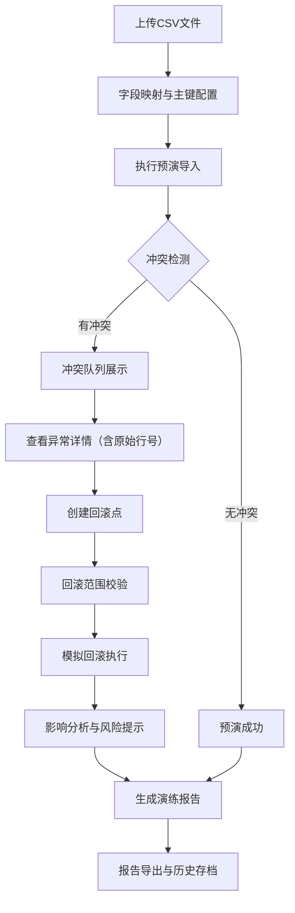

## 1. 产品概述
数据导入回滚演练系统是为运营团队设计的后台工具，用于在正式批量导入CSV数据前进行演练，提前发现主键重复、部分成功丢失、回滚范围错误等关键问题，降低生产环境的数据风险。

- **核心价值**：通过预演导入暴露潜在数据冲突，支持回滚验证，保留完整操作审计轨迹
- **目标用户**：运营团队、数据管理员、系统维护人员
- **解决问题**：生产环境数据导入失败、冲突处理不透明、回滚不可控等痛点

## 2. 核心功能

### 2.1 用户角色
| 角色 | 注册方式 | 核心权限 |
|------|----------|----------|
| 运营人员 | 员工账号登录 | 导入预演、冲突查看、回滚演练、报告导出 |
| 数据管理员 | 管理员账号 | 字段映射配置、主键设置、历史记录审计 |

### 2.2 功能模块
1. **导入预演工作台**：CSV上传、字段映射、主键配置、预演执行
2. **冲突队列中心**：冲突列表、原始行号关联、异常详情查看、冲突分类
3. **回滚计划引擎**：回滚点创建、范围校验、版本保护、回滚模拟
4. **历史审计追踪**：数据变更记录、操作人追溯、版本对比
5. **演练报告中心**：统计图表、报告生成、多格式导出

### 2.3 页面详情
| 页面名称 | 模块名称 | 功能描述 |
|----------|----------|----------|
| 导入预演工作台 | 文件上传区 | 支持CSV拖拽上传、文件校验、版本编号管理（不覆盖前一版） |
| 导入预演工作台 | 字段映射配置 | 可视化字段匹配、主键标记、映射模板保存 |
| 导入预演工作台 | 预演执行引擎 | 模拟导入、冲突检测、进度实时展示 |
| 冲突队列中心 | 冲突列表 | 按类型分组展示冲突、关联原始行号、支持筛选搜索 |
| 冲突队列中心 | 异常详情面板 | 展示原始记录、冲突原因、建议处理方案 |
| 回滚计划引擎 | 回滚点管理 | 创建回滚点、版本标记、回滚范围预览 |
| 回滚计划引擎 | 回滚模拟 | 模拟回滚执行、影响范围分析、风险提示 |
| 历史审计追踪 | 变更时间线 | 数据进入时间、修改记录、操作人信息 |
| 历史审计追踪 | 版本对比 | 多版本数据差异可视化对比 |
| 演练报告中心 | 统计仪表盘 | 冲突统计、成功率、回滚影响分析图表 |
| 演练报告中心 | 报告导出 | 生成演练报告、支持PDF/Excel导出 |

## 3. 核心流程

### 3.1 预演导入流程
用户上传CSV文件 → 配置字段映射与主键 → 执行预演导入 → 系统检测冲突 → 生成冲突队列 → 用户查看异常详情 → 确认演练结果

### 3.2 回滚演练流程
创建回滚点（标记版本） → 选择回滚范围 → 系统校验范围有效性 → 模拟回滚执行 → 展示影响分析 → 用户确认或调整 → 生成回滚报告

### 3.3 流程图示

## 4. 用户界面设计

### 4.1 设计风格
- **主色调**：深海军蓝 (#0F3460) 代表专业可信，搭配警示橙 (#E94560) 突出冲突异常
- **辅助色**：成功绿 (#10B981)、警告黄 (#F59E0B)、信息蓝 (#3B82F6)
- **按钮风格**：圆角矩形、悬停微动画、状态色彩分明
- **字体**：标题使用思源黑体 Bold，正文使用 Inter Regular，等宽字体展示数据
- **布局风格**：左侧导航+右侧内容区、卡片式模块、分层阴影营造深度
- **图标风格**：线性图标，统一2px描边，状态变化时颜色过渡

### 4.2 页面设计概述
| 页面名称 | 模块名称 | UI元素 |
|----------|----------|--------|
| 导入预演工作台 | 文件上传区 | 拖拽虚线框、文件图标动画、进度条、版本编号显示 |
| 冲突队列中心 | 冲突列表 | 斑马纹表格、冲突类型标签、原始行号醒目显示、展开/收起详情 |
| 回滚计划引擎 | 时间线 | 垂直时间线、回滚点标记、范围高亮、连接线动画 |
| 演练报告中心 | 仪表盘 | 环形进度图、柱状图、趋势折线图、卡片悬浮效果 |

### 4.3 响应式
- 采用桌面优先设计，最小支持1280px宽度
- 平板端自适应，导航可折叠
- 关键数据表格支持横向滚动
- 触控区域最小44px

### 4.4 交互动效
- 页面加载：元素错落入场动画（staggered reveal）
- 冲突检测：进度条脉冲动画，发现冲突时高亮闪烁
- 详情展开：平滑高度过渡，内容淡入
- 图表加载：数据柱状图从底部生长动画
