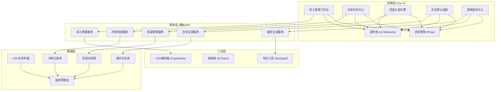
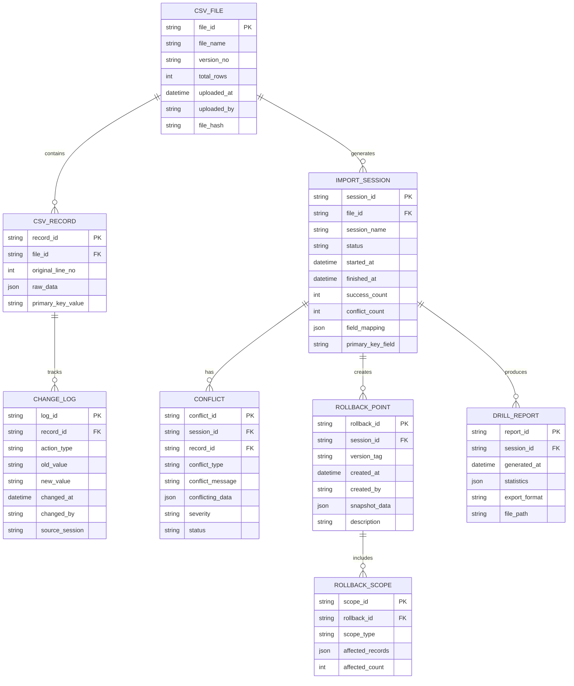

## 1. 架构设计



## 2. 技术描述

- **前端框架**: Vue 3.4 + TypeScript 5.4 + Vite 5.2
- **状态管理**: Pinia 2.1
- **UI框架**: Tailwind CSS 3.4
- **图标库**: Lucide Vue Next
- **CSV解析**: PapaParse 5.4
- **图表可视化**: ECharts 5.5
- **文件导出**: xlsx (Excel) + jspdf (PDF)
- **路由管理**: Vue Router 4.3
- **代码规范**: ESLint + Prettier
- **后端模拟**: Mock Service Worker + 本地JSON数据存储

## 3. 路由定义

| 路由路径 | 页面名称 | 功能说明 |
|----------|----------|----------|
| / | 仪表盘概览 | 演练统计、快速入口、最近活动 |
| /import | 导入预演工作台 | CSV上传、字段映射、预演执行 |
| /conflicts | 冲突队列中心 | 冲突列表、详情查看、分类筛选 |
| /rollback | 回滚计划引擎 | 回滚点管理、范围校验、模拟执行 |
| /history | 历史审计追踪 | 变更时间线、操作记录、版本对比 |
| /reports | 演练报告中心 | 统计图表、报告生成、导出功能 |

## 4. 数据模型定义

### 4.1 核心实体关系图



### 4.2 关键类型定义

```typescript
// CSV文件信息
interface CsvFile {
  fileId: string;
  fileName: string;
  versionNo: string;
  totalRows: number;
  uploadedAt: Date;
  uploadedBy: string;
  fileHash: string;
  records: CsvRecord[];
}

// CSV记录
interface CsvRecord {
  recordId: string;
  fileId: string;
  originalLineNo: number;
  rawData: Record<string, any>;
  primaryKeyValue: string;
  changeLogs: ChangeLog[];
}

// 导入会话
interface ImportSession {
  sessionId: string;
  fileId: string;
  sessionName: string;
  status: 'pending' | 'running' | 'completed' | 'failed';
  startedAt: Date;
  finishedAt?: Date;
  successCount: number;
  conflictCount: number;
  fieldMapping: FieldMapping[];
  primaryKeyField: string;
  conflicts: Conflict[];
}

// 冲突类型
type ConflictType = 'duplicate_primary_key' | 'partial_success' | 'rollback_scope_error' | 'field_validation' | 'data_type_mismatch';

// 冲突记录
interface Conflict {
  conflictId: string;
  sessionId: string;
  recordId: string;
  conflictType: ConflictType;
  conflictMessage: string;
  conflictingData: Record<string, any>;
  severity: 'high' | 'medium' | 'low';
  status: 'open' | 'resolved' | 'ignored';
  originalLineNo: number;
}

// 回滚点
interface RollbackPoint {
  rollbackId: string;
  sessionId: string;
  versionTag: string;
  createdAt: Date;
  createdBy: string;
  snapshotData: Record<string, any>;
  description: string;
  scopes: RollbackScope[];
}

// 回滚范围
interface RollbackScope {
  scopeId: string;
  rollbackId: string;
  scopeType: 'full' | 'partial' | 'selected';
  affectedRecords: string[];
  affectedCount: number;
  riskLevel: 'high' | 'medium' | 'low';
}

// 变更日志
interface ChangeLog {
  logId: string;
  recordId: string;
  actionType: 'create' | 'update' | 'delete' | 'rollback';
  oldValue?: string;
  newValue?: string;
  changedAt: Date;
  changedBy: string;
  sourceSession: string;
}

// 演练报告
interface DrillReport {
  reportId: string;
  sessionId: string;
  generatedAt: Date;
  statistics: ReportStatistics;
  exportFormat: 'pdf' | 'excel' | 'json';
  filePath?: string;
}

// 报告统计
interface ReportStatistics {
  totalRecords: number;
  successRate: number;
  conflictBreakdown: Record<ConflictType, number>;
  rollbackImpact: {
    affectedRecords: number;
    dataLossRisk: number;
  };
  recommendations: string[];
}
```

## 5. 核心模块设计

### 5.1 导入预演引擎模块
- **职责**: CSV解析、字段映射验证、主键检测、模拟导入执行
- **关键算法**: 主键重复检测算法、数据类型校验引擎、分批处理机制

### 5.2 冲突检测模块
- **职责**: 识别各类冲突、冲突分级、关联原始行号
- **冲突类型**: 
  - 主键重复：同一导入文件内或与历史数据冲突
  - 部分成功：导入中断导致部分记录丢失
  - 回滚范围错误：回滚范围超出预期
  - 字段验证：数据格式/类型不匹配

### 5.3 版本管理模块
- **职责**: 版本编号生成、防止覆盖、历史版本追溯
- **策略**: 语义化版本号 + 时间戳、文件哈希校验、重复检测

### 5.4 回滚引擎模块
- **职责**: 快照创建、范围校验、影响分析、模拟执行
- **安全机制**: 范围越界检测、数据丢失预警、确认机制

### 5.5 审计追踪模块
- **职责**: 操作记录、变更时间线、版本对比
- **追踪粒度**: 单条记录级、字段级变更历史
