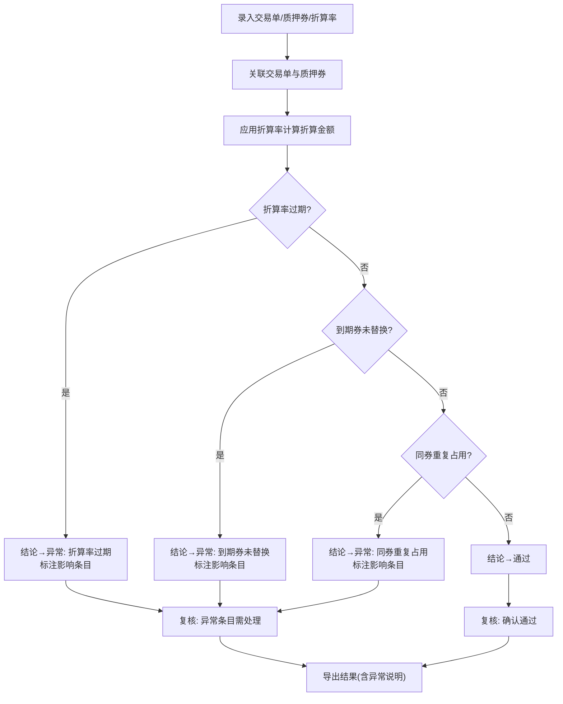

## 1. 产品概述

银行间回购质押券折算系统——为资金交易员提供本地化的小型服务，覆盖质押券录入、折算率处理、复核校验和结果导出的完整工作流。解决交易单、质押券、折算率来源分散、版本混乱、异常状态无拦截的问题。

- 目标用户：银行间市场资金交易员
- 核心价值：将分散在不同群消息中的质押券信息集中管理，自动校验折算率过期/到期券未替换/同券重复占用等风险，校验结果直接影响处理结论，不再"一路绿灯"

## 2. 核心功能

### 2.1 用户角色

| 角色 | 使用方式 | 核心权限 |
|------|----------|----------|
| 交易员 | 直接本地启动 | 录入、处理、复核、导出全部操作 |

### 2.2 功能模块

1. **录入页**：交易单录入、质押券录入、折算率录入（含来源与版本标记）
2. **处理页**：质押券校验、折算重算、替换状态更新，异常直接影响处理结论
3. **复核页**：逐条复核处理结果，标注异常条目及影响范围
4. **导出页**：按批次导出处理结果，含异常说明

### 2.3 页面详情

| 页面 | 模块 | 功能说明 |
|------|------|----------|
| 录入页 | 交易单录入 | 录入回购方向、金额、期限、对手方，标记数据来源与版本 |
| 录入页 | 质押券录入 | 录入债券代码、名称、面值、数量，标记来源与版本 |
| 录入页 | 折算率录入 | 录入债券代码、折算率、生效日、到期日，标记来源与版本 |
| 处理页 | 质押券校验 | 校验折算率是否过期、到期券是否已替换、同券是否重复占用；校验结果改变处理结论 |
| 处理页 | 折算重算 | 根据最新折算率重新计算质押券折算金额 |
| 处理页 | 替换状态 | 跟踪到期券替换状态，未替换券标记为"待替换"，影响最终结论 |
| 复核页 | 结果复核 | 逐条展示处理结论，异常条目高亮并说明影响范围 |
| 复核页 | 异常汇总 | 汇总所有异常类型及影响条目数，支持按异常筛选 |
| 导出页 | 结果导出 | 导出CSV/Excel，含处理结论和异常说明 |
| 导出页 | 批次管理 | 按批次管理导出记录，保留历史版本 |

## 3. 核心流程

交易员将每日从群消息收集的交易单、质押券清单、折算率表录入系统。系统自动关联交易单与质押券，应用折算率计算折算金额。处理引擎执行三项核心校验：折算率过期检查（折算率到期日 < 当前日期）、到期券替换检查（债券到期日 < 回购到期日且无替换券）、同券重复占用检查（同一债券代码在同一批次被多笔交易引用）。校验结果直接修改处理结论——"通过"变为"异常"并标注原因和影响条目。复核环节逐条确认，异常条目必须处理后方可标记"已复核"。最终导出含结论和异常说明的完整结果。

## 4. 用户界面设计

### 4.1 设计风格

- 主色调：深灰(#1a1a2e) + 冷蓝(#16213e) 背景，搭配琥珀色(#e2b714)警示和翠绿(#00b894)通过状态
- 按钮：圆角扁平风格，主要操作用实心填充，次要操作用描边
- 字体：数据表格使用等宽字体 JetBrains Mono，标题使用 Noto Sans SC
- 布局：左侧固定导航 + 右侧内容区，数据表格为主
- 图标风格：线性图标(Lucide)，简洁专业

### 4.2 页面设计概览

| 页面 | 模块 | UI元素 |
|------|------|--------|
| 录入页 | 交易单录入 | 表单卡片、来源/版本标签、快速添加按钮 |
| 录入页 | 质押券录入 | 可编辑表格、批量粘贴入口、来源标记 |
| 录入页 | 折算率录入 | 可编辑表格、生效/到期日高亮、来源标记 |
| 处理页 | 校验面板 | 三项校验状态卡片(通过/异常)、影响条目列表 |
| 处理页 | 折算结果表 | 折算金额列、结论列(颜色编码)、异常原因列 |
| 复核页 | 复核列表 | 行级状态标记、展开异常详情、批量确认按钮 |
| 复核页 | 异常汇总 | 统计卡片(按异常类型)、筛选下拉框 |
| 导出页 | 导出面板 | 格式选择、批次列表、导出按钮 |

### 4.3 响应式

桌面端优先设计，支持1280px以上宽度最佳体验。表格在小屏下可横向滚动。

### 4.4 3D场景

不适用
