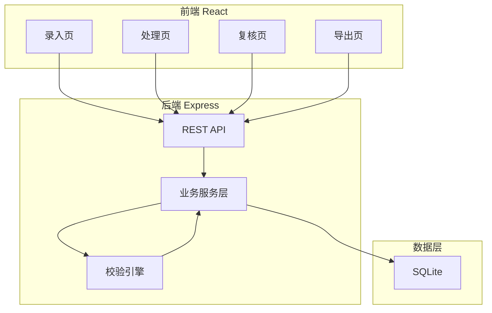
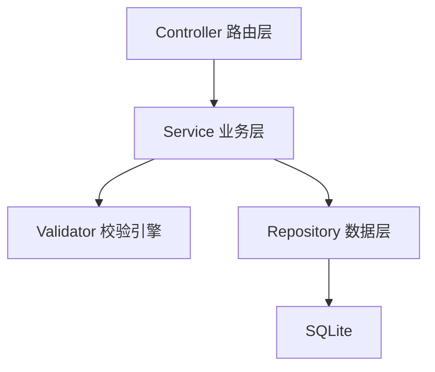
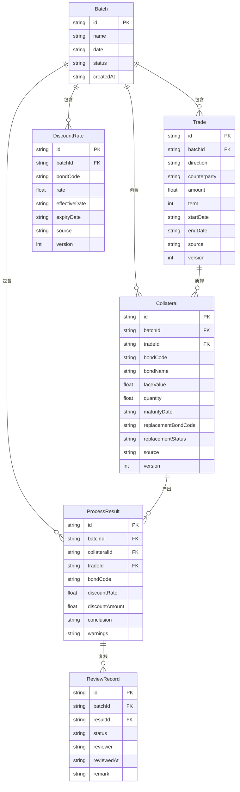

## 1. 架构设计



## 2. 技术说明

- 前端：React@18 + TailwindCSS@3 + Vite
- 初始化工具：vite-init
- 后端：Express@4 + TypeScript (ESM)
- 数据库：SQLite (better-sqlite3)，本地文件存储，零配置
- 状态管理：Zustand

## 3. 路由定义

| 路由 | 用途 |
|------|------|
| / | 首页/仪表盘，展示批次概览 |
| /entry | 录入页：交易单、质押券、折算率录入 |
| /process | 处理页：校验、折算重算、替换状态 |
| /review | 复核页：逐条复核、异常汇总 |
| /export | 导出页：格式选择、批次导出 |

## 4. API定义

### 4.1 批次管理

```
POST   /api/batches                 创建新批次
GET    /api/batches                 获取批次列表
GET    /api/batches/:id             获取批次详情
```

### 4.2 交易单

```
POST   /api/batches/:id/trades      录入交易单
GET    /api/batches/:id/trades      获取交易单列表
PUT    /api/batches/:id/trades/:tid  更新交易单
DELETE /api/batches/:id/trades/:tid  删除交易单
```

### 4.3 质押券

```
POST   /api/batches/:id/collaterals      录入质押券
GET    /api/batches/:id/collaterals      获取质押券列表
PUT    /api/batches/:id/collaterals/:cid  更新质押券
DELETE /api/batches/:id/collaterals/:cid  删除质押券
```

### 4.4 折算率

```
POST   /api/batches/:id/rates        录入折算率
GET    /api/batches/:id/rates        获取折算率列表
PUT    /api/batches/:id/rates/:rid   更新折算率
DELETE /api/batches/:id/rates/:rid   删除折算率
```

### 4.5 处理与复核

```
POST   /api/batches/:id/process      执行处理（校验+折算重算+替换状态）
GET    /api/batches/:id/results      获取处理结果
POST   /api/batches/:id/review       提交复核（逐条确认）
GET    /api/batches/:id/export       导出结果（CSV格式）
```

### 4.6 数据类型定义

```typescript
interface Batch {
  id: string
  name: string
  date: string
  status: "draft" | "processed" | "reviewed" | "exported"
  createdAt: string
}

interface Trade {
  id: string
  batchId: string
  direction: "正回购" | "逆回购"
  counterparty: string
  amount: number
  term: number
  startDate: string
  endDate: string
  source: string
  version: number
}

interface Collateral {
  id: string
  batchId: string
  tradeId: string
  bondCode: string
  bondName: string
  faceValue: number
  quantity: number
  maturityDate: string
  replacementBondCode?: string
  replacementStatus: "无替换" | "待替换" | "已替换"
  source: string
  version: number
}

interface DiscountRate {
  id: string
  batchId: string
  bondCode: string
  rate: number
  effectiveDate: string
  expiryDate: string
  source: string
  version: number
}

interface ProcessResult {
  id: string
  batchId: string
  collateralId: string
  tradeId: string
  bondCode: string
  discountRate: number
  discountAmount: number
  conclusion: "通过" | "异常"
  warnings: Warning[]
}

interface Warning {
  type: "折算率过期" | "到期券未替换" | "同券重复占用"
  message: string
  affectedTradeIds: string[]
  affectedCollateralIds: string[]
}

interface ReviewRecord {
  id: string
  batchId: string
  resultId: string
  status: "待复核" | "已复核"
  reviewer: string
  reviewedAt?: string
  remark?: string
}
```

## 5. 服务端架构图



## 6. 数据模型

### 6.1 数据模型定义



### 6.2 数据定义语言

```sql
CREATE TABLE batches (
  id TEXT PRIMARY KEY,
  name TEXT NOT NULL,
  date TEXT NOT NULL,
  status TEXT NOT NULL DEFAULT 'draft',
  created_at TEXT NOT NULL DEFAULT (datetime('now'))
);

CREATE TABLE trades (
  id TEXT PRIMARY KEY,
  batch_id TEXT NOT NULL REFERENCES batches(id),
  direction TEXT NOT NULL,
  counterparty TEXT NOT NULL,
  amount REAL NOT NULL,
  term INTEGER NOT NULL,
  start_date TEXT NOT NULL,
  end_date TEXT NOT NULL,
  source TEXT NOT NULL DEFAULT '',
  version INTEGER NOT NULL DEFAULT 1
);

CREATE TABLE collaterals (
  id TEXT PRIMARY KEY,
  batch_id TEXT NOT NULL REFERENCES batches(id),
  trade_id TEXT NOT NULL REFERENCES trades(id),
  bond_code TEXT NOT NULL,
  bond_name TEXT NOT NULL,
  face_value REAL NOT NULL,
  quantity REAL NOT NULL,
  maturity_date TEXT NOT NULL,
  replacement_bond_code TEXT,
  replacement_status TEXT NOT NULL DEFAULT '无替换',
  source TEXT NOT NULL DEFAULT '',
  version INTEGER NOT NULL DEFAULT 1
);

CREATE TABLE discount_rates (
  id TEXT PRIMARY KEY,
  batch_id TEXT NOT NULL REFERENCES batches(id),
  bond_code TEXT NOT NULL,
  rate REAL NOT NULL,
  effective_date TEXT NOT NULL,
  expiry_date TEXT NOT NULL,
  source TEXT NOT NULL DEFAULT '',
  version INTEGER NOT NULL DEFAULT 1
);

CREATE TABLE process_results (
  id TEXT PRIMARY KEY,
  batch_id TEXT NOT NULL REFERENCES batches(id),
  collateral_id TEXT NOT NULL REFERENCES collaterals(id),
  trade_id TEXT NOT NULL REFERENCES trades(id),
  bond_code TEXT NOT NULL,
  discount_rate REAL NOT NULL,
  discount_amount REAL NOT NULL,
  conclusion TEXT NOT NULL DEFAULT '通过',
  warnings TEXT NOT NULL DEFAULT '[]'
);

CREATE TABLE review_records (
  id TEXT PRIMARY KEY,
  batch_id TEXT NOT NULL REFERENCES batches(id),
  result_id TEXT NOT NULL REFERENCES process_results(id),
  status TEXT NOT NULL DEFAULT '待复核',
  reviewer TEXT NOT NULL DEFAULT '',
  reviewed_at TEXT,
  remark TEXT
);

CREATE INDEX idx_trades_batch ON trades(batch_id);
CREATE INDEX idx_collaterals_batch ON collaterals(batch_id);
CREATE INDEX idx_collaterals_trade ON collaterals(trade_id);
CREATE INDEX idx_collaterals_bond ON collaterals(bond_code);
CREATE INDEX idx_rates_batch ON discount_rates(batch_id);
CREATE INDEX idx_rates_bond ON discount_rates(bond_code);
CREATE INDEX idx_results_batch ON process_results(batch_id);
CREATE INDEX idx_results_conclusion ON process_results(conclusion);
CREATE INDEX idx_reviews_batch ON review_records(batch_id);
CREATE INDEX idx_reviews_status ON review_records(status);
```
