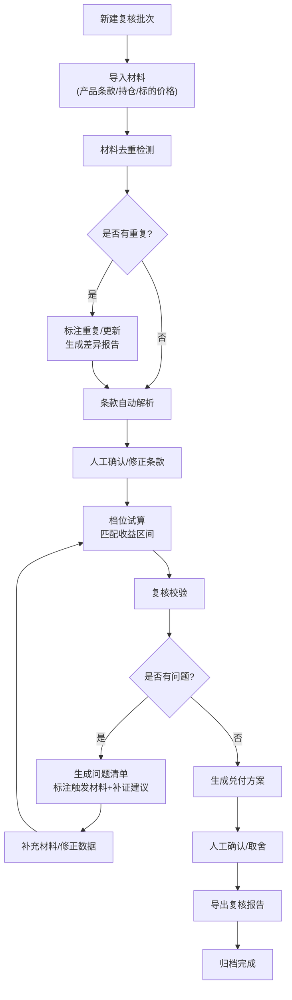

## 1. 产品概述

结构性存款收益复核系统，面向银行理财经理，解决人工计算时挂钩标的、观察区间容易填错的问题。通过条款解析、档位试算、兑付匹配三大核心能力，提供可复查的证据链，帮助业务同事高效完成收益复核工作。

## 2. 核心功能

### 2.1 用户角色

| 角色 | 注册方式 | 核心权限 |
|------|----------|----------|
| 理财经理 | 内部账号登录 | 材料导入、复核计算、结果导出、历史回看 |

### 2.2 功能模块

1. **工作台**：待处理批次列表、复核进度概览、快捷操作入口
2. **材料导入**：支持产品条款、客户持仓、标的价格三类材料分批导入，自动去重和更新检测
3. **条款解析**：自动识别挂钩标的、观察区间、收益档位、提前终止条款，支持人工修正
4. **档位试算**：根据标的价格和观察区间，自动匹配收益档位，计算预期收益
5. **复核校验**：检查区间边界错误、收益档位误套、提前终止未处理等问题
6. **兑付匹配**：生成最终兑付方案，支持多方案取舍对比
7. **证据链追踪**：记录每一步操作的来源材料，支持问题定位和回溯
8. **结果导出**：支持导出复核报告、计算明细、问题清单

### 2.3 页面详情

| 页面名称 | 模块名称 | 功能描述 |
|-----------|-------------|---------------------|
| 工作台 | 批次概览 | 展示所有复核批次的状态、问题数、完成进度 |
| 工作台 | 快捷操作 | 新建批次、导入材料、最近访问批次 |
| 批次详情 | 材料管理 | 展示已导入的原始材料，区分材料类型，支持增删改 |
| 批次详情 | 条款解析 | 展示解析结果，支持人工修正，标注解析来源 |
| 批次详情 | 档位试算 | 展示档位匹配过程、计算明细、中间结果 |
| 批次详情 | 复核校验 | 列出所有问题，标注触发材料、卡点原因、补证建议 |
| 批次详情 | 兑付方案 | 展示最终兑付方案，支持多方案对比 |
| 批次详情 | 操作日志 | 完整记录所有操作和证据链 |
| 历史回看 | 批次列表 | 支持按产品、客户、时间、状态筛选 |
| 历史回看 | 版本对比 | 同一批次多次补传的差异对比，标注更新和重复 |

## 3. 核心流程

## 4. 用户界面设计

### 4.1 设计风格

- **设计方向**：朴素实用的工具风格，强调信息密度和操作效率
- **主色调**：深灰蓝(#1e3a5f) 作为主色，搭配白色背景，突出专业稳重
- **辅助色**：
  - 警告橙(#f59e0b) 用于问题提示
  - 成功绿(#10b981) 用于校验通过
  - 错误红(#ef4444) 用于严重错误
  - 信息蓝(#3b82f6) 用于普通提示
- **按钮风格**：直角矩形，边框清晰，hover状态有轻微背景变化
- **字体**：系统等宽字体用于数字展示，确保对齐；无衬线字体用于正文
- **布局**：顶部导航 + 左侧菜单 + 主内容区，信息密度高，留白克制
- **图标**：简洁的线性图标，避免花哨装饰

### 4.2 页面设计概述

| 页面名称 | 模块名称 | UI Elements |
|-----------|-------------|-------------|
| 工作台 | 批次概览 | 卡片式列表，状态标签醒目，关键指标突出显示 |
| 批次详情 | 材料管理 | 三栏布局区分三类材料，每份材料标注导入时间、来源、校验状态 |
| 批次详情 | 条款解析 | 表单式布局，每个字段标注解析来源（哪份材料哪一行） |
| 批次详情 | 档位试算 | 表格展示各档位计算过程，高亮匹配档位 |
| 批次详情 | 复核校验 | 问题列表按严重程度排序，每条问题展开显示证据链和补证建议 |
| 批次详情 | 操作日志 | 时间线布局，完整记录每一步操作 |

### 4.3 响应性

- 桌面优先设计，支持1280px及以上分辨率
- 关键表格支持横向滚动，确保数据完整展示
- 移动端适配主要列表查看功能

## 5. 关键业务规则

### 5.1 材料类型定义
- **产品条款**：包含产品代码、挂钩标的、观察区间、收益档位、提前终止条款
- **客户持仓**：包含客户信息、产品代码、持有金额、起息日、到期日
- **标的价格**：包含标的代码、观察日期、价格数据

### 5.2 材料去重规则
- 按"材料类型+产品代码+关键数据指纹"判断重复
- 完全一致：标记为"重复提交"，不覆盖原有数据
- 部分字段不同：标记为"数据更新"，保留历史版本，提示差异
- 新增字段：标记为"补充材料"，合并到现有数据

### 5.3 复核校验规则
- **区间边界错误**：标的价格触达区间边界但未正确处理（如≥误写为>）
- **收益档位误套**：价格区间与档位不匹配，导致收益计算错误
- **提前终止未处理**：存在提前终止条款但未纳入计算
- **数据缺失**：必要字段为空或不完整
- **逻辑矛盾**：不同材料间数据冲突（如起息日不一致）

### 5.4 证据链规则
- 每条解析结果关联来源材料的具体位置（文件名+行号）
- 每次修改记录修改人、修改时间、修改前后值
- 每个问题关联触发的材料、计算过程、卡点原因
