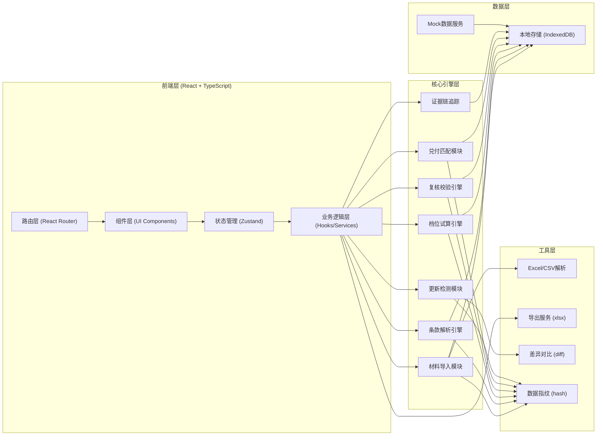
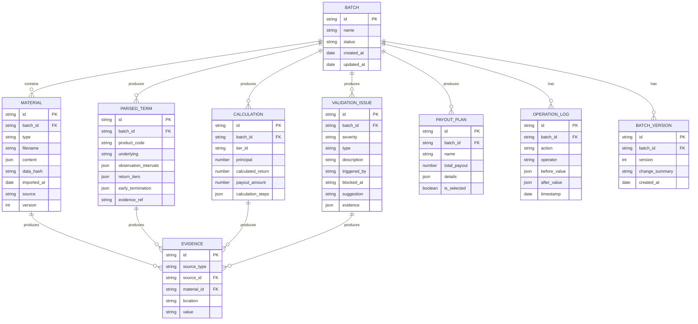

## 1. 架构设计



## 2. 技术描述

- **前端**：React@18 + TypeScript + Vite
- **样式**：TailwindCSS@3
- **状态管理**：Zustand（轻量级，适合本地数据管理）
- **本地数据库**：IndexedDB (Dexie.js)
- **路由**：React Router@6
- **UI组件**：原生Table组件（自定义开发，保持朴素实用风格）
- **Excel处理**：xlsx (SheetJS)
- **数据对比**：deep-object-diff
- **数据指纹**：object-hash

## 3. 核心模块设计

### 3.1 目录结构

```
src/
├── assets/          # 静态资源
├── components/    # 公共组件
│   ├── common/     # 基础组件（Button, Table, Form等）
│   └── business/ # 业务组件（材料上传、问题列表等）
├── engine/      # 核心引擎
│   ├── import.ts      # 材料导入
│   ├── parser.ts      # 条款解析
│   ├── calculator.ts  # 档位试算
│   ├── validator.ts   # 复核校验
│   ├── payout.ts     # 兑付匹配
│   ├── evidence.ts  # 证据链
│   └── deduplicate.ts # 更新检测
├── hooks/       # 自定义Hooks
├── pages/       # 页面组件
├── store/       # Zustand状态管理
├── types/       # TypeScript类型定义
├── utils/       # 工具函数
└── mock/        # Mock数据
```

### 3.2 路由定义

| 路由 | 页面 | 用途 |
|-------|------|-------|
| / | 工作台 | 批次列表、快捷操作 |
| /batch/:id | 批次详情 | 材料管理、条款解析、档位试算、复核校验、兑付方案 |
| /batch/:id/version/:versionId | 版本对比 | 同一批次多版本对比 |
| /history | 历史回看 | 所有批次筛选、查看 |

## 4. 数据模型

### 4.1 ER图



### 4.2 核心类型定义

```typescript
// 材料类型
type MaterialType = 'product_terms' | 'customer_position' | 'underlying_price';

interface Material {
  id: string;
  batchId: string;
  type: MaterialType;
  filename: string;
  content: Record<string, any>;
  dataHash: string;
  importedAt: Date;
  source: string;
  version: number;
}

// 条款解析结果
interface ParsedTerms {
  id: string;
  batchId: string;
  productCode: string;
  underlying: string;
  observationIntervals: ObservationInterval[];
  returnTiers: ReturnTier[];
  earlyTermination: EarlyTermination | null;
  evidenceRef: Record<string, EvidenceRef>;
}

interface ObservationInterval {
  startDate: string;
  endDate: string;
  lowerBound: number;
  upperBound: number;
  lowerInclusive: boolean;
  upperInclusive: boolean;
}

interface ReturnTier {
  id: string;
  lowerBound: number;
  upperBound: number;
  lowerInclusive: boolean;
  upperInclusive: boolean;
  returnRate: number;
}

// 复核问题
interface ValidationIssue {
  id: string;
  batchId: string;
  severity: 'error' | 'warning' | 'info';
  type: 'boundary_error' | 'tier_mismatch' | 'early_termination_missing' | 'data_missing' | 'logic_conflict';
  description: string;
  triggeredBy: string;
  blockedAt: string;
  suggestion: string;
  evidence: EvidenceRef[];
}

// 证据引用
interface EvidenceRef {
  materialId: string;
  filename: string;
  location: string;
  value: string;
}
```

## 5. 核心引擎设计

### 5.1 条款解析引擎

```typescript
// 解析产品条款，识别关键信息
function parseProductTerms(
  material: Material
): ParseResult<ParsedTerms> {
  // 1. 提取产品代码
  // 2. 识别挂钩标的
  // 3. 解析观察区间（含边界处理）
  // 4. 提取收益档位
  // 5. 识别提前终止条款
  // 6. 为每个解析结果关联证据引用
}
```

### 5.2 档位试算引擎

```typescript
// 根据标的价格匹配收益档位
function calculateReturn(
  terms: ParsedTerms,
  position: CustomerPosition,
  prices: UnderlyingPrice[]
): CalculationResult {
  // 1. 验证价格验证
  // 2. 观察区间匹配
  // 3. 档位匹配（注意边界处理）
  // 4. 收益计算
  // 5. 记录每一步证据
}
```

### 5.3 复核校验引擎

```typescript
// 检查各类错误
function validateBatch(batchId: string): ValidationIssue[] {
  // 1. 区间边界检查
  // 2. 档位匹配检查
  // 3. 提前终止检查
  // 4. 数据完整性检查
  // 5. 逻辑一致性检查
}
```

### 5.4 材料更新检测

```typescript
// 检测材料是否重复或更新
function detectMaterialUpdate(
  newMaterial: Material,
  existingMaterials: Material[]
): UpdateDetectionResult {
  // 1. 计算数据指纹
  // 2. 对比现有材料
  // 3. 生成差异报告
  // 4. 标注更新/重复
}
```

## 6. 状态管理设计

```typescript
// Zustand Store
interface BatchStore {
  batches: Batch[];
  currentBatch: Batch | null;
  materials: Material[];
  parsedTerms: ParsedTerms | null;
  calculations: Calculation[];
  validationIssues: ValidationIssue[];
  operations: OperationLog[];
  
  // Actions...
}
```

## 7. 导出服务

支持导出：
- Excel格式复核报告
- CSV格式计算明细
- PDF格式问题清单
