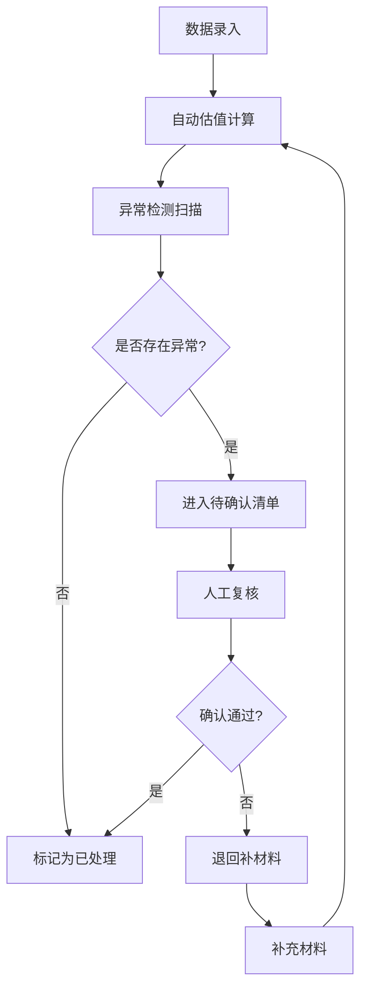

## 1. 产品概述

私募基金侧袋估值系统，旨在解决私募运营中侧袋资产处理时的估值口径不一致问题。系统支持正常份额与侧袋份额分开估值、合并展示，实现筛选条件与图表明细的实时联动，通过异常检测机制确保问题记录不被遗漏。

- **核心问题**：侧袋估值口径不统一、异常记录易遗漏、状态流转不清晰
- **目标用户**：私募运营人员、估值核算人员、风控合规人员
- **产品价值**：规范侧袋估值流程，提升运营效率，降低操作风险

## 2. 核心功能

### 2.1 用户角色

| 角色 | 注册方式 | 核心权限 |
|------|----------|----------|
| 运营人员 | 系统账号登录 | 数据录入、状态流转、异常处理 |
| 估值人员 | 系统账号登录 | 估值确认、版本管理、数据复核 |
| 风控人员 | 系统账号登录 | 异常监控、合规检查、审计查看 |

### 2.2 功能模块

1. **估值概览仪表盘**：关键指标卡片、估值趋势图表、份额分布分析
2. **估值记录管理**：基金份额表、侧袋资产表、估值明细表的完整展示
3. **异常检测中心**：自动识别份额拆分错误、限制期漏算、估值覆盖等问题
4. **状态流转工作台**：已处理、待确认、退回补材料三类记录的分类处理
5. **高级筛选联动**：多维度筛选条件，图表与明细实时同步更新

### 2.3 页面详情

| 页面名称 | 模块名称 | 功能描述 |
|----------|----------|----------|
| 估值概览 | 指标卡片区 | 展示基金总数、估值金额、异常记录数、待确认数等核心KPI |
| 估值概览 | 估值趋势图 | 展示近30天正常份额与侧袋份额的估值变化趋势，支持双轴对比 |
| 估值概览 | 份额分布图 | 饼图展示各基金正常份额与侧袋份额的占比情况 |
| 估值明细 | 筛选条件区 | 支持按基金、日期范围、状态、估值版本、业务类型等多维度筛选 |
| 估值明细 | 数据表格区 | 展示基金份额、侧袋资产、估值明细，支持展开查看详情和操作历史 |
| 估值明细 | 异常标记列 | 对问题记录高亮显示，悬停显示异常原因和处理建议 |
| 状态工作台 | 待确认列表 | 展示需要人工复核的记录，支持通过/退回操作 |
| 状态工作台 | 退回补材料列表 | 展示需要补充信息的记录，支持查看退回原因和重新提交 |
| 状态工作台 | 已处理列表 | 展示已完成的记录，支持查看完整处理链路 |

## 3. 核心流程

### 3.1 估值处理主流程

运营人员录入基金份额和侧袋资产数据 → 系统自动进行估值计算 → 异常检测引擎扫描识别问题 → 正常记录进入已处理，异常记录进入待确认 → 估值人员复核待确认记录 → 确认无误标记为已处理，存在问题退回补材料 → 补充材料后重新进入估值流程

### 3.2 异常检测规则

| 异常类型 | 触发条件 | 处理方式 |
|----------|----------|----------|
| 份额拆分错误 | 拆分后份额合计与原份额偏差超过0.001% | 进入待确认，需人工复核 |
| 限制期漏算 | 侧袋资产在限制期内但未标记限制状态 | 进入待确认，需人工确认 |
| 侧袋估值覆盖主账 | 侧袋估值金额大于正常份额估值的50% | 进入异常清单，需风控审批 |
| 缺字段 | 关键字段为空 | 自动退回补材料 |
| 重复提交 | 同一基金同一估值日期存在多条记录 | 标记重复，保留最新版本 |

## 4. 用户界面设计

### 4.1 设计风格

- **主色调**：深海军蓝 (#0F2B4A) - 专业稳重，符合金融气质
- **辅助色**：
  - 翡翠绿 (#10B981) - 正常/已处理状态
  - 琥珀橙 (#F59E0B) - 待确认/警告状态
  - 玫瑰红 (#EF4444) - 异常/退回状态
  - 天空蓝 (#3B82F6) - 操作/链接
- **中性色**：
  - 背景：浅灰蓝 (#F8FAFC)
  - 卡片：纯白 (#FFFFFF)
  - 文字：深灰 (#1E293B) / 中灰 (#64748B)
- **字体**：
  - 标题：思源宋体 CN - 专业精致
  - 正文：Inter - 清晰易读
  - 数字：JetBrains Mono - 等宽对齐，便于比对
- **布局风格**：卡片式布局，清晰的信息层级，充足留白
- **按钮风格**：圆角4px，微投影，hover时轻微上浮
- **图标风格**：线性图标，粗细1.5px，与文字同色

### 4.2 页面设计概述

| 页面名称 | 模块名称 | UI元素 |
|----------|----------|--------|
| 估值概览 | 指标卡片区 | 4张卡片横向排列，数字大号加粗，带趋势箭头和环比变化 |
| 估值概览 | 图表区 | 左右分栏，左侧折线图（估值趋势），右侧环形图（份额分布） |
| 估值概览 | 异常摘要区 | 横向排列异常类型标签，点击可跳转至对应筛选结果 |
| 估值明细 | 筛选栏 | 固定在顶部，多条件并排，带"重置"和"导出"按钮 |
| 估值明细 | 数据表格 | 斑马纹，异常行整行浅红底色，异常单元格带角标 |
| 估值明细 | 行详情 | 点击行展开，显示操作历史、版本对比、备注记录 |
| 状态工作台 | 三栏布局 | 待确认（琥珀色边框）、退回补材料（玫瑰红边框）、已处理（翡翠绿边框） |
| 状态工作台 | 记录卡片 | 每条记录为独立卡片，带状态标签和操作按钮组 |

### 4.3 响应式设计

- 桌面端（≥1280px）：三栏完整布局，图表并排展示
- 平板端（768px-1279px）：图表上下堆叠，表格支持水平滚动
- 移动端（<768px）：筛选条件折叠，表格转为卡片列表展示

### 4.4 交互与动效

- 页面加载：元素按从左到右、从上到下顺序淡入，间隔50ms
- 筛选变更：图表和表格数据平滑过渡（300ms ease-out）
- 状态变更：记录卡片左右滑出，新状态从对应方向滑入
- 异常悬停：气泡提示从目标元素向上滑出，带小三角指向
- 按钮点击：scale(0.96) 微缩反馈，100ms后恢复
