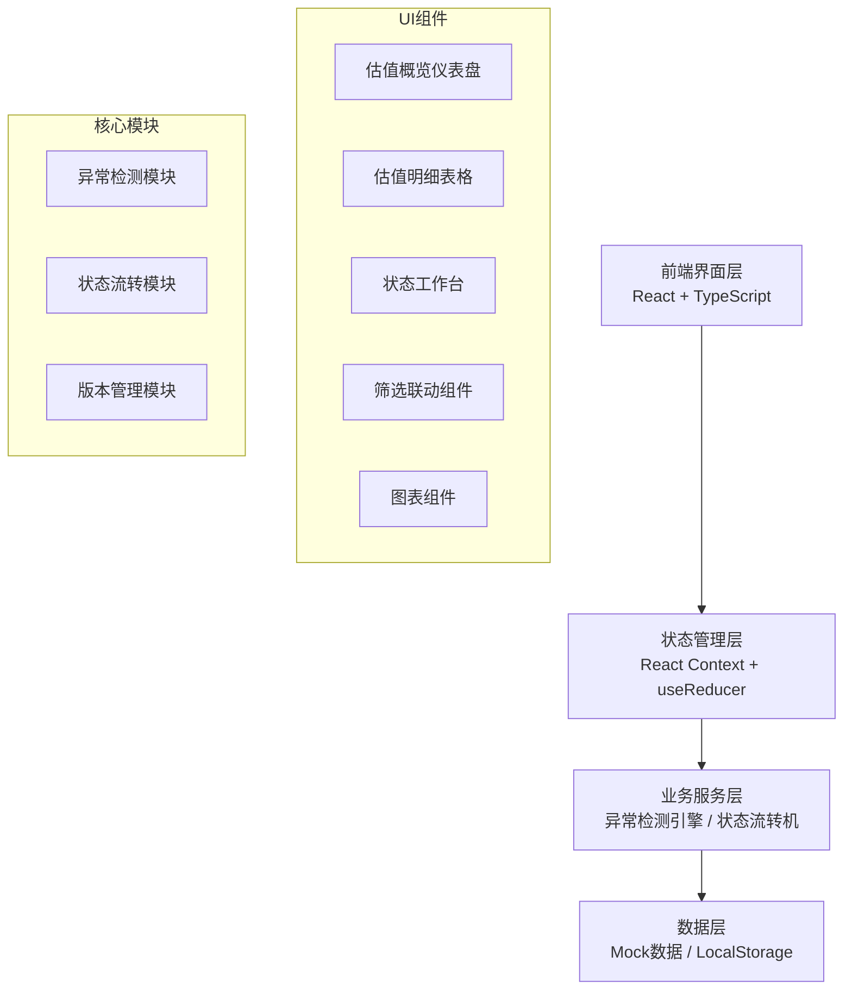
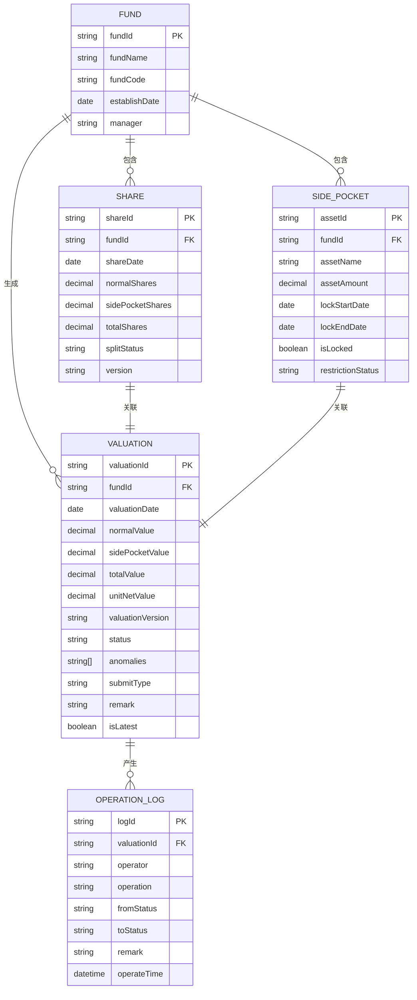

## 1. 架构设计



## 2. 技术描述

- **前端框架**：React@18 + TypeScript + Vite@5
- **样式方案**：TailwindCSS@3 + CSS变量主题系统
- **图表库**：Recharts@2 - React生态友好，支持复杂交互
- **状态管理**：React Context + useReducer - 轻量可控，适合中后台系统
- **图标库**：Lucide React - 线性风格，与设计一致
- **数据持久化**：LocalStorage - 模拟后端存储，支持刷新保留
- **Mock数据**：TypeScript类型驱动，内置完整样例数据

## 3. 路由定义

| 路由 | 页面组件 | 用途 |
|------|----------|------|
| / | Dashboard | 估值概览仪表盘，包含KPI卡片和图表 |
| /records | ValuationRecords | 估值明细表，支持多维度筛选和异常展示 |
| /workbench | StatusWorkbench | 状态工作台，三栏分类处理不同状态记录 |

## 4. 数据模型

### 4.1 核心数据实体



### 4.2 TypeScript 类型定义

```typescript
// 状态枚举
export type RecordStatus = 'processed' | 'pending' | 'returned' | 'anomaly';
export type SubmitType = 'normal' | 'supplement' | 'withdraw' | 'duplicate';
export type AnomalyType = 'split_error' | 'lock_miss' | 'coverage_over' | 'missing_field' | 'duplicate_submit';

// 基金信息
export interface Fund {
  fundId: string;
  fundName: string;
  fundCode: string;
  establishDate: string;
  manager: string;
}

// 份额信息
export interface ShareRecord {
  shareId: string;
  fundId: string;
  shareDate: string;
  normalShares: number;
  sidePocketShares: number;
  totalShares: number;
  splitStatus: 'normal' | 'error' | 'corrected';
  version: string;
}

// 侧袋资产
export interface SidePocketAsset {
  assetId: string;
  fundId: string;
  assetName: string;
  assetAmount: number;
  lockStartDate: string;
  lockEndDate: string;
  isLocked: boolean;
  restrictionStatus: 'normal' | 'missing' | 'corrected';
}

// 估值记录
export interface ValuationRecord {
  valuationId: string;
  fundId: string;
  valuationDate: string;
  normalValue: number;
  sidePocketValue: number;
  totalValue: number;
  unitNetValue: number;
  valuationVersion: string;
  status: RecordStatus;
  anomalies: AnomalyType[];
  submitType: SubmitType;
  remark: string;
  isLatest: boolean;
  createdAt: string;
  updatedAt: string;
}

// 筛选条件
export interface FilterConditions {
  fundIds: string[];
  dateRange: [string, string] | null;
  statuses: RecordStatus[];
  valuationVersions: string[];
  submitTypes: SubmitType[];
  hasAnomaly: boolean | null;
}

// 操作日志
export interface OperationLog {
  logId: string;
  valuationId: string;
  operator: string;
  operation: string;
  fromStatus: RecordStatus | null;
  toStatus: RecordStatus;
  remark: string;
  operateTime: string;
}
```

## 5. 核心模块设计

### 5.1 异常检测引擎

```typescript
// 异常检测规则配置
const ANOMALY_RULES: Record<AnomalyType, (record: ValuationRecord, shares?: ShareRecord, assets?: SidePocketAsset[]) => boolean> = {
  split_error: (record, shares) => {
    if (!shares) return false;
    const calculated = shares.normalShares + shares.sidePocketShares;
    const diff = Math.abs(calculated - shares.totalShares) / shares.totalShares;
    return diff > 0.00001; // 0.001% 偏差阈值
  },
  
  lock_miss: (record, shares, assets) => {
    if (!assets) return false;
    const today = new Date(record.valuationDate);
    return assets.some(asset => {
      const lockStart = new Date(asset.lockStartDate);
      const lockEnd = new Date(asset.lockEndDate);
      const isInLockPeriod = today >= lockStart && today <= lockEnd;
      return isInLockPeriod && !asset.isLocked;
    });
  },
  
  coverage_over: (record) => {
    if (record.normalValue === 0) return false;
    return record.sidePocketValue / record.normalValue > 0.5;
  },
  
  missing_field: (record) => {
    return !record.normalValue || !record.sidePocketValue || !record.unitNetValue;
  },
  
  duplicate_submit: (record, shares, assets, allRecords) => {
    if (!allRecords) return false;
    return allRecords.filter(r => 
      r.fundId === record.fundId && 
      r.valuationDate === record.valuationDate &&
      r.valuationId !== record.valuationId
    ).length > 0;
  }
};
```

### 5.2 状态流转机

```typescript
// 状态流转规则
const STATUS_TRANSITIONS: Record<RecordStatus, RecordStatus[]> = {
  pending: ['processed', 'returned'],      // 待确认可转为已处理或退回
  returned: ['pending', 'processed'],      // 退回后可重新提交为待确认或直接处理
  processed: [],                            // 已处理为终态
  anomaly: ['pending', 'returned']         // 异常可转为待确认或退回
};

// 操作按钮权限
const STATUS_OPERATIONS: Record<RecordStatus, { label: string; action: string; target: RecordStatus }[]> = {
  pending: [
    { label: '确认通过', action: 'approve', target: 'processed' },
    { label: '退回补材料', action: 'return', target: 'returned' }
  ],
  returned: [
    { label: '重新提交', action: 'resubmit', target: 'pending' },
    { label: '直接确认', action: 'force_approve', target: 'processed' }
  ],
  processed: [],
  anomaly: [
    { label: '解除异常', action: 'resolve', target: 'pending' },
    { label: '退回重录', action: 'reject', target: 'returned' }
  ]
};
```

### 5.3 项目目录结构

```
src/
├── types/              # 类型定义
│   └── index.ts
├── data/               # Mock数据
│   ├── funds.ts
│   ├── shares.ts
│   ├── sidePockets.ts
│   ├── valuations.ts
│   └── operationLogs.ts
├── hooks/              # 自定义Hooks
│   ├── useFilter.ts
│   ├── useAnomaly.ts
│   └── useStatusFlow.ts
├── context/            # 状态管理
│   └── ValuationContext.tsx
├── components/         # 组件
│   ├── dashboard/      # 仪表盘组件
│   │   ├── KPICard.tsx
│   │   ├── ValuationTrendChart.tsx
│   │   └── ShareDistributionChart.tsx
│   ├── records/        # 估值明细组件
│   │   ├── FilterBar.tsx
│   │   ├── DataTable.tsx
│   │   ├── TableRow.tsx
│   │   └── AnomalyBadge.tsx
│   ├── workbench/      # 工作台组件
│   │   ├── StatusColumn.tsx
│   │   ├── RecordCard.tsx
│   │   └── OperationModal.tsx
│   └── common/         # 通用组件
│       ├── Header.tsx
│       ├── Sidebar.tsx
│       └── StatusTag.tsx
├── pages/              # 页面
│   ├── Dashboard.tsx
│   ├── ValuationRecords.tsx
│   └── StatusWorkbench.tsx
├── utils/              # 工具函数
│   ├── anomalyDetector.ts
│   ├── statusFlow.ts
│   └── formatters.ts
├── App.tsx
├── main.tsx
└── index.css
```
