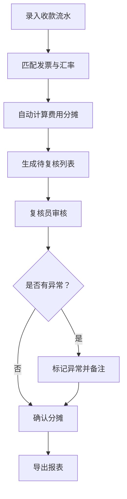

## 1. 产品概述
跨境收款手续费分摊系统是面向外贸财务人员的本地轻量化工具，解决多币种货款到账后，银行扣费、代理行费用、客户短付的精准分摊与证据留存问题。
- 核心目标：将分散的收款流水、发票、汇率数据自动归集，形成完整的业务链路，避免人工判断失误
- 价值：保留手续费重复扣除、汇率日期错误、短付被误当折扣等关键证据，确保交接时同事能快速追溯

## 2. 核心功能

### 2.1 用户角色
| 角色 | 注册方式 | 核心权限 |
|------|----------|----------|
| 财务录入员 | 本地直接使用 | 录入收款流水、发票信息、汇率数据 |
| 财务复核员 | 本地直接使用 | 审核分摊结果、标记异常、导出报表 |

### 2.2 功能模块
1. **收款登记页**：录入银行到账流水、关联发票、选择币种与汇率
2. **费用分摊页**：自动识别银行扣费、代理行费用、客户短付，生成分摊明细
3. **复核工作台**：审核异常项、查看证据链、标记确认或驳回
4. **数据导出页**：导出分摊明细表、异常记录单、完整审计日志

### 2.3 页面详情
| 页面名称 | 模块名称 | 功能描述 |
|----------|----------|----------|
| 收款登记页 | 流水录入 | 支持多币种录入，自动获取汇率历史数据 |
| 收款登记页 | 发票匹配 | 根据金额、日期、客户智能匹配对应发票 |
| 费用分摊页 | 自动分摊 | 按比例分摊银行费用到各发票行，识别短付并标记 |
| 费用分摊页 | 人工调整 | 支持手动调整分摊比例，填写调整理由 |
| 复核工作台 | 异常列表 | 高亮显示重复扣费、汇率异常、短付争议项 |
| 复核工作台 | 证据链查看 | 从摘要可回溯到原始流水、发票、操作日志 |
| 数据导出页 | 报表导出 | 支持Excel格式导出，包含完整分摊明细和备注 |

## 3. 核心流程

用户录入收款流水 → 系统匹配发票与汇率 → 自动计算费用分摊 → 生成待复核列表 → 复核员审核并查看证据链 → 确认或调整后导出报表

## 4. 用户界面设计

### 4.1 设计风格
- 主色调：深蓝色（#1e3a5f）代表专业可靠，辅助色：橙色（#e67e22）用于异常警示
- 按钮风格：圆角矩形，轻微阴影，悬停有颜色渐变效果
- 字体：中文使用思源黑体，数字使用等宽字体，确保金额对齐
- 布局风格：顶部导航 + 左侧菜单栏 + 主内容卡片式布局
- 图标：使用线性图标，金额类用￥$符号，审核类用对勾/叉号

### 4.2 页面设计概览
| 页面名称 | 模块名称 | UI元素 |
|----------|----------|--------|
| 收款登记页 | 表单区域 | 分栏表单、币种选择器、日期选择器、金额输入框 |
| 费用分摊页 | 分摊表格 | 可编辑单元格、实时计算、颜色区分费用类型 |
| 复核工作台 | 异常卡片 | 红色边框警示、展开查看详情、一键跳转原始数据 |
| 数据导出页 | 导出选项 | 复选框选择导出内容、预览按钮、下载进度条 |

### 4.3 响应式
- 桌面端优先设计，支持1366px及以上分辨率
- 表格区域支持水平滚动，适配多列数据展示
- 触控优化：按钮最小尺寸44x44px，便于平板操作

### 4.4 交互体验
- 分摊计算时显示加载动画，完成后高亮变化金额
- 鼠标悬停在汇总金额上显示Tooltip，展示计算明细
- 异常项自动吸顶显示，避免遗漏
- 从摘要点击可展开完整链路，支持面包屑导航返回
