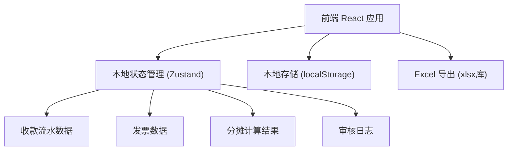
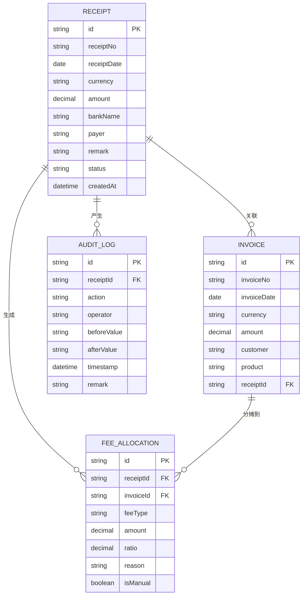

## 1. 架构设计



## 2. 技术说明
- 前端：React@18 + TypeScript + Vite
- 样式：TailwindCSS@3
- 状态管理：Zustand（轻量级，适合本地应用）
- 本地存储：localStorage + IndexedDB（数据持久化）
- Excel导出：xlsx库
- 后端：无后端，纯前端本地运行
- 数据库：本地浏览器存储，支持导入/导出JSON备份

## 3. 路由定义
| 路由 | 用途 |
|------|------|
| / | 首页/收款登记页 |
| /allocation | 费用分摊页 |
| /review | 复核工作台 |
| /export | 数据导出页 |

## 4. 数据模型定义

### 4.1 数据模型ER图



### 4.2 TypeScript 类型定义

```typescript
// 收款流水
interface Receipt {
  id: string;
  receiptNo: string;
  receiptDate: string;
  currency: 'USD' | 'EUR' | 'GBP' | 'JPY' | 'CNY';
  amount: number;
  bankName: string;
  payer: string;
  remark: string;
  status: 'pending' | 'allocated' | 'reviewed' | 'rejected';
  createdAt: string;
  exchangeRate?: number;
  exchangeRateDate?: string;
}

// 发票
interface Invoice {
  id: string;
  invoiceNo: string;
  invoiceDate: string;
  currency: string;
  amount: number;
  customer: string;
  product: string;
  receiptId?: string;
  shortPayment?: number;
  shortPaymentReason?: string;
}

// 费用分摊
interface FeeAllocation {
  id: string;
  receiptId: string;
  invoiceId: string;
  feeType: 'bank_fee' | 'agent_fee' | 'short_payment' | 'other';
  amount: number;
  ratio: number;
  reason: string;
  isManual: boolean;
  createdAt: string;
}

// 审核日志
interface AuditLog {
  id: string;
  receiptId: string;
  action: 'create' | 'update' | 'allocate' | 'review' | 'reject' | 'export';
  operator: string;
  beforeValue?: string;
  afterValue?: string;
  timestamp: string;
  remark: string;
}

// 异常标记
interface Anomaly {
  id: string;
  receiptId: string;
  type: 'duplicate_fee' | 'exchange_rate_date' | 'short_payment_dispute' | 'mismatch';
  severity: 'warning' | 'error';
  description: string;
  evidence: string;
  resolved: boolean;
  resolvedBy?: string;
  resolvedAt?: string;
}
```

## 5. 核心算法说明

### 5.1 费用自动分摊算法
```
输入：收款金额、关联发票列表、费用明细
输出：各发票分摊金额

1. 计算发票总金额 = SUM(各发票金额)
2. 对每张发票：
   - 分摊比例 = 发票金额 / 发票总金额
   - 分摊金额 = 费用金额 × 分摊比例
   - 保留2位小数，尾差调整到最后一张发票
3. 生成人性化理由：
   "按发票金额占比分摊，该发票占总金额的 {ratio}%，对应分摊 {amount} {currency}"
```

### 5.2 异常检测规则
- **重复扣费检测**：同一银行、同一日期、同一金额的手续费记录出现多次
  > 理由："系统检测到XX银行在XX日有两笔相同金额的扣费，可能存在重复扣除，请人工核实"
  
- **汇率日期异常**：汇率日期与收款日期间隔超过3天
  > 理由："所选汇率日期距离收款日超过3天，建议使用收款当日汇率以确保准确性"
  
- **短付标记**：收款金额与发票金额差异超过±5%且无备注
  > 理由："收款金额与发票金额差异较大，已标记为待核实短付，请勿直接作为折扣处理"

## 6. 本地存储方案
- 使用 localStorage 存储关键数据（上限约5MB）
- 使用 IndexedDB 存储大量历史数据和附件
- 支持一键导出完整数据为 JSON 备份文件
- 支持从备份文件恢复数据
