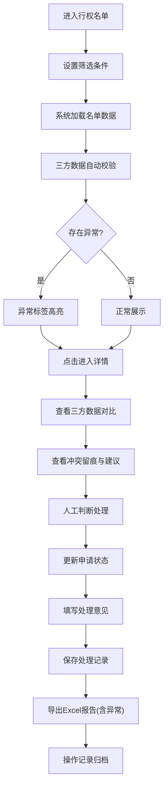

## 1. 产品概述

债券回售行权名单管理系统，面向固收运营业务人员，解决债券回售处理中客户持仓、行权日、撤回申请三者数据冲突的痛点。通过持仓主信息、回售公告、行权申请三方数据交叉校验，自动识别异常并留痕，支持筛选、处理、回看、导出全流程操作，确保业务处理的准确性和可追溯性。

## 2. 核心功能

### 2.1 用户角色
| 角色 | 登录方式 | 核心权限 |
|------|----------|----------|
| 固收运营人员 | 企业账号登录 | 名单查看、筛选、处理、导出、操作回看 |
| 业务主管 | 企业账号登录 | 全部操作权限 + 异常复核权限 |

### 2.2 功能模块
1. **行权名单首页**：债券回售行权名单列表、筛选条件、异常标识、批量操作
2. **详情处理页**：三方数据对比、冲突留痕、状态流转、处理记录
3. **操作回看页**：历史操作日志、筛选条件追溯、导出记录
4. **公告管理页**：回售公告版本管理、公告导入、版本对比

### 2.3 页面详情
| 页面名称 | 模块名称 | 功能描述 |
|----------|----------|----------|
| 行权名单首页 | 筛选区 | 债券代码、行权日期、客户名称、持仓数量、申请状态、异常类型多条件筛选，筛选结果与导出范围一致 |
| 行权名单首页 | 名单列表 | 展示债券基本信息、客户持仓、行权日、申请状态、异常标签，支持排序、分页 |
| 行权名单首页 | 异常告警区 | 高亮显示行权日错位、撤回仍入榜、持仓不足三类异常 |
| 行权名单首页 | 批量操作 | 批量标记处理、批量导出Excel报告 |
| 详情处理页 | 三方数据对比 | 并排展示持仓数据、公告数据、申请数据，差异字段高亮 |
| 详情处理页 | 冲突留痕 | 冲突类型、冲突描述、处理建议、人工判断输入框 |
| 详情处理页 | 状态流转 | 申请状态机：待确认→已确认→已行权→已撤回，状态变更留痕 |
| 详情处理页 | 处理记录 | 完整记录每次操作的操作人、时间、内容 |
| 操作回看页 | 操作日志 | 按时间倒序展示所有操作，支持按操作人、操作类型筛选 |
| 操作回看页 | 导出记录 | 记录每次导出的筛选条件、导出时间、导出人、文件链接 |
| 公告管理页 | 公告列表 | 按债券代码展示公告版本、发布日期、生效日期 |
| 公告管理页 | 版本对比 | 同一债券不同版本公告的字段差异对比 |

## 3. 核心业务流程

业务人员进入系统，首先查看行权名单，通过筛选条件定位目标债券。系统自动校验三方数据，对异常记录打上醒目标签。点击进入详情页，对比持仓、公告、申请三方数据，查看冲突详情和系统建议。业务人员根据实际情况进行人工判断，更新申请状态并留下处理意见。处理完成后，可导出包含异常说明的完整报告。所有操作均记录日志，支持后续回看和审计。

## 4. 用户界面设计

### 4.1 设计风格
- **主色调**：深蓝 #1e3a5f（专业稳重），辅以湖蓝 #2d7dd2 作为交互色
- **异常色**：行权日错位用橙红 #e67e22，撤回仍入榜用红色 #e74c3c，持仓不足用黄色 #f39c12
- **成功色**：正常状态用深绿 #27ae60
- **按钮风格**：直角矩形、2px边框、实心填充，强调专业感
- **字体**：中文使用思源宋体（display）+ 思源黑体（body），数字使用等宽字体 JetBrains Mono
- **布局**：顶部导航 + 左侧筛选 + 右侧主内容区，信息密度适中，强调数据可读性
- **图标**：使用线性图标，保持简洁专业

### 4.2 页面设计概述
| 页面名称 | 模块名称 | UI 元素 |
|----------|----------|----------|
| 行权名单首页 | 筛选区 | 紧凑排列的筛选表单，筛选条件标签化展示，一键清除 |
| 行权名单首页 | 数据表格 | 斑马纹表格，异常行背景色区分，悬停高亮，固定表头 |
| 行权名单首页 | 异常统计卡 | 顶部展示三类异常的数量统计，点击可快速筛选 |
| 详情处理页 | 三栏对比 | 三列等高卡片布局，差异字段用红色边框 + 背景标注 |
| 详情处理页 | 时间线 | 右侧状态流转时间线，清晰展示申请状态变更历史 |
| 操作回看页 | 日志列表 | 时间倒序的操作列表，操作类型用彩色标签区分 |
| 公告管理页 | 版本时间轴 | 垂直时间轴展示公告版本演进，版本差异并列对比 |

### 4.3 响应式设计
- 桌面端（1200px+）：三栏布局，左侧筛选固定宽度280px
- 平板端（768px-1200px）：筛选区可折叠，主内容区自适应
- 移动端（<768px）：筛选区改为抽屉式，表格横向滚动，重点信息卡片化展示
- 所有交互元素最小尺寸44px，支持触摸操作

### 4.4 数据可视化
- **异常分布饼图**：首页右上角展示三类异常占比
- **行权日历热力图**：展示各日期行权数量分布
- **状态流转趋势图**：近30天各状态申请数量变化趋势
- 所有图表数据范围与当前筛选条件保持一致
