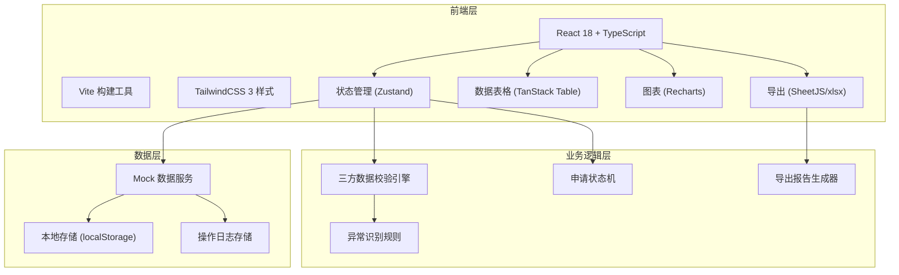
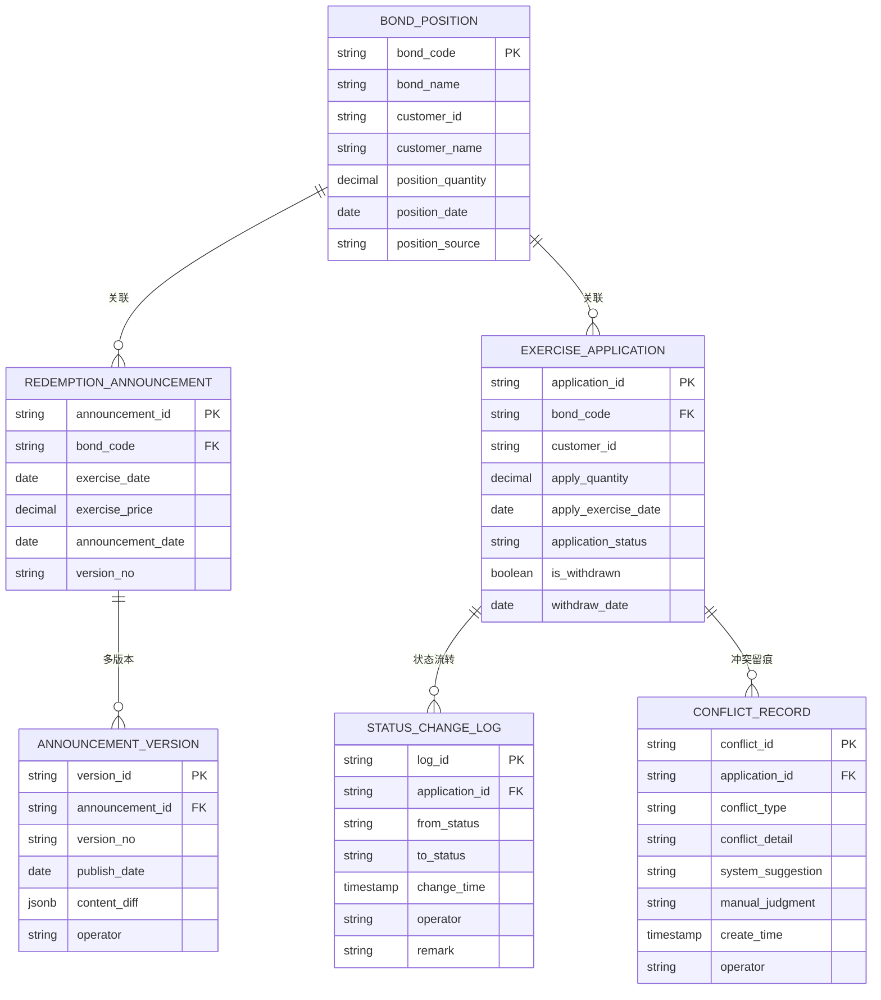

## 1. 架构设计



## 2. 技术栈说明

- **前端框架**：React@18 + TypeScript@5，类型安全，组件化开发
- **构建工具**：Vite@5，热更新快，构建产物优化
- **样式方案**：TailwindCSS@3，原子化CSS，快速开发
- **状态管理**：Zustand，轻量状态管理，支持持久化
- **数据表格**：TanStack Table@8，高性能表格，支持筛选排序
- **图表组件**：Recharts@2，React生态图表库
- **Excel导出**：SheetJS/xlsx，支持复杂Excel格式生成
- **路由管理**：React Router@6
- **日期处理**：dayjs，轻量日期库
- **Mock数据**：MSW + faker.js，模拟真实业务数据

## 3. 路由定义

| 路由路径 | 页面用途 |
|----------|----------|
| / | 重定向到 /redemption-list |
| /redemption-list | 债券回售行权名单首页（主页面） |
| /redemption-list/:bondId | 债券详情处理页 |
| /operation-logs | 操作回看页 |
| /announcement-management | 公告管理页 |

## 4. 数据模型

### 4.1 数据实体关系



### 4.2 TypeScript 类型定义

```typescript
// 债券持仓
interface BondPosition {
  bondCode: string;
  bondName: string;
  customerId: string;
  customerName: string;
  positionQuantity: number;
  positionDate: string;
  positionSource: string;
}

// 回售公告
interface RedemptionAnnouncement {
  announcementId: string;
  bondCode: string;
  exerciseDate: string;
  exercisePrice: number;
  announcementDate: string;
  versionNo: string;
  versions: AnnouncementVersion[];
}

// 公告版本
interface AnnouncementVersion {
  versionId: string;
  versionNo: string;
  publishDate: string;
  contentDiff: Record<string, { old: any; new: any }>;
  operator: string;
}

// 行权申请
interface ExerciseApplication {
  applicationId: string;
  bondCode: string;
  customerId: string;
  customerName: string;
  applyQuantity: number;
  applyExerciseDate: string;
  applicationStatus: 'pending' | 'confirmed' | 'exercised' | 'withdrawn';
  isWithdrawn: boolean;
  withdrawDate?: string;
  createTime: string;
  updateTime: string;
}

// 冲突类型
type ConflictType = 'exercise_date_mismatch' | 'withdrawn_still_in_list' | 'insufficient_position';

// 冲突记录
interface ConflictRecord {
  conflictId: string;
  applicationId: string;
  conflictType: ConflictType;
  conflictDetail: string;
  systemSuggestion: string;
  manualJudgment?: string;
  createTime: string;
  operator?: string;
}

// 状态变更日志
interface StatusChangeLog {
  logId: string;
  applicationId: string;
  fromStatus: string;
  toStatus: string;
  changeTime: string;
  operator: string;
  remark?: string;
}

// 行权名单合并视图
interface RedemptionListItem {
  bondCode: string;
  bondName: string;
  customerId: string;
  customerName: string;
  positionQuantity: number;
  applyQuantity: number;
  announcementExerciseDate: string;
  applyExerciseDate: string;
  applicationStatus: string;
  isWithdrawn: boolean;
  conflicts: ConflictType[];
  latestAnnouncementVersion: string;
  lastUpdateTime: string;
}

// 筛选条件
interface FilterConditions {
  bondCode?: string;
  customerName?: string;
  exerciseDateStart?: string;
  exerciseDateEnd?: string;
  applicationStatus?: string[];
  conflictTypes?: ConflictType[];
  positionQuantityMin?: number;
  applyQuantityMin?: number;
}

// 导出报告配置
interface ExportConfig {
  includeConflicts: boolean;
  includeProcessingHistory: boolean;
  includeAnnouncementVersions: boolean;
  fileFormat: 'xlsx' | 'csv';
}
```

## 5. 核心业务规则

### 5.1 三方数据校验规则
1. **行权日错位校验**：比较公告行权日与申请行权日，不一致则标记异常
2. **撤回仍入榜校验**：申请状态为已撤回但仍在名单中，标记异常
3. **持仓不足校验**：申请行权数量 > 客户持仓数量，标记异常

### 5.2 申请状态机
```
待确认(pending) → 已确认(confirmed) → 已行权(exercised)
     ↓                  ↓
  已撤回(withdrawn)  已撤回(withdrawn)
```
- 状态变更不可逆，需记录操作人和时间
- 撤回操作需填写撤回原因

### 5.3 导出一致性规则
- 导出数据范围严格等于当前筛选条件下的可见数据
- 导出文件名包含筛选条件摘要和导出时间戳
- 导出报告包含：基础数据页、异常详情页、处理记录页
