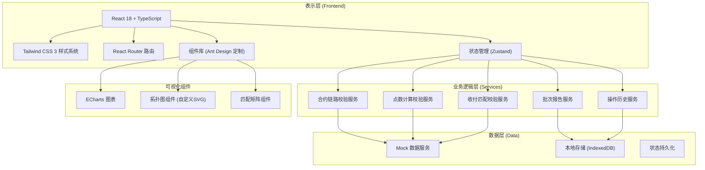

## 1. 架构设计



## 2. 技术选型

### 2.1 核心技术栈
- **前端框架**: React 18 + TypeScript 5.4
- **构建工具**: Vite 5.2
- **样式方案**: Tailwind CSS 3.4 + CSS Variables
- **状态管理**: Zustand 4.5（轻量级，支持中间件持久化）
- **路由管理**: React Router 6.22
- **UI组件库**: Ant Design 5.15（主题定制，金融风格）
- **图表库**: ECharts 5.5（丰富的金融图表支持）
- **日期处理**: Day.js 1.11
- **数据验证**: Zod 3.22
- **本地存储**: IndexedDB + Dexie.js 4.0（操作历史和批次报告持久化）

### 2.2 工程化配置
- **代码规范**: ESLint + Prettier + Husky + lint-staged
- **类型检查**: TypeScript strict模式
- **单元测试**: Vitest + React Testing Library
- **构建优化**: Vite 代码分割、按需加载、Tree Shaking

### 2.3 目录结构
```
src/
├── assets/              # 静态资源（字体、图标）
├── components/          # 公共组件
│   ├── layout/         # 布局组件
│   ├── charts/         # 图表组件
│   ├── table/          # 表格组件
│   └── common/         # 通用组件（按钮、标签、弹窗等）
├── pages/              # 页面组件
│   ├── dashboard/      # 台账首页
│   ├── contract-link/  # 合约链路视图
│   ├── points-calc/    # 点数计算视图
│   ├── payment-match/  # 收付匹配视图
│   ├── history/        # 操作历史
│   └── report/         # 批次报告
├── store/              # 状态管理
│   ├── useFilterStore.ts
│   ├── useContractStore.ts
│   ├── useValidationStore.ts
│   └── useHistoryStore.ts
├── services/           # 业务服务
│   ├── contractService.ts
│   ├── validationService.ts
│   ├── pointsService.ts
│   ├── matchingService.ts
│   ├── reportService.ts
│   └── historyService.ts
├── types/              # TypeScript 类型定义
│   ├── contract.ts
│   ├── validation.ts
│   └── report.ts
├── mock/               # Mock 数据
│   ├── contracts.ts
│   ├── payments.ts
│   └── history.ts
├── utils/              # 工具函数
│   ├── formatters.ts   # 格式化函数（金额、日期、汇率）
│   ├── validators.ts   # 校验工具
│   └── constants.ts    # 常量定义
├── hooks/              # 自定义 Hooks
│   ├── useFilter.ts
│   ├── useValidation.ts
│   └── useReport.ts
├── router/             # 路由配置
├── styles/             # 全局样式
├── App.tsx
└── main.tsx
```

## 3. 路由定义

| 路由路径 | 页面名称 | 说明 |
|----------|----------|------|
| / | 台账首页 | 仪表盘、筛选、指标卡、图表、明细列表 |
| /contract-link | 合约链路视图 | 合约链路拓扑图、覆盖性检查、影响分析 |
| /points-calc | 点数计算视图 | 计算过程拆解、方向校验、计算溯源 |
| /payment-match | 收付匹配视图 | 匹配矩阵、重复匹配检测、匹配追溯 |
| /history | 操作历史 | 变更记录、字段对比、筛选追溯 |
| /report | 批次报告 | 批次管理、报告预览、导出下载 |

## 4. 状态管理设计

### 4.1 Filter Store（筛选状态）
```typescript
interface FilterState {
  contractNo: string;
  counterparty: string;
  currency: string;
  dateRange: [Date, Date];
  status: ValidationStatus[];
  setFilter: (key: keyof FilterState, value: any) => void;
  resetFilters: () => void;
}
```

### 4.2 Contract Store（合约数据）
```typescript
interface ContractState {
  contracts: ForwardContract[];
  rolloverApps: RolloverApplication[];
  payments: PaymentRecord[];
  loading: boolean;
  fetchData: () => Promise<void>;
  updateContract: (id: string, data: Partial<ForwardContract>, reason: string) => void;
}
```

### 4.3 Validation Store（校验结果）
```typescript
interface ValidationState {
  linkValidation: LinkValidationResult[];
  pointsValidation: PointsValidationResult[];
  matchValidation: MatchValidationResult[];
  overallStatus: 'pass' | 'warning' | 'error';
  runValidation: (filters?: FilterState) => void;
  getErrorsByContract: (contractId: string) => ValidationError[];
}
```

### 4.4 History Store（操作历史）
```typescript
interface HistoryState {
  records: HistoryRecord[];
  addRecord: (record: Omit<HistoryRecord, 'id' | 'timestamp'>) => void;
  getByContract: (contractId: string) => HistoryRecord[];
  getByOperator: (operator: string) => HistoryRecord[];
}
```

## 5. 核心业务接口定义

### 5.1 数据模型
```typescript
// 远期合约
interface ForwardContract {
  id: string;
  contractNo: string;
  currencyPair: string; // 如 USD/CNY
  notionalAmount: number;
  tradeDate: Date;
  valueDate: Date;
  forwardRate: number;
  counterparty: string;
  status: 'active' | 'rolled' | 'matured' | 'cancelled';
  rolloverFrom?: string; // 来源合约ID
  rolloverTo?: string;   // 展期后合约ID
  createdAt: Date;
  updatedAt: Date;
  isManuallyModified: boolean;
}

// 展期申请
interface RolloverApplication {
  id: string;
  applicationNo: string;
  originalContractId: string;
  newContractId?: string;
  rolloverDate: Date;
  newValueDate: Date;
  spotRate: number;       // 即期汇率（后补）
  swapPoints: number;     // 掉期点数（后补）
  rolloverPoints: number; // 展期点数
  pointsDirection: 'premium' | 'discount'; // 升水/贴水
  status: 'pending' | 'approved' | 'rejected';
  applicationMaterial: string; // 申请材料
  spotRateMaterial?: string;   // 即期汇率证明材料
  createdAt: Date;
  updatedAt: Date;
  hasSupplementalData: boolean; // 是否有后补数据
}

// 收付记录
interface PaymentRecord {
  id: string;
  voucherNo: string;
  contractId?: string;
  amount: number;
  currency: string;
  paymentDate: Date;
  paymentType: 'settlement' | 'margin' | 'fee';
  matchedStatus: 'unmatched' | 'matched' | 'duplicate';
  matchedContractIds: string[]; // 可能被多次匹配
  materialRef: string; // 银行水单/凭证
  createdAt: Date;
}
```

### 5.2 校验结果模型
```typescript
interface ValidationError {
  id: string;
  type: 'link' | 'points' | 'match';
  severity: 'error' | 'warning' | 'info';
  contractNo?: string;
  voucherNo?: string;
  fieldName: string;
  fieldValue?: any;
  expectedValue?: any;
  errorMessage: string;
  relatedMaterial?: string;
  suggestion: string;
  impactOnResult: number; // 对结果的影响权重 0-100
  isHistoricalJudgment: boolean; // 是否为历史判断
  timestamp: Date;
}

interface LinkValidationResult {
  contractId: string;
  isComplete: boolean;
  hasCoverageGap: boolean;
  coverageGapAmount?: number;
  chain: string[]; // 合约链路ID列表
  errors: ValidationError[];
}

interface PointsValidationResult {
  applicationId: string;
  calculationSteps: CalculationStep[];
  directionCorrect: boolean;
  calculatedPoints: number;
  actualPoints: number;
  deviation: number;
  errors: ValidationError[];
}

interface MatchValidationResult {
  paymentId: string;
  isDuplicate: boolean;
  matchedContractCount: number;
  errors: ValidationError[];
}

interface CalculationStep {
  stepNo: number;
  description: string;
  formula: string;
  input: any;
  output: number;
  isError: boolean;
  impact: number; // 对最终结果影响百分比
}
```

### 5.3 操作历史模型
```typescript
interface HistoryRecord {
  id: string;
  operator: string;
  operationType: 'create' | 'update' | 'delete' | 'manual_correct' | 'supplement';
  contractId?: string;
  paymentId?: string;
  applicationId?: string;
  fieldChanges: FieldChange[];
  reason: string;
  timestamp: Date;
  batchNo?: string;
}

interface FieldChange {
  fieldName: string;
  oldValue: any;
  newValue: any;
  isManuallyModified: boolean;
}
```

### 5.4 批次报告模型
```typescript
interface BatchReport {
  id: string;
  batchNo: string; // 格式：BATCH-YYYYMM-XXX
  period: [Date, Date];
  createdAt: Date;
  createdBy: string;
  contractCount: number;
  rolloverCount: number;
  errorCount: number;
  warningCount: number;
  passRate: number;
  fileName: string; // 格式：外汇远期展期报告_{batchNo}_{YYYYMMDD}.pdf
  content: ReportContent;
}

interface ReportContent {
  summary: ReportSummary;
  contractDetails: ForwardContract[];
  validationErrors: ValidationError[];
  operationHistory: HistoryRecord[];
  watermark: string; // 批次号水印
}
```

## 6. 数据校验规则

### 6.1 合约链路校验规则
1. **完整性校验**：原合约必须有对应的展期申请，展期申请必须对应新合约
2. **覆盖性校验**：新合约名义金额必须 ≥ 原合约未到期金额
3. **时间连续性校验**：新合约起息日必须 = 原合约到期日（或T+1）
4. **币种一致性校验**：展期前后币种对必须一致

### 6.2 点数计算校验规则
1. **即期汇率校验**：即期汇率必须在合理范围内（中间价±2%）
2. **点数方向校验**：根据利率平价理论，高利率货币远期贴水，低利率货币远期升水
3. **计算公式校验**：
   - 远期汇率 = 即期汇率 + 掉期点数
   - 展期点数 = 新远期点数 - 原远期点数
   - 方向必须与币种对利率差方向一致
4. **数值一致性校验**：计算值与申报值偏差不得超过±5bp

### 6.3 收付匹配校验规则
1. **唯一性校验**：同一收付凭证只能匹配一个合约
2. **金额一致性校验**：收付金额必须与合约结算金额一致（±0.5%容差）
3. **时间合理性校验**：收付日期必须在合约到期日前后3个工作日内
4. **完整性校验**：所有到期合约必须有对应的收付记录

## 7. 核心算法

### 7.1 合约链路追踪算法
```
输入：合约ID
输出：完整链路 [原合约, 展期申请, 新合约, ...]
算法：
1. 从当前合约开始，递归查找 rolloverFrom 直到起点
2. 递归查找 rolloverTo 直到终点
3. 检查每个节点之间的关联关系
4. 计算链路覆盖率 = Σ(新合约金额) / Σ(原合约金额)
5. 返回链路和校验结果
```

### 7.2 增量校验算法（补录保护）
```
输入：新增/更新的数据项
输出：校验结果（不覆盖历史判断）
算法：
1. 获取该数据项的历史校验结果，标记为 isHistoricalJudgment = true
2. 基于当前完整数据执行新的校验
3. 对比历史结果与新结果
4. 合并结果集，保留历史判断并标记区分
5. 仅新增差异部分，不修改原有判断
6. 返回合并后的完整校验结果
```

### 7.3 影响权重计算
```
为每个校验项计算对最终结果的影响权重：
- 合约链路完整性：30%
- 合约覆盖性：25%
- 点数方向正确性：20%
- 点数计算准确性：15%
- 收付匹配唯一性：7%
- 收付金额一致性：3%
```

## 8. 性能优化策略

1. **筛选联动优化**：使用 React.memo 包裹图表和表格组件，使用 useMemo 缓存计算结果
2. **大数据渲染**：表格使用虚拟滚动，图表使用增量更新
3. **状态更新优化**：Zustand 状态分片，避免不必要的重渲染
4. **本地缓存**：校验结果缓存到 IndexedDB，相同筛选条件直接读取
5. **懒加载**：路由级代码分割，非核心组件动态导入
