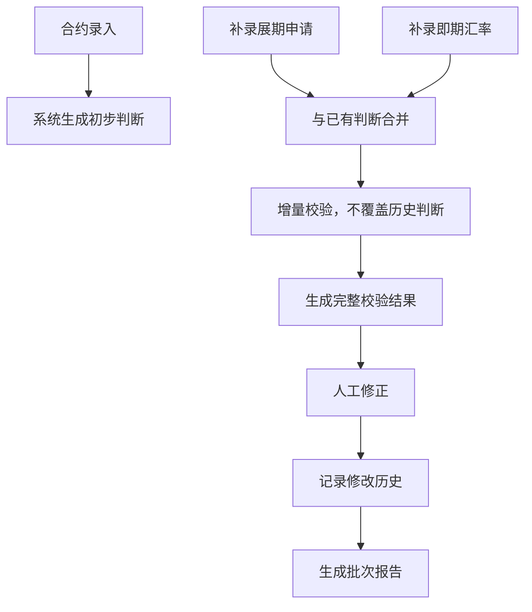
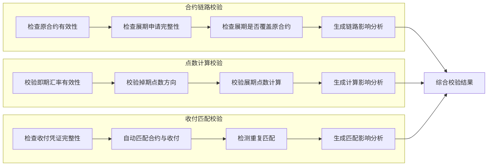

## 1. 产品概述

外汇远期展期台账系统，用于集团财务部门管理外汇远期合约的展期业务，解决原合约、展期点数、实际收付三者口径不一致问题，提供完整的校验链路可视化和操作追溯能力。

- 面向用户：集团财务资金部外汇业务岗、复核岗、审计岗
- 核心价值：降低人工核对差错率，规范展期业务流程，保留完整审计痕迹
- 解决痛点：口径不一致、补录覆盖判断、漏检展期覆盖/点数方向/收付重复、错误提示模糊、无影响链路分析、操作无历史、报告无批次标识

## 2. 核心功能

### 2.1 用户角色

| 角色 | 注册方式 | 核心权限 |
|------|----------|----------|
| 操作岗 | 内部账号 | 录入合约、展期申请、收付记录，发起校验 |
| 复核岗 | 内部账号 | 审核数据、人工修正、查看校验结果 |
| 审计岗 | 内部账号 | 只读查看、操作历史追溯、导出报告 |

### 2.2 功能模块

1. **台账首页**：数据概览仪表盘、筛选条件区、核心指标卡片、异常预警列表
2. **合约链路视图**：原合约→展期申请→新合约的完整链路可视化，展示各环节状态和影响关系
3. **点数计算视图**：展期点数计算过程拆解，方向校验，每一步计算对结果的影响
4. **收付匹配视图**：实际收付与合约自动匹配，重复匹配检测，匹配状态追溯
5. **校验结果面板**：三维度（合约链路/点数计算/收付匹配）校验结果，错误精确定位到材料/对象
6. **操作历史**：所有人工修改记录，字段级变更对比，操作人/时间/原因完整追溯
7. **批次报告**：按批次生成报告，文件名和内容带批次标识，支持导出

### 2.3 页面详情

| 页面名称 | 模块名称 | 功能描述 |
|----------|----------|----------|
| 台账首页 | 筛选条件区 | 多维度筛选（合约编号、交易对手、币种、日期范围、状态），变化后图表和明细实时同步 |
| 台账首页 | 核心指标卡 | 合约总数、展期数、异常数、未匹配收付款、校验通过率等关键指标 |
| 台账首页 | 趋势图表 | 展期数量趋势、异常类型分布、币种分布等可联动图表 |
| 合约链路视图 | 链路拓扑图 | 可视化展示原合约、展期申请、新合约的关联关系，节点状态色标区分 |
| 合约链路视图 | 覆盖性检查 | 自动检测展期是否完整覆盖原合约，标记未覆盖部分 |
| 点数计算视图 | 计算过程拆解 | 即期汇率、掉期点数、展期点数的分步计算，每步可追溯 |
| 点数计算视图 | 方向校验 | 检测点数方向是否正确，错误时提示具体合约和计算参数 |
| 收付匹配视图 | 匹配状态矩阵 | 收付记录与合约的匹配关系，高亮重复匹配和未匹配项 |
| 收付匹配视图 | 重复匹配检测 | 标记同一收付记录被多次匹配的情况，精确到凭证号 |
| 校验结果面板 | 三维度校验 | 合约链路、点数计算、收付匹配独立校验，分别展示对最终结果的影响 |
| 校验结果面板 | 精确错误提示 | 错误信息包含：合约编号/凭证号、具体字段、错误原因、涉及材料、建议操作 |
| 操作历史 | 变更记录列表 | 按时间倒序展示所有修改，支持按合约/操作人/时间筛选 |
| 操作历史 | 字段级对比 | 展示修改前后值对比，高亮差异字段 |
| 批次报告 | 批次管理 | 按月/自定义周期生成批次，批次号唯一标识 |
| 批次报告 | 报告导出 | 导出PDF/Excel，文件名含批次号和日期，内容含批次水印 |

## 3. 核心流程

### 3.1 主要业务流程

1. 操作岗录入远期合约（先到）
2. 系统初步校验合约基本信息
3. 后续补录展期申请和即期汇率（后到）
4. 系统执行三维度完整校验（合约覆盖/点数方向/收付匹配）
5. 复核岗查看校验结果，对异常项进行人工修正
6. 系统记录所有人工修改历史，保留审计痕迹
7. 按批次生成报告，文件名和内容带批次标识
8. 审计岗可追溯完整操作历史和校验链路

### 3.2 数据保护机制

### 3.3 三维度校验流程

## 4. 用户界面设计

### 4.1 设计风格

- **设计理念**：专业金融级工作台，严谨、清晰、可信赖
- **主色调**：深蓝 #0F2B5B（专业、稳重），辅以 #1E40AF（交互）
- **辅助色**：
  - 成功：#059669（校验通过）
  - 警告：#D97706（待确认）
  - 错误：#DC2626（校验失败）
  - 信息：#0284C7（提示）
- **字体**：
  - 标题：Noto Serif SC（专业感）
  - 正文：Noto Sans SC（清晰度）
  - 数字：JetBrains Mono（等宽对齐，便于比对）
- **布局**：左右分栏，左侧导航+右侧内容，卡片式模块，清晰的视觉层级
- **图标风格**：线性图标，统一2px描边，金融专业图标集
- **数据展示**：表格采用斑马纹+悬停高亮，重要数据使用千分位分隔和颜色编码

### 4.2 页面设计概要

| 页面名称 | 模块名称 | UI元素 |
|----------|----------|--------|
| 台账首页 | 顶部导航 | 面包屑、用户信息、通知、批次切换、报告导出 |
| 台账首页 | 筛选栏 | 下拉选择、日期范围、搜索框、重置按钮、筛选标签 |
| 台账首页 | 指标卡 | 大号数字、趋势箭头、环比变化、状态色标 |
| 台账首页 | 图表区 | 折线图（趋势）、柱状图（分布）、饼图（占比），支持联动 |
| 台账首页 | 明细列表 | 数据表格，支持排序、分页、行展开查看详情 |
| 合约链路视图 | 拓扑图 | 节点卡片、连接线、状态色标、悬停详情、缩放控制 |
| 合约链路视图 | 影响分析 | 分步展示，每步标注对最终结果的影响权重 |
| 点数计算视图 | 计算面板 | 公式展示、中间结果、高亮错误项、计算溯源 |
| 收付匹配视图 | 匹配矩阵 | 行=合约，列=收付，交叉点=匹配状态，颜色编码 |
| 校验结果面板 | 结果列表 | 错误分类标签、精确错误信息、快速定位按钮 |
| 操作历史 | 时间线 | 垂直时间线，操作卡片，展开查看字段对比 |
| 批次报告 | 预览页 | 报告内容预览、批次水印、下载按钮、发送邮件 |

### 4.3 交互细节

- **筛选联动**：筛选条件变化时，图表和明细表格平滑过渡更新，显示loading骨架屏
- **补录保护**：补录数据时，已有判断结果显示为"历史判断"，新增判断显示为"新增判断"，清晰区分
- **错误提示**：错误信息格式：`[合约#XXX] 字段[YYY]值错误：[具体原因]，涉及材料：[材料名称]，建议操作：[具体建议]`
- **人工修改**：修改前弹窗确认，必填修改原因，修改后字段显示"人工修正"标签
- **链路追溯**：点击任意节点/计算步骤/匹配项，高亮显示其在整个链路中的位置和影响

### 4.4 响应式

- 桌面端优先，优化1920×1080和2560×1440分辨率
- 平板端（≥1024px）：保持双栏布局，适当压缩侧边栏宽度
- 移动端（<1024px）：单栏布局，导航改为抽屉式，表格支持横向滚动
- 触控优化：增大可点击区域（≥44px），支持双指缩放拓扑图

### 4.5 数据可视化规范

- 所有金额统一保留2位小数，显示币种符号
- 汇率保留4位小数，点数保留基点（bp）单位
- 日期格式：YYYY-MM-DD，时间格式：YYYY-MM-DD HH:mm:ss
- 状态标签统一圆角4px，内边距4px 8px，字体12px
- 图表配色与系统主题一致，支持色盲友好模式
