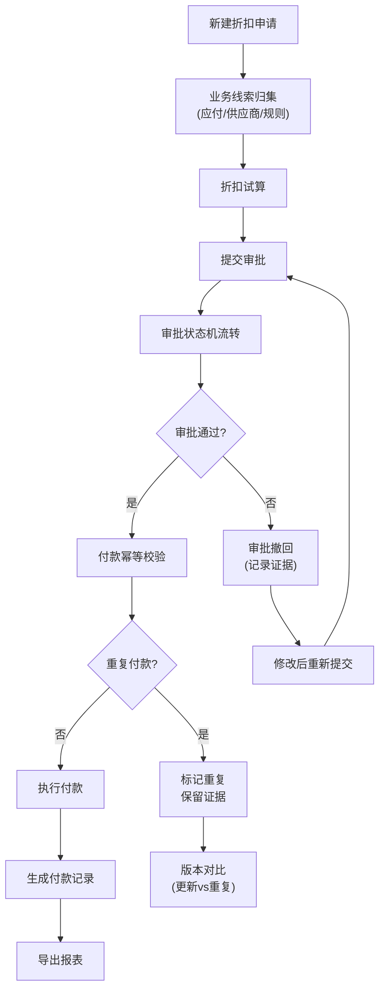

## 1. 产品概述

供应链动态折扣付款系统，面向采购财务与业务同事，解决供应商提前付款折扣流程中的动态变化管理问题。

- 核心解决：账期/折扣率频繁变更、审批状态追踪、证据链留存、重复付款识别、业务线索归集
- 目标用户：采购财务人员、业务同事、审批交接人员

## 2. 核心功能

### 2.1 用户角色

| 角色 | 核心权限 |
|------|----------|
| 业务录入员 | 新建折扣申请、上传材料、提交审批 |
| 财务审核员 | 折扣试算、审核操作、撤回审批、查看完整证据链 |
| 审批管理员 | 状态流转、付款确认、导出报表 |

### 2.2 功能模块

1. **折扣申请列表页**：多维度筛选、批量操作、状态概览
2. **折扣申请详情页**：折扣试算、审批状态机、付款记录、证据链追踪
3. **新建/编辑申请页**：应付账款关联、供应商信息、折扣规则配置
4. **历史回溯页**：版本对比、变更记录、重复提交识别

### 2.3 页面详情

| 页面名称 | 模块名称 | 功能描述 |
|---------|---------|---------|
| 折扣申请列表 | 筛选区域 | 按供应商、账期、折扣率、审批状态、付款状态多维度筛选 |
| 折扣申请列表 | 数据表格 | 显示核心信息，支持排序、分页、批量选择 |
| 折扣申请列表 | 操作栏 | 新建、导出、批量审批、批量撤回 |
| 申请详情页 | 折扣试算器 | 实时计算提前天数、折扣金额、实际付款、年化收益率 |
| 申请详情页 | 审批状态机 | 可视化状态流转图，记录每个节点的操作人、时间、备注 |
| 申请详情页 | 付款幂等记录 | 显示所有付款尝试，标记重复提交与实际付款 |
| 申请详情页 | 证据链时间线 | 完整记录所有变更、附件、操作日志 |
| 申请详情页 | 版本对比 | 高亮显示两次提交的差异（更新vs重复） |
| 新建申请页 | 业务线索归集 | 自动关联应付账款、供应商等级、历史折扣规则 |
| 新建申请页 | 材料上传 | 支持补传，自动检测重复文件 |

## 3. 核心流程

## 4. 用户界面设计

### 4.1 设计风格

- **主色调**：深灰蓝(#1e3a5f) - 专业财务系统调性
- **强调色**：琥珀橙(#f59e0b) - 状态警告、重要操作
- **成功色**：翠绿(#10b981) - 审批通过、付款完成
- **中性色**：浅灰背景、深灰文字 - 确保长时间使用不疲劳
- **按钮风格**：直角矩形，2px边框，悬停有轻微阴影
- **字体**：系统默认等宽字体用于数字展示，保证对齐可读性
- **布局**：顶部导航 + 侧边筛选 + 主内容区卡片式布局
- **图标**：简洁线性图标，避免花哨装饰

### 4.2 页面设计概述

| 页面名称 | 模块名称 | UI 要素 |
|---------|---------|---------|
| 申请列表 | 筛选区域 | 紧凑排列的下拉筛选器，可折叠展开 |
| 申请列表 | 数据表格 | 斑马纹行，状态列彩色标签，悬停高亮 |
| 申请详情 | 状态机 | 横向时间线，节点用不同颜色区分状态 |
| 申请详情 | 证据链 | 纵向时间线，左侧图标+右侧内容，附件可点击预览 |
| 申请详情 | 版本对比 | 双栏布局，差异部分用底色高亮标注 |
| 新建申请 | 试算器 | 实时计算，输入变化时数字有平滑过渡动画 |

### 4.3 响应式

- 桌面端优先设计，1280px以上最佳体验
- 平板端自适应，筛选区域改为顶部堆叠
- 移动端表格支持横向滚动，核心信息优先展示

## 5. 关键业务规则

### 5.1 证据链规则
- 任何状态变更必须记录：操作人、时间、IP、备注
- 折扣天数错误修正需标注原始值与修正值
- 审批撤回需填写强制原因
- 所有附件永久保存，不可删除（可标记作废）

### 5.2 付款幂等规则
- 同一申请+同一金额+同一日期视为重复付款
- 重复付款自动标记但不阻止，需人工确认
- 付款记录版本号递增，保留所有历史版本

### 5.3 重复提交识别规则
- 文件MD5校验识别完全重复
- 关键字段对比识别更新内容
- 版本对比高亮显示：新增/修改/删除/未变化
