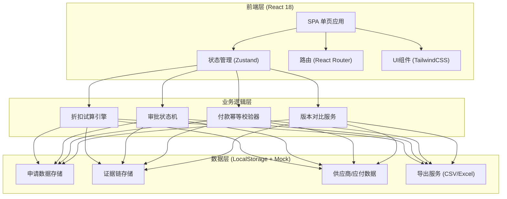

## 1. 架构设计



## 2. 技术描述

- **前端框架**: React@18 + TypeScript@5
- **构建工具**: Vite@5
- **样式方案**: TailwindCSS@3 + PostCSS
- **状态管理**: Zustand@4 (轻量，适合业务系统)
- **路由方案**: React Router@6
- **图标库**: Lucide React (线性简洁图标)
- **数据存储**: LocalStorage (前端持久化) + Mock数据
- **导出功能**: SheetJS (xlsx) + 原生CSV导出
- **后端**: 无后端，纯前端实现（演示用）

## 3. 路由定义

| 路由 | 页面 | 用途 |
|------|------|------|
| / | 折扣申请列表 | 首页，展示所有申请，支持筛选、批量操作 |
| /application/:id | 申请详情 | 查看单条申请完整信息，包含状态机、证据链、版本对比 |
| /application/new | 新建申请 | 创建新的折扣申请 |
| /application/:id/edit | 编辑申请 | 修改已有申请（创建新版本） |

## 4. 核心类型定义

```typescript
// 折扣申请主数据
interface DiscountApplication {
  id: string;
  applicationNo: string;
  supplierId: string;
  supplierName: string;
  supplierLevel: 'A' | 'B' | 'C' | 'D';
  payableId: string;
  payableAmount: number;
  originalDueDate: string;
  proposedDueDate: string;
  discountRate: number;
  discountAmount: number;
  actualPaymentAmount: number;
  status: ApplicationStatus;
  currentVersion: number;
  createdAt: string;
  updatedAt: string;
  createdBy: string;
}

type ApplicationStatus = 
  | 'DRAFT'
  | 'SUBMITTED'
  | 'APPROVING'
  | 'APPROVED'
  | 'REJECTED'
  | 'WITHDRAWN'
  | 'PAID'
  | 'CANCELLED';

// 审批状态流转记录
interface StatusTransition {
  id: string;
  applicationId: string;
  fromStatus: ApplicationStatus;
  toStatus: ApplicationStatus;
  operator: string;
  operatorIp: string;
  timestamp: string;
  remark: string;
}

// 付款记录（幂等）
interface PaymentRecord {
  id: string;
  applicationId: string;
  paymentNo: string;
  amount: number;
  paymentDate: string;
  isDuplicate: boolean;
  duplicateOf: string | null;
  version: number;
  operator: string;
  status: 'PENDING' | 'SUCCESS' | 'FAILED';
}

// 证据链条目
interface EvidenceItem {
  id: string;
  applicationId: string;
  type: 'STATUS_CHANGE' | 'FIELD_CHANGE' | 'ATTACHMENT' | 'COMMENT' | 'PAYMENT';
  content: string;
  operator: string;
  timestamp: string;
  metadata: Record<string, any>;
}

// 版本对比
interface VersionDiff {
  field: string;
  oldValue: any;
  newValue: any;
  changeType: 'ADD' | 'MODIFY' | 'DELETE' | 'UNCHANGED';
}

// 供应商信息
interface Supplier {
  id: string;
  name: string;
  level: 'A' | 'B' | 'C' | 'D';
  creditRating: number;
  historicalDiscountCount: number;
}

// 应付账款
interface Payable {
  id: string;
  supplierId: string;
  amount: number;
  dueDate: string;
  invoiceNo: string;
  relatedContracts: string[];
}
```

## 5. 核心服务模块

### 5.1 折扣试算引擎

```typescript
class DiscountCalculator {
  static calculateDaysEarly(originalDueDate: Date, proposedDate: Date): number;
  static calculateDiscountAmount(principal: number, rate: number, days: number): number;
  static calculateAnnualizedReturn(discountAmount: number, principal: number, days: number): number;
  static validateDiscountRule(supplierLevel: string, rate: number): boolean;
}
```

### 5.2 审批状态机

```typescript
class ApprovalStateMachine {
  private currentState: ApplicationStatus;
  private transitions: Map<ApplicationStatus, ApplicationStatus[]>;
  
  canTransition(to: ApplicationStatus): boolean;
  transition(to: ApplicationStatus, operator: string, remark: string): StatusTransition;
  getAvailableTransitions(): ApplicationStatus[];
}
```

### 5.3 付款幂等校验器

```typescript
class PaymentIdempotency {
  static generateKey(applicationId: string, amount: number, date: string): string;
  static checkDuplicate(key: string): PaymentRecord | null;
  static recordPayment(payment: PaymentRecord): void;
  static getPaymentHistory(applicationId: string): PaymentRecord[];
}
```

### 5.4 版本对比服务

```typescript
class VersionComparator {
  static compareVersions(v1: DiscountApplication, v2: DiscountApplication): VersionDiff[];
  static isSubstantiveChange(diffs: VersionDiff[]): boolean;
  static highlightDiffs(diffs: VersionDiff[]): React.ReactNode;
}
```

## 6. 状态管理结构 (Zustand)

```typescript
interface AppState {
  applications: DiscountApplication[];
  currentApplication: DiscountApplication | null;
  statusTransitions: StatusTransition[];
  paymentRecords: PaymentRecord[];
  evidenceItems: EvidenceItem[];
  suppliers: Supplier[];
  payables: Payable[];
  filters: ApplicationFilters;
  
  actions: {
    loadMockData: () => void;
    createApplication: (data: Partial<DiscountApplication>) => string;
    updateApplication: (id: string, data: Partial<DiscountApplication>) => void;
    transitionStatus: (id: string, to: ApplicationStatus, remark: string) => void;
    recordPayment: (applicationId: string, amount: number) => PaymentRecord;
    addEvidence: (item: Omit<EvidenceItem, 'id' | 'timestamp'>) => void;
    setFilters: (filters: Partial<ApplicationFilters>) => void;
    exportToCSV: (ids: string[]) => Blob;
    exportToExcel: (ids: string[]) => Blob;
  };
}
```

## 7. 数据初始化（Mock）

创建包含以下内容的模拟数据：
- 20条折扣申请记录（覆盖各种状态）
- 10个供应商（不同等级）
- 30条应付账款记录
- 50条审批流转记录
- 20条付款记录（含重复付款示例）
- 100条证据链记录

## 8. 性能优化点

- 列表虚拟滚动（大数据量时）
- 状态机计算缓存
- 导出文件分片生成
- 图片/附件懒加载
- 搜索防抖处理
