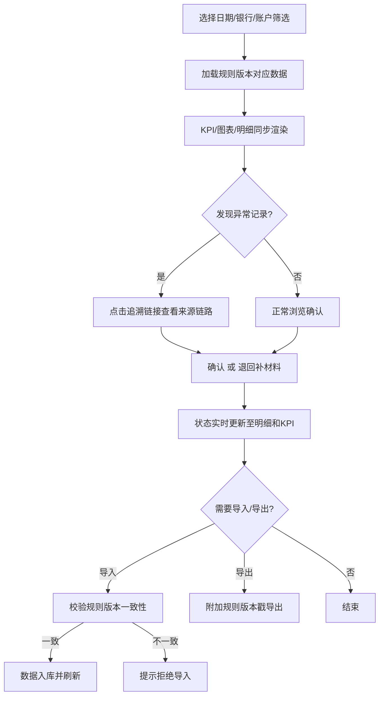

## 1. 产品概述

集团司库"现金管理归集限额"工具，解决子账户归集过程中监管限额、留底余额、跨行到账时间口径不一致的问题，实现筛选-图表-明细联动、来源可追溯、规则版本统一的现金归集管理。

- 目标用户：集团司库人员、资金管理岗、结算中心操作员
- 核心价值：统一归集口径，消除余额/限额/规则间来回切换，异常记录自动分类，全程可追溯

## 2. 核心功能

### 2.1 用户角色

| 角色 | 权限说明 |
|------|----------|
| 司库管理员 | 全部功能：查看、确认、退回、导出、规则配置 |
| 资金岗操作员 | 查看明细、确认归集、退回补材料 |
| 结算复核员 | 查看明细、复核待确认记录 |

### 2.2 功能模块

1. **总览仪表盘**：全局筛选面板、KPI指标卡、归集趋势图、限额使用率图、异常预警列表
2. **归集限额明细**：可筛选数据表、状态标签（已处理/待确认/退回补材料）、来源追溯弹窗、批量操作
3. **规则与版本管理**：规则版本对照、限额校验配置、归集状态口径定义、导入导出

### 2.3 页面详情

| 页面 | 模块 | 功能说明 |
|------|------|----------|
| 总览仪表盘 | 全局筛选面板 | 按日期、银行、子账户、归集状态、规则版本筛选；筛选变化后图表和KPI同步刷新 |
| 总览仪表盘 | KPI指标卡 | 当日归集总额、留底不足笔数、限额超用笔数、待确认笔数、退回补材料笔数 |
| 总览仪表盘 | 归集趋势图 | 近7日/30日归集金额折线图，按银行分组，异常点标注 |
| 总览仪表盘 | 限额使用率图 | 各子账户监管限额使用率柱状图，超限标红 |
| 总览仪表盘 | 异常预警列表 | 留底不足、限额超用、回执晚到重复归集的实时预警，可点击跳转明细 |
| 归集限额明细 | 筛选与搜索 | 全局筛选联动，支持子账户名称/编号模糊搜索 |
| 归集限额明细 | 数据表 | 子账户、余额、归集金额、留底余额、监管限额、限额余额、归集状态、规则版本、来源追溯链接 |
| 归集限额明细 | 状态标签 | 已处理（绿色）、待确认（琥珀色）、退回补材料（红色），可筛选 |
| 归集限额明细 | 来源追溯弹窗 | 点击追溯链接弹出，展示导入来源、原始记录、规则版本、校验过程链路 |
| 归集限额明细 | 批量操作 | 勾选多条记录进行批量确认、批量退回 |
| 规则与版本管理 | 规则版本对照 | 当前生效版本与历史版本对比，字段差异高亮 |
| 规则与版本管理 | 限额校验配置 | 监管限额阈值、留底比例、归集触发条件配置 |
| 规则与版本管理 | 归集状态口径定义 | 已处理/待确认/退回补材料的判定规则和口径说明 |
| 规则与版本管理 | 导入导出 | 导入子账户数据（校验规则版本一致性），导出带规则版本戳的明细 |

## 3. 核心流程

1. 司库管理员选择日期和银行，系统加载对应规则版本下的子账户归集数据
2. 筛选条件变化后，KPI卡片、趋势图、限额图、明细表同步刷新
3. 发现异常记录（留底不足/限额超用/回执晚到），点击追溯链接查看完整来源链路
4. 对待确认记录执行确认或退回补材料操作，状态实时更新
5. 导入新数据时系统校验规则版本一致性，不一致则提示并拒绝
6. 导出时自动附加当前规则版本戳、限额校验结果、归集状态口径标识

## 4. 用户界面设计

### 4.1 设计风格

- **主色调**：深蓝灰（#1a1f2e）背景 + 青蓝（#0ea5e9）强调色 + 琥珀色（#f59e0b）预警
- **辅助色**：翠绿（#10b981）已处理、红色（#ef4444）退回、锌灰（#71717a）次要文字
- **按钮风格**：圆角微凸（rounded-lg），主按钮填充强调色，次按钮边框
- **字体**：JetBrains Mono（数据/金额）+ Noto Sans SC（界面文字）
- **布局风格**：左侧固定导航 + 右侧内容区，卡片式模块，数据密集但层次分明
- **图标风格**：Lucide线性图标，2px描边

### 4.2 页面设计概览

| 页面 | 模块 | UI元素 |
|------|------|--------|
| 总览仪表盘 | 全局筛选面板 | 顶部横向筛选条，日期范围选择器、银行下拉、状态多选、版本下拉，筛选变化带过渡动画 |
| 总览仪表盘 | KPI指标卡 | 5个等宽卡片横排，数字用JetBrains Mono大号显示，异常指标带脉冲动画 |
| 总览仪表盘 | 归集趋势图 | 折线图，多系列按银行分色，异常点用红色圆点+tooltip |
| 总览仪表盘 | 限额使用率图 | 横向柱状图，使用率>80%渐变至红色，hover显示具体数值 |
| 总览仪表盘 | 异常预警列表 | 紧凑列表，左侧色条标识类型，点击整行跳转明细并高亮对应记录 |
| 归集限额明细 | 筛选与搜索 | 与仪表盘共享筛选状态，额外增加搜索框和状态标签筛选 |
| 归集限额明细 | 数据表 | 斑马纹行，金额列右对齐，状态列彩色标签，追溯列链接样式，可排序 |
| 归集限额明细 | 追溯弹窗 | 右侧滑入抽屉，时间轴展示来源链路，每步标注规则版本 |
| 归集限额明细 | 批量操作 | 表头勾选框 + 底部浮动操作栏，确认/退回按钮 |
| 规则与版本管理 | 版本对照 | 左右分栏对比，差异字段高亮背景色 |
| 规则与版本管理 | 限额配置 | 表单卡片，数字输入框带单位提示，保存需确认 |
| 规则与版本管理 | 口径定义 | 定义列表，每条口径带说明和示例 |
| 规则与版本管理 | 导入导出 | 拖拽上传区 + 导出按钮，导入进度条+校验结果提示 |

### 4.3 响应式

- 桌面优先设计（1440px基准），1280px以上完整展示
- 1024-1280px图表缩为两列，筛选面板可折叠
- 1024px以下筛选面板转为抽屉式

### 4.4 3D场景

不适用
