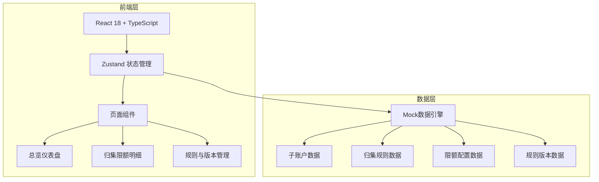
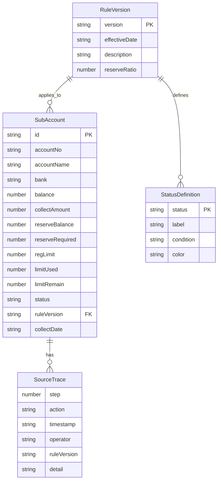

## 1. 架构设计



## 2. 技术说明

- 前端：React@18 + TypeScript + Tailwind CSS@3 + Vite
- 初始化工具：vite-init
- 后端：无（纯前端，Mock数据）
- 数据库：无（内存数据 + LocalStorage持久化）
- 图表库：Recharts
- 状态管理：Zustand

## 3. 路由定义

| 路由 | 用途 |
|------|------|
| / | 总览仪表盘，KPI指标、图表、异常预警 |
| /details | 归集限额明细，数据表、追溯、批量操作 |
| /rules | 规则与版本管理，版本对照、限额配置、口径定义、导入导出 |

## 4. API定义

无后端API，使用前端Mock数据。数据接口通过Zustand store提供：

```typescript
interface SubAccount {
  id: string
  accountNo: string
  accountName: string
  bank: string
  balance: number
  collectAmount: number
  reserveBalance: number
  reserveRequired: number
  regLimit: number
  limitUsed: number
  limitRemain: number
  status: "processed" | "pending" | "returned"
  ruleVersion: string
  collectDate: string
  sourceTrace: SourceTrace[]
  arrivalTime?: string
  isDuplicateCollect?: boolean
}

interface SourceTrace {
  step: number
  action: string
  timestamp: string
  operator: string
  ruleVersion: string
  detail: string
}

interface RuleVersion {
  version: string
  effectiveDate: string
  description: string
  reserveRatio: number
  regLimitConfig: Record<string, number>
  statusDefinitions: StatusDefinition[]
}

interface StatusDefinition {
  status: "processed" | "pending" | "returned"
  label: string
  condition: string
  color: string
}

interface FilterState {
  dateRange: [string, string]
  banks: string[]
  statuses: string[]
  ruleVersion: string
  searchKeyword: string
}
```

## 5. 服务端架构

不适用（纯前端项目）

## 6. 数据模型

### 6.1 数据模型定义



### 6.2 Mock数据说明

样例数据包含以下边缘场景：
- **留底不足**：子账户余额不足以维持规定留底，归集金额被削减
- **限额超用**：归集后使用金额超过监管限额，触发预警
- **回执晚到重复归集**：跨行转账回执延迟到达，系统误判未归集而重复发起归集

至少包含5家银行、15个子账户、覆盖3个规则版本的30条以上记录。
