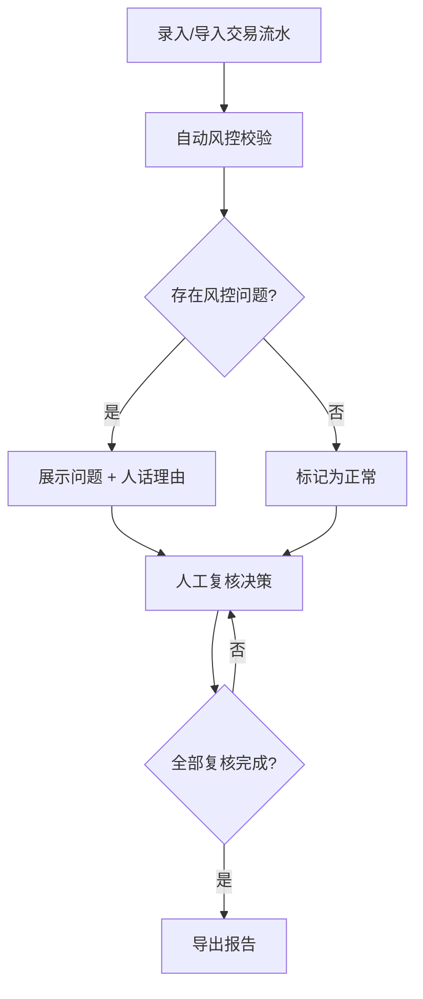

## 1. 产品概述

企业支付团队复核虚拟卡交易时，预算科目、商户类别和员工报销经常对不上。本产品是一个本地启动的"虚拟卡交易风控复核"小服务，覆盖交易录入→自动处理→人工复核→导出报告的完整链路，自动识别预算越权、商户类别错配、报销重复三类风控问题，给出人话理由而非枚举值，冲突数据先留痕再判断。

- 目标用户：企业支付/财务团队复核人员
- 核心价值：把散落在三个维度的矛盾（交易、员工、预算）集中到一个可追溯的复核流程中，自动判断 + 人工决策，导出带完整风控标记的报告

## 2. 核心功能

### 2.1 用户角色

| 角色 | 注册方式 | 核心权限 |
|------|----------|----------|
| 复核员 | 本地账号登录 | 录入交易、查看复核结果、导出报告 |
| 管理员 | 本地账号登录 | 以上全部 + 配置预算科目、商户类别映射 |

### 2.2 功能模块

1. **交易录入页**：批量导入/单条录入虚拟卡流水，关联员工信息和预算科目
2. **处理复核页**：自动风控校验结果展示，人工逐条复核决策
3. **导出报告页**：一键导出含风控标记的复核报告（CSV）

### 2.3 页面详情

| 页面名称 | 模块名称 | 功能描述 |
|----------|----------|----------|
| 交易录入 | 交易信息表单 | 录入交易编号、金额、商户名称、商户类别码(MCC)、交易时间 |
| 交易录入 | 员工信息补录 | 关联员工工号、姓名、部门、报销单号 |
| 交易录入 | 预算科目绑定 | 选择预算科目、可用额度、已用额度 |
| 交易录入 | 批量导入 | CSV 文件批量导入交易流水 |
| 处理复核 | 交易列表 | 展示全部交易及风控状态标签（正常/预警/异常） |
| 处理复核 | 风控校验面板 | 逐条展示预算越权/商户类别错/报销重复的判断及人话理由 |
| 处理复核 | 人工决策操作 | 复核通过/退回/标记待查，填写复核意见 |
| 导出报告 | 报告预览 | 预览导出内容：交易明细 + 风控标记 + 复核结论 |
| 导出报告 | CSV 导出 | 下载含全部风控信息的 CSV 报告 |

## 3. 核心流程

1. 复核员录入或批量导入虚拟卡交易流水
2. 系统自动进行三类风控校验：预算越权（交易金额 > 预算剩余额度）、商户类别错配（MCC 与预算科目不匹配）、报销重复（同一员工+金额+商户+时间窗口内重复）
3. 三类数据（交易主信息、员工信息、预算科目）冲突时，系统先记录冲突详情，再给出自动判断建议和人话理由
4. 复核员逐条查看校验结果，做出人工决策（通过/退回/待查）
5. 完成复核后导出报告，报告中包含所有风控问题和复核结论

## 4. 用户界面设计

### 4.1 设计风格

- 主色：深靛蓝(#1E3A5F) + 琥珀预警色(#D97706) + 翠绿正常色(#059669)
- 按钮风格：圆角8px，扁平微阴影，主操作实色填充，次操作描边
- 字体：JetBrains Mono（数据/编号）+ Noto Sans SC（正文）
- 布局：左侧导航栏 + 右侧内容区，顶部状态概览条
- 图标：lucide-react 线性图标

### 4.2 页面设计概览

| 页面名称 | 模块名称 | UI 元素 |
|----------|----------|----------|
| 交易录入 | 交易信息表单 | 卡片式表单，分步录入，输入框带图标前缀 |
| 交易录入 | 批量导入 | 虚线拖拽区域 + 文件选择按钮，导入进度条 |
| 处理复核 | 交易列表 | 表格布局，状态标签彩色胶囊，行点击展开详情 |
| 处理复核 | 风控校验面板 | 右侧抽屉面板，三类问题分色展示，人话理由高亮 |
| 处理复核 | 人工决策操作 | 底部操作栏，三个决策按钮 + 意见输入框 |
| 导出报告 | 报告预览 | 表格预览，风控标记列带图标，可筛选 |
| 导出报告 | CSV 导出 | 主操作按钮，导出完成 toast 提示 |

### 4.3 响应式

- 桌面优先，最小宽度 1024px
- 表格区域支持横向滚动
- 侧边导航可折叠

### 4.4 3D 场景

不适用
