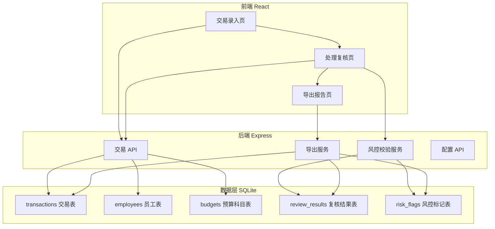
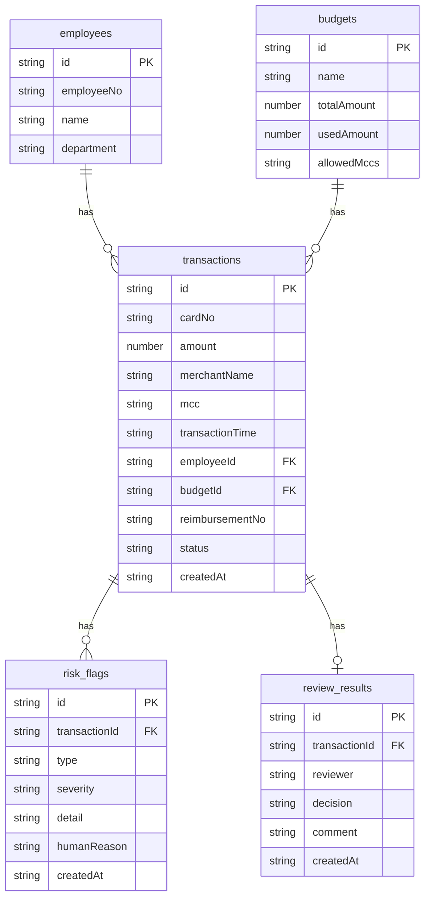

## 1. 架构设计



## 2. 技术说明

- 前端：React@18 + TypeScript + Tailwind CSS@3 + Vite
- 初始化工具：vite-init (react-express-ts 模板)
- 后端：Express@4 + TypeScript (ESM)
- 数据库：SQLite (better-sqlite3)
- 状态管理：Zustand

## 3. 路由定义

| 路由 | 用途 |
|------|------|
| / | 首页，展示统计概览（交易数、待复核数、异常数） |
| /entry | 交易录入页，单条录入和批量导入 |
| /review | 处理复核页，风控校验和人工决策 |
| /export | 导出报告页，预览和下载 |

## 4. API 定义

### 4.1 交易 API

```typescript
// POST /api/transactions - 创建单条交易
interface CreateTransactionReq {
  cardNo: string;
  amount: number;
  merchantName: string;
  mcc: string;
  transactionTime: string;
  employeeId: string;
  budgetId: string;
  reimbursementNo?: string;
}

interface Transaction {
  id: string;
  cardNo: string;
  amount: number;
  merchantName: string;
  mcc: string;
  transactionTime: string;
  employeeId: string;
  budgetId: string;
  reimbursementNo: string;
  status: "pending" | "normal" | "warning" | "error";
  createdAt: string;
}

// POST /api/transactions/batch - 批量导入
interface BatchImportReq {
  transactions: CreateTransactionReq[];
}

// GET /api/transactions - 查询交易列表
interface ListTransactionsReq {
  page?: number;
  pageSize?: number;
  status?: string;
  keyword?: string;
}

// GET /api/transactions/:id - 查询单条交易详情（含风控标记和复核结果）
```

### 4.2 风控校验 API

```typescript
// POST /api/risk/check/:transactionId - 对单条交易执行风控校验
interface RiskCheckResult {
  transactionId: string;
  flags: RiskFlag[];
  autoJudgment: {
    decision: "pass" | "reject" | "review";
    reason: string; // 人话理由
  };
}

interface RiskFlag {
  type: "budget_overrun" | "mcc_mismatch" | "duplicate_reimbursement";
  severity: "warning" | "error";
  detail: string; // 结构化详情
  humanReason: string; // 人话理由，如"该笔交易金额3200元，超出预算科目'差旅费'剩余额度1500元"
}
```

### 4.3 复核 API

```typescript
// POST /api/reviews - 提交复核决策
interface CreateReviewReq {
  transactionId: string;
  decision: "approved" | "rejected" | "pending_review";
  comment?: string;
}

interface ReviewResult {
  id: string;
  transactionId: string;
  reviewer: string;
  decision: string;
  comment: string;
  createdAt: string;
}

// GET /api/reviews - 查询复核结果列表
```

### 4.4 导出 API

```typescript
// GET /api/export/csv - 导出复核报告 CSV
// Response: CSV 文件流
// 列：交易编号、金额、商户、MCC、员工、部门、预算科目、风控类型、风控理由、复核结论、复核意见、复核时间
```

### 4.5 配置 API

```typescript
// GET /api/budgets - 获取预算科目列表
// POST /api/budgets - 创建预算科目
interface Budget {
  id: string;
  name: string;
  totalAmount: number;
  usedAmount: number;
  allowedMccs: string[]; // 允许的商户类别码列表
}

// GET /api/employees - 获取员工列表
// POST /api/employees - 创建员工
interface Employee {
  id: string;
  name: string;
  department: string;
  employeeNo: string;
}

// GET /api/mcc-mapping - 获取 MCC 类别映射
```

## 5. 服务端架构图


- Controller：路由和请求验证
- Service：业务逻辑（风控校验核心逻辑在此）
- Repository：数据库操作封装

## 6. 数据模型

### 6.1 数据模型定义



### 6.2 数据定义语言

```sql
CREATE TABLE employees (
  id TEXT PRIMARY KEY,
  employeeNo TEXT NOT NULL UNIQUE,
  name TEXT NOT NULL,
  department TEXT NOT NULL
);

CREATE TABLE budgets (
  id TEXT PRIMARY KEY,
  name TEXT NOT NULL,
  totalAmount REAL NOT NULL,
  usedAmount REAL NOT NULL DEFAULT 0,
  allowedMccs TEXT NOT NULL DEFAULT '[]'
);

CREATE TABLE transactions (
  id TEXT PRIMARY KEY,
  cardNo TEXT NOT NULL,
  amount REAL NOT NULL,
  merchantName TEXT NOT NULL,
  mcc TEXT NOT NULL,
  transactionTime TEXT NOT NULL,
  employeeId TEXT NOT NULL,
  budgetId TEXT NOT NULL,
  reimbursementNo TEXT,
  status TEXT NOT NULL DEFAULT 'pending',
  createdAt TEXT NOT NULL DEFAULT (datetime('now')),
  FOREIGN KEY (employeeId) REFERENCES employees(id),
  FOREIGN KEY (budgetId) REFERENCES budgets(id)
);

CREATE TABLE risk_flags (
  id TEXT PRIMARY KEY,
  transactionId TEXT NOT NULL,
  type TEXT NOT NULL,
  severity TEXT NOT NULL,
  detail TEXT NOT NULL,
  humanReason TEXT NOT NULL,
  createdAt TEXT NOT NULL DEFAULT (datetime('now')),
  FOREIGN KEY (transactionId) REFERENCES transactions(id)
);

CREATE TABLE review_results (
  id TEXT PRIMARY KEY,
  transactionId TEXT NOT NULL UNIQUE,
  reviewer TEXT NOT NULL,
  decision TEXT NOT NULL,
  comment TEXT,
  createdAt TEXT NOT NULL DEFAULT (datetime('now')),
  FOREIGN KEY (transactionId) REFERENCES transactions(id)
);

CREATE INDEX idx_transactions_status ON transactions(status);
CREATE INDEX idx_transactions_employee ON transactions(employeeId);
CREATE INDEX idx_transactions_budget ON transactions(budgetId);
CREATE INDEX idx_risk_flags_transaction ON risk_flags(transactionId);
CREATE INDEX idx_risk_flags_type ON risk_flags(type);
```
