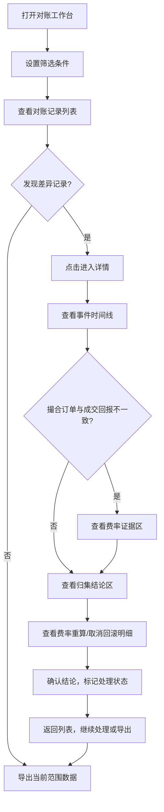

## 1. 产品概述

经纪商撮合费对账系统，面向交易平**台业务同事**，解决撮合费结算中因订单取消、跨市场成交、费率版本变动带来的对账难题。系统需将撮合订单与成交回报的差异可视化，以经纪商费率作为补充证据，确保对账结论可追溯、可印证、可导出。

- 核心价值：将"撤单仍计费 × 跨市场重复 × 费率版本错晚到"三种复杂场景的互相影响透明化，让业务人员能快速定位差异、确认结论、完成对账
- 目标用户：交易平台结算部门业务同事

## 2. 核心功能

### 2.1 用户角色

| 角色 | 注册方式 | 核心权限 |
|------|----------|----------|
| 业务对账员 | 管理员分配账号 | 筛选查看对账记录、处理差异、导出数据 |
| 对账主管 | 管理员分配账号 | 审核处理结果、查看汇总报表、导出数据 |

### 2.2 功能模块

1. **对账工作台**：多维筛选器、对账记录列表、批量处理操作、范围一致的导出
2. **对账详情**：时间线事件流、费率证据区、归集结论区、费率重算/取消回滚明细

### 2.3 页面详情

| 页面名称 | 模块名称 | 功能描述 |
|----------|----------|----------|
| 对账工作台 | 筛选器面板 | 按经纪商、日期范围、差异类型（撤单仍计费/跨市场重复/费率版本差异/不一致）、处理状态、市场筛选 |
| 对账工作台 | 对账记录列表 | 展示每条对账记录的关键字段：经纪商、订单号、撮合费、成交回报费、差异金额、差异类型标签、处理状态、最后更新时间 |
| 对账工作台 | 批量处理栏 | 选中记录后可批量标记"已确认"/"待复核"，批量导出当前筛选范围数据 |
| 对账工作台 | 导出按钮 | 导出范围 = 当前屏幕筛选条件命中的所有记录，确保屏幕看到什么就导出什么 |
| 对账详情 | 事件时间线 | 按时间先后展示：订单创建 → 成交回报 → 撤单(如适用) → 跨市场标记(如适用) → 费率版本变更(如适用) → 对账结论，明确标注先后顺序 |
| 对账详情 | 费率证据区 | 当撮合订单与成交回报结论不一致时，展示经纪商费率作为补充证据，包含费率版本号、生效时间、费率值 |
| 对账详情 | 归集结论区 | 订单归集得出的最终结论，包含归集逻辑说明和结论金额 |
| 对账详情 | 费率重算明细 | 费率重算的完整过程记录，每一步重算前后对比，可印证归集结论 |
| 对账详情 | 取消回滚明细 | 撤单回滚的完整过程记录，回滚前后费用对比，可印证归集结论 |

## 3. 核心流程

业务同事打开对账工作台，通过筛选器缩小范围（如选择某经纪商+某日期+差异类型），列表展示匹配的对账记录。点击某条记录进入详情，查看事件时间线了解先后顺序，查看费率证据理解差异原因，查看归集结论确认最终结果。如需处理，在列表或详情中标记处理状态。导出时，当前筛选条件下的所有记录都会被导出，与屏幕上看到的范围完全一致。

## 4. 用户界面设计

### 4.1 设计风格

- 主色调：深石板灰(#1e293b) + 铁蓝(#3b82f6) 作为强调色 + 琥珀黄(#f59e0b) 作为差异告警色
- 辅助色：翡翠绿(#10b981)表示一致/已确认，玫红(#ef4444)表示异常
- 按钮风格：圆角矩形(px-3 py-1.5)，次要按钮边框样式
- 字体：JetBrains Mono 用于数字和金额，Noto Sans SC 用于中文正文
- 布局风格：顶部导航 + 左侧固定筛选面板 + 右侧主内容区，信息密度优先
- 图标风格：lucide-react 线性图标，16px

### 4.2 页面设计概览

| 页面名称 | 模块名称 | UI元素 |
|----------|----------|--------|
| 对账工作台 | 筛选器面板 | 左侧固定面板，多选下拉框、日期范围选择器、标签式差异类型筛选、重置按钮 |
| 对账工作台 | 记录列表 | 表格布局，行悬停高亮，差异类型彩色标签，状态徽章，可勾选行 |
| 对账工作台 | 批量操作栏 | 底部固定栏，选中计数，批量操作按钮，导出按钮含范围提示文字 |
| 对账工作台 | 范围提示 | 筛选器下方显示"当前筛选 N 条记录，导出将包含全部 N 条" |
| 对账详情 | 事件时间线 | 竖向时间线，节点圆点颜色区分事件类型，节点间连线，时间戳+事件描述 |
| 对账详情 | 费率证据区 | 卡片式布局，左：经纪商费率信息，右：撮合/成交结论对比，差异高亮 |
| 对账详情 | 归集结论区 | 顶部结论条，绿色/红色背景标识结论方向，下方归集逻辑说明 |
| 对账详情 | 重算/回滚明细 | 折叠面板，展开后表格对比重算前后/回滚前后数据 |

### 4.3 响应式设计

- 桌面优先（1920px 标准），最小支持 1280px
- 筛选面板在窄屏时可折叠为顶部下拉
- 表格在窄屏时水平滚动

### 4.4 3D场景

不适用
