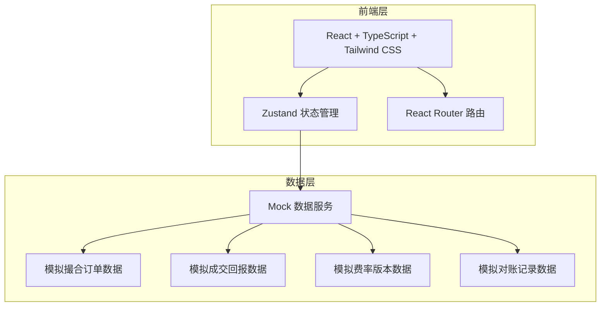
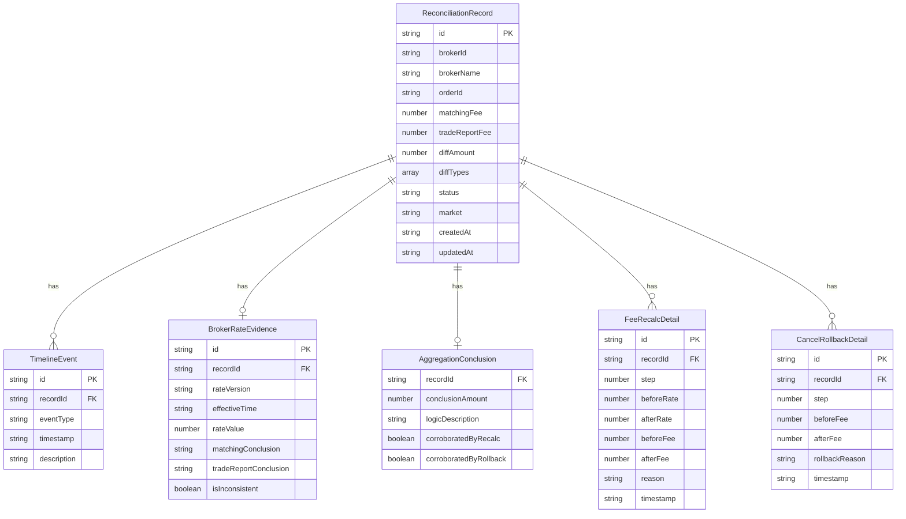

## 1. 架构设计



纯前端项目，使用 Mock 数据模拟完整的业务场景，不涉及后端服务。

## 2. 技术说明

- 前端：React@18 + TailwindCSS@3 + Vite
- 初始化工具：vite-init
- 后端：无（纯前端，Mock 数据）
- 数据库：无（内存状态 + Mock 数据）

## 3. 路由定义

| 路由 | 用途 |
|------|------|
| / | 对账工作台：筛选器 + 记录列表 + 批量操作 + 导出 |
| /detail/:id | 对账详情：时间线 + 费率证据 + 归集结论 + 重算/回滚明细 |

## 4. API定义

无后端 API，使用前端 Mock 数据服务。

### 4.1 核心数据类型

```typescript
interface ReconciliationRecord {
  id: string
  brokerId: string
  brokerName: string
  orderId: string
  matchingFee: number
  tradeReportFee: number
  diffAmount: number
  diffTypes: DiffType[]
  status: ReconciliationStatus
  market: Market
  createdAt: string
  updatedAt: string
  aggregationConclusion?: AggregationConclusion
}

type DiffType = 'cancellation_fee' | 'cross_market' | 'rate_version' | 'inconsistent'
type ReconciliationStatus = 'pending' | 'confirmed' | 'review' | 'resolved'
type Market = 'SSE' | 'SZSE' | 'BSE' | 'NEEQ'

interface TimelineEvent {
  id: string
  recordId: string
  eventType: 'order_created' | 'trade_report' | 'order_cancelled' | 'cross_market_tag' | 'rate_version_change' | 'conclusion'
  timestamp: string
  description: string
  metadata: Record<string, unknown>
}

interface BrokerRateEvidence {
  id: string
  recordId: string
  rateVersion: string
  effectiveTime: string
  rateValue: number
  matchingConclusion: string
  tradeReportConclusion: string
  isInconsistent: boolean
}

interface AggregationConclusion {
  recordId: string
  conclusionAmount: number
  logicDescription: string
  corroboratedByRecalc: boolean
  corroboratedByRollback: boolean
}

interface FeeRecalcDetail {
  id: string
  recordId: string
  step: number
  beforeRate: number
  afterRate: number
  beforeFee: number
  afterFee: number
  reason: string
  timestamp: string
}

interface CancelRollbackDetail {
  id: string
  recordId: string
  step: number
  beforeFee: number
  afterFee: number
  rollbackReason: string
  timestamp: string
}
```

## 5. 服务器架构图

不适用（纯前端项目）

## 6. 数据模型

### 6.1 数据模型定义



### 6.2 数据定义语言

不适用（无数据库，使用内存 Mock 数据）
