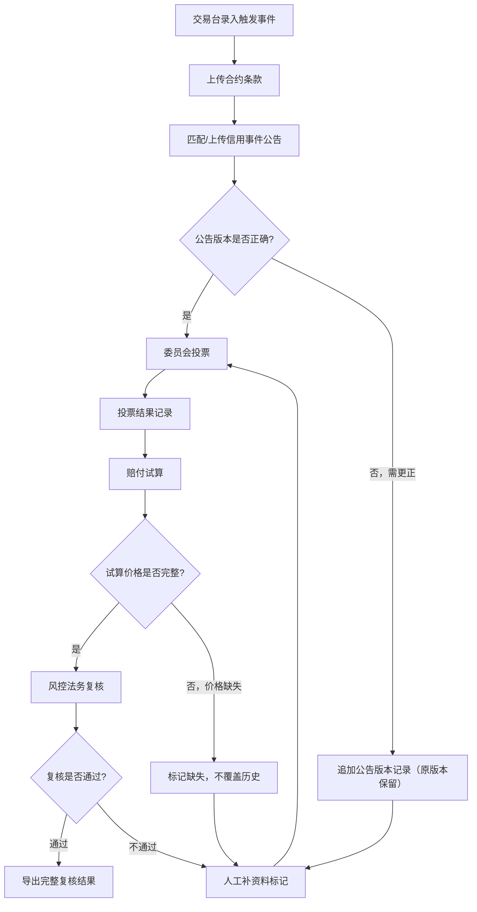

## 1. 产品概述

信用衍生品触发事件复核系统，面向风控法务团队，解决信用衍生品触发事件处理中口径不一致、证据链断裂、状态机与赔付试算各自为政的问题。核心目标是：公告/投票/赔付测算全程留痕可追溯，筛选条件变化后图表明细同步更新，合约条款/信用事件公告/委员会投票独立展示来源与版本，历史状态不可覆盖只能追加，导出结果可一次性复查。

- 目标用户：风控法务复核岗、信用衍生品交易台、合规审计
- 核心价值：从"一行总记录"升级为"可拆解、可追溯、可复查"的证据链管理体系

## 2. 核心功能

### 2.1 用户角色

| 角色 | 权限 |
|------|------|
| 风控法务复核岗 | 查看触发事件列表、复核证据链、发起人工补资料、导出复核结果 |
| 交易台操作员 | 录入触发事件、上传公告文件、提交赔付试算 |
| 合规审计 | 只读查看全部历史记录与导出 |

### 2.2 功能模块

1. **触发事件总览页**：事件列表 + 状态分布图表 + 筛选联动
2. **事件详情页**：三栏独立展示合约条款/信用事件公告/委员会投票 + 证据链时间线 + 赔付试算 + 状态机流转

### 2.3 页面详情

| 页面名称 | 模块名称 | 功能描述 |
|----------|----------|----------|
| 触发事件总览页 | 事件列表 | 展示所有触发事件，支持按状态/产品/日期筛选，筛选变化后图表和列表同步更新 |
| 触发事件总览页 | 状态分布图表 | 饼图/柱状图展示各状态事件数量，点击图表区域可联动筛选列表 |
| 触发事件总览页 | 统计卡片 | 事件总数、待复核数、本周新增、人工补资料数 |
| 事件详情页 | 合约条款面板 | 独立展示合约条款原文与解析，标注数据来源与版本号 |
| 事件详情页 | 信用事件公告面板 | 独立展示公告全文，支持版本对比，标注公告来源与发布机构 |
| 事件详情页 | 委员会投票面板 | 独立展示投票记录（赞成/反对/弃权），标注投票人、时间、投票依据 |
| 事件详情页 | 证据链时间线 | 按时间排列所有证据节点，每个节点标注来源系统、操作人、时间戳 |
| 事件详情页 | 状态机流转 | 可视化展示当前状态与可流转方向，历史状态不可删除只能追加 |
| 事件详情页 | 赔付试算 | 展示赔付价格计算过程与结果，关联证据链版本号 |
| 事件详情页 | 导出复核结果 | 一键导出包含状态机、证据版本、赔付试算的完整可复查结果 |

## 3. 核心流程

1. 交易台录入触发事件基本信息，上传合约条款
2. 系统自动匹配信用事件公告（或人工上传），生成证据链初始节点
3. 委员会投票决议，投票结果作为独立证据节点追加
4. 系统基于公告版本与投票结果进行赔付试算
5. 风控法务复核岗逐项核查证据链完整性，如缺资料则发起人工补资料
6. 复核通过后导出完整结果，包含全部历史版本

## 4. 用户界面设计

### 4.1 设计风格

- **主色调**：深灰蓝 (#1a1f36) 为底，强调色用琥珀橙 (#e8a838) 标注风险/待处理，青绿 (#2dd4a8) 标注已通过
- **辅助色**：冷灰 (#3b4263) 用于面板背景，暖白 (#f0ece4) 用于文本
- **按钮风格**：小圆角 (4px)，扁平静默风格，危险操作用琥珀橙边框
- **字体**：正文使用 Source Han Sans / Noto Sans SC，数据数字使用 JetBrains Mono
- **布局风格**：桌面端双栏/三栏分栏布局，左侧导航 + 右侧内容区
- **图标**：线性图标风格 (Lucide Icons)
- **整体调性**：工业/监控室风格——深色背景、信息密度高、数据驱动，类似专业交易终端

### 4.2 页面设计概览

| 页面名称 | 模块名称 | UI 元素 |
|----------|----------|---------|
| 触发事件总览页 | 统计卡片 | 深色卡片，数字用 JetBrains Mono 大号字，指标名用浅灰小字 |
| 触发事件总览页 | 状态分布图表 | 深底饼图/柱状图，颜色对应状态，点击联动筛选 |
| 触发事件总览页 | 事件列表 | 深色表格，行悬停高亮，状态列用色块标签 |
| 事件详情页 | 三栏面板 | 左/中/右分别对应合约条款/公告/投票，各自可折叠，标题栏标注来源 |
| 事件详情页 | 证据链时间线 | 竖向时间线，节点用图标区分类型，连线用虚线 |
| 事件详情页 | 状态机 | 横向流程图，当前状态高亮，可流转方向用虚线箭头 |
| 事件详情页 | 赔付试算 | 卡片式展示，计算步骤折叠/展开，关联证据版本号链接 |
| 事件详情页 | 导出按钮 | 底部固定操作栏，琥珀橙按钮 |

### 4.3 响应式

- 桌面优先设计 (1440px+)
- 中等屏幕 (1024-1440px) 三栏缩为两栏，投票面板移至下方
- 小屏幕 (<1024px) 全部单栏堆叠

### 4.4 3D 场景

不适用
