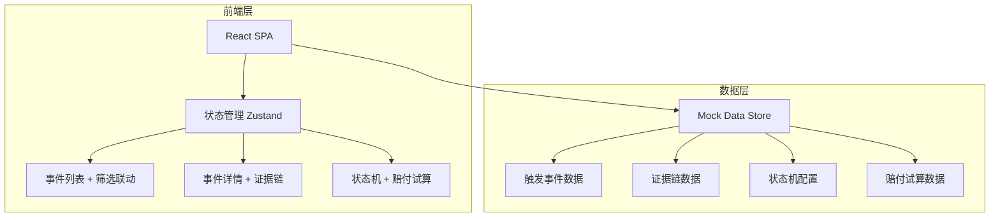
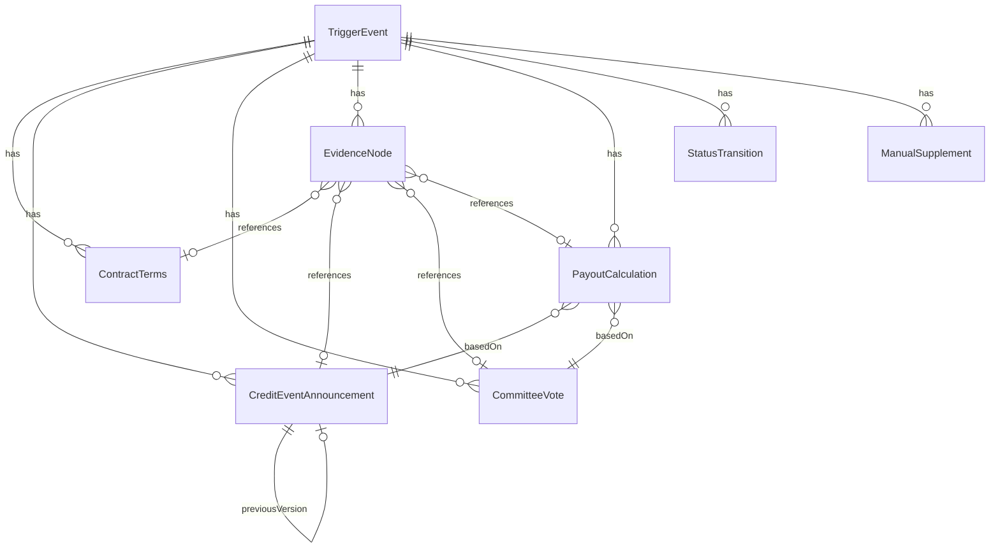

## 1. 架构设计



纯前端单页应用，所有数据存储在内存中的 Mock Store，状态变更通过 Zustand 管理，确保筛选联动与证据链追加的响应式更新。

## 2. 技术说明

- **前端**：React@18 + TypeScript + Tailwind CSS@3 + Vite
- **初始化工具**：Vite (react-ts 模板)
- **状态管理**：Zustand（轻量、无 boilerplate，适合单页应用）
- **图表**：Recharts（React 生态集成好）
- **后端**：无（纯前端 Mock）
- **数据库**：无（Mock 数据内置）

## 3. 路由定义

| 路由 | 用途 |
|------|------|
| `/` | 触发事件总览页（列表 + 图表 + 筛选联动） |
| `/event/:id` | 事件详情页（三栏面板 + 证据链 + 状态机 + 赔付试算 + 导出） |

## 4. API 定义

无后端 API，使用 Zustand Store 管理数据。核心数据类型定义：

```typescript
interface TriggerEvent {
  id: string;
  eventName: string;
  productType: string;
  referenceEntity: string;
  status: EventStatus;
  createdAt: string;
  updatedAt: string;
  needsManualSupplement: boolean;
}

type EventStatus =
  | "pending_announcement"
  | "announcement_matched"
  | "voting_in_progress"
  | "voting_completed"
  | "payout_calculating"
  | "under_review"
  | "review_passed"
  | "review_failed";

interface ContractTerms {
  id: string;
  eventId: string;
  source: string;
  version: number;
  content: string;
  parsedTerms: Record<string, string>;
  updatedAt: string;
}

interface CreditEventAnnouncement {
  id: string;
  eventId: string;
  source: string;
  sourceInstitution: string;
  version: number;
  content: string;
  publishedAt: string;
  isCurrentVersion: boolean;
  previousVersionId: string | null;
}

interface CommitteeVote {
  id: string;
  eventId: string;
  voterName: string;
  voterRole: string;
  voteResult: "approve" | "reject" | "abstain";
  voteBasis: string;
  votedAt: string;
}

interface EvidenceNode {
  id: string;
  eventId: string;
  nodeType: "contract" | "announcement" | "vote" | "payout" | "manual_supplement" | "status_change";
  source: string;
  operator: string;
  timestamp: string;
  summary: string;
  relatedVersionId: string;
}

interface PayoutCalculation {
  id: string;
  eventId: string;
  announcementVersionId: string;
  voteResultId: string;
  notionalAmount: number;
  recoveryRate: number;
  payoutPrice: number | null;
  calculationSteps: CalculationStep[];
  calculatedAt: string;
  isComplete: boolean;
}

interface CalculationStep {
  step: number;
  description: string;
  formula: string;
  result: number | null;
}

interface StatusTransition {
  id: string;
  eventId: string;
  fromStatus: EventStatus;
  toStatus: EventStatus;
  operator: string;
  timestamp: string;
  reason: string;
}

interface ManualSupplement {
  id: string;
  eventId: string;
  supplementType: string;
  description: string;
  requestedBy: string;
  requestedAt: string;
  resolvedAt: string | null;
  status: "pending" | "resolved";
}
```

## 5. 服务端架构

不适用（纯前端应用）

## 6. 数据模型

### 6.1 数据模型定义



### 6.2 样例数据设计

样例数据包含 3 条触发事件记录，覆盖以下场景：

1. **顺利流程**（事件 ID: EVT-001）：完整走通从公告匹配→投票→赔付试算→复核通过的全流程，所有证据节点齐全
2. **边界记录**（事件 ID: EVT-002）：公告版本更正（V1→V2），原版本保留在证据链中，赔付试算基于 V2 重新计算，状态不回退
3. **需人工补资料**（事件 ID: EVT-003）：赔付价格缺失，投票结果不完整，触发人工补资料标记，状态停在"复核中"
