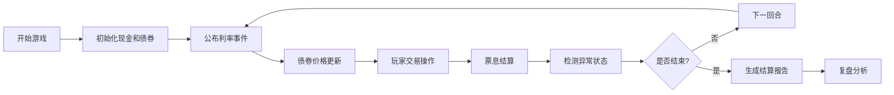

## 1. 产品概述
仓鼠债券交易所是一款面向投教场景的浏览器小游戏，通过回合制交易让学生轻松理解债券价格、票息和利率变化的关系。游戏包含完整的开始、暂停、重开、结算和复盘功能，记录所有关键中间量便于教学复核。
- 核心目标：让学生在游戏中直观理解债券定价原理、利率风险、票息收益
- 目标用户：金融课程学生、投教培训学员

## 2. 核心功能

### 2.1 用户角色
| 角色 | 注册方式 | 核心权限 |
|------|----------|----------|
| 玩家 | 无需注册，直接开始 | 进行游戏交易、查看复盘数据 |

### 2.2 功能模块
1. **游戏主界面**：开始/暂停/重开按钮、回合信息、市场利率看板
2. **债券卡组**：债券卡展示、价格波动、票息信息
3. **交易面板**：买入/卖出操作、现金余额、持仓显示
4. **事件系统**：利率事件卡、市场消息提示
5. **结算系统**：票息结算、现金计算、错误检测
6. **复盘系统**：历史回合追溯、关键指标对比、错误分析

### 2.3 页面详情
| 页面名称 | 模块名称 | 功能描述 |
|---------|---------|----------|
| 游戏主界面 | 控制栏 | 开始游戏、暂停游戏、重新开始、结算游戏 |
| 游戏主界面 | 信息看板 | 当前回合、市场利率、现金余额、总资产、版本来源 |
| 游戏主界面 | 债券市场 | 债券卡展示（面值、票息率、当前价格、到期回合） |
| 游戏主界面 | 交易操作 | 买入债券、卖出债券、数量选择 |
| 游戏主界面 | 事件区 | 利率事件卡显示、历史事件记录 |
| 结算界面 | 结算汇总 | 最终资产、收益分析、错误清单 |
| 复盘界面 | 回合追溯 | 历史回合数据、关键指标变化曲线 |
| 复盘界面 | 错误分析 | 票息漏入账、利率方向反、现金透支的影响说明 |

## 3. 核心流程
玩家开始游戏后，每回合依次经历：利率事件公布 → 债券价格波动 → 玩家交易 → 票息结算 → 进入下一回合。游戏结束后显示结算报告和复盘数据。

## 4. 用户界面设计

### 4.1 设计风格
- **主色调**：暖黄色系（#FFD166）配合深棕色（#264653），营造仓鼠可爱温暖的氛围
- **辅助色**：绿色（#2A9D8F）表示收益，红色（#E76F51）表示亏损
- **按钮风格**：圆角立体按钮，悬停时有弹跳动画
- **字体**：使用圆润可爱的显示字体（如ZCOOL KuaiLe）配合清晰易读的正文字体
- **布局风格**：卡片式布局，带有仓鼠元素装饰（爪印、小仓鼠图标）
- **图标风格**：emoji风格，使用🐹、💰、📈、💵等金融相关表情符号

### 4.2 页面设计概述
| 页面名称 | 模块名称 | UI元素 |
|---------|---------|--------|
| 游戏主界面 | 控制栏 | 大型彩色按钮、仓鼠图标装饰、状态指示灯 |
| 游戏主界面 | 债券卡 | 3D卡片效果、价格浮动动画、票息标签、到期进度条 |
| 游戏主界面 | 事件卡 | 翻牌动画效果、箭头指示利率方向、影响数值高亮 |
| 结算界面 | 数据展示 | 数字滚动动画、收益曲线、错误标记高亮 |
| 复盘界面 | 时间轴 | 横向时间轴、可点击节点、数据对比面板 |

### 4.3 响应式
- 桌面端优先设计，适配1280px以上屏幕
- 移动端自适应，债券卡改为垂直排列
- 触摸操作优化，按钮最小尺寸48px

### 4.4 动画效果
- 价格变化：数字跳动+颜色渐变
- 债券卡片：悬停时轻微上浮+阴影加深
- 事件触发：卡片翻转+光芒特效
- 结算：数字从0滚动到最终值
