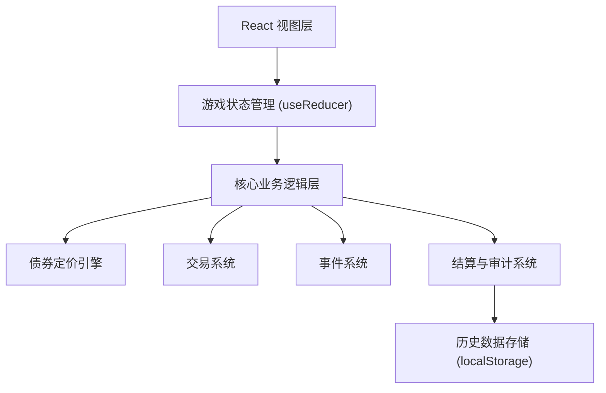

## 1. 架构设计
本项目为纯前端单页应用，所有游戏逻辑和数据存储均在浏览器端完成，无需后端服务。



## 2. 技术描述
- **前端框架**: React@18 + TypeScript + Vite@5
- **样式方案**: TailwindCSS@3 + CSS Modules
- **状态管理**: React useReducer + Context (无需额外状态库)
- **数据持久化**: localStorage 存储游戏历史和复盘数据
- **图表可视化**: Recharts 展示收益曲线和历史数据
- **构建工具**: Vite
- **版本来源**: 代码中嵌入版本号和数据源说明

## 3. 核心数据结构定义

### 3.1 债券(Bond)
```typescript
interface Bond {
  id: string;
  name: string;
  faceValue: number;      // 面值
  couponRate: number;     // 票息率 (%)
  currentPrice: number;   // 当前价格
  maturityRound: number;  // 到期回合
  issueRound: number;     // 发行回合
  source: string;         // 来源标识
  version: string;        // 版本号
}
```

### 3.2 持仓(Position)
```typescript
interface Position {
  bondId: string;
  quantity: number;
  avgCost: number;        // 平均成本
}
```

### 3.3 利率事件(InterestEvent)
```typescript
interface InterestEvent {
  id: string;
  round: number;
  rateChange: number;     // 利率变化 (bps)
  description: string;
  direction: 'up' | 'down' | 'stable';
  source: string;
}
```

### 3.4 交易记录(Transaction)
```typescript
interface Transaction {
  id: string;
  round: number;
  type: 'buy' | 'sell';
  bondId: string;
  quantity: number;
  price: number;
  timestamp: number;
}
```

### 3.5 游戏状态(GameState)
```typescript
interface GameState {
  status: 'idle' | 'playing' | 'paused' | 'ended';
  currentRound: number;
  totalRounds: number;
  marketRate: number;     // 当前市场利率 (%)
  initialRate: number;    // 初始利率
  cash: number;           // 现金余额
  positions: Position[];
  bonds: Bond[];
  events: InterestEvent[];
  transactions: Transaction[];
  couponRecords: CouponRecord[];
  errors: GameError[];
  history: RoundSnapshot[];
  version: string;
  source: string;
}
```

### 3.6 错误检测(GameError)
```typescript
interface GameError {
  id: string;
  round: number;
  type: 'coupon_missed' | 'rate_reversed' | 'cash_overdraft';
  description: string;
  impact: {
    metric: string;
    expectedValue: number;
    actualValue: number;
    difference: number;
  };
  affectedResults: string[];  // 影响的结果项
}
```

### 3.7 回合快照(RoundSnapshot)
```typescript
interface RoundSnapshot {
  round: number;
  marketRate: number;
  cash: number;
  totalAssets: number;
  bondPrices: { [bondId: string]: number };
  positions: Position[];
  event: InterestEvent | null;
  errors: GameError[];
}
```

## 4. 核心业务逻辑

### 4.1 债券定价公式
```
债券价格 = Σ(票息 / (1 + r)^t) + 面值 / (1 + r)^n
其中:
- r = 市场利率 / 100
- t = 第t期
- n = 剩余期数
```

### 4.2 票息结算
每回合结束时，根据持仓计算票息收入：
`票息收入 = Σ(持仓数量 × 面值 × 票息率 / 100)`

### 4.3 错误检测机制
1. **票息漏入账检测**：对比应得票息与实际入账票息
2. **利率方向反检测**：验证债券价格变化方向是否与利率变化反向
3. **现金透支检测**：交易后现金是否为负，计算透支金额和影响

## 5. 模块划分

| 文件路径 | 职责说明 |
|---------|---------|
| `src/types/game.ts` | 所有类型定义 |
| `src/state/gameReducer.ts` | 游戏状态管理 |
| `src/logic/bondPricing.ts` | 债券定价引擎 |
| `src/logic/trading.ts` | 交易系统逻辑 |
| `src/logic/events.ts` | 利率事件生成 |
| `src/logic/settlement.ts` | 结算和错误检测 |
| `src/components/` | React 组件 |
| `src/data/initialData.ts` | 初始游戏数据 |

## 6. 版本和来源管理
- 所有债券卡、事件数据均包含 `source` 和 `version` 字段
- 游戏主界面显示当前版本号
- 复盘数据中保留每条记录的来源信息
