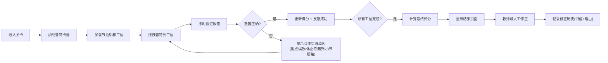

## 1. 产品概述

"音符工厂排班赛"是一款面向音乐教室的节拍认知教学游戏，通过工厂排班的趣味场景帮助孩子学习音符时值和节拍组合。游戏强调每一步操作的即时反馈、错误原因的具体提示、以及人工修正的历史追溯。

- 核心目标：通过拖拽交互让玩家掌握正确的节拍组合，理解音符时值
- 解决问题：附点音符误放、休止符漏算、小节超拍等常见错误
- 目标用户：音乐教室的儿童学生、培训老师

## 2. 核心功能

### 2.1 用户角色
| 角色 | 使用方式 | 核心权限 |
|------|----------|----------|
| 学生玩家 | 游戏登录 | 进行关卡游戏、查看评分、查看错题 |
| 教师用户 | 后台登录 | 调整关卡配置、人工修正判定、查看历史记录 |

### 2.2 功能模块
1. **游戏主界面**：音符卡池、节拍轨、工位槽、操作历史
2. **拖拽交互系统**：音符拖拽、放置验证、即时反馈
3. **关卡系统**：多难度关卡、目标节拍、评分标准
4. **反馈系统**：具体错误提示、正确放置提示、最终评分
5. **人工修正系统**：教师修正判定、记录旧值与理由、历史追溯

### 2.3 页面详情
| 页面名称 | 模块名称 | 功能描述 |
|-----------|-------------|---------------------|
| 游戏主页 | 关卡选择 | 展示可用关卡、难度标识、完成状态 |
| 游戏页面 | 音符卡池 | 待分配的音符卡片（先出现） |
| 游戏页面 | 节拍轨区域 | 小节工位槽（后补充加载） |
| 游戏页面 | 操作反馈区 | 每一步操作的即时提示、错误详情 |
| 游戏页面 | 评分面板 | 实时得分、准确度、完成度 |
| 结果页面 | 结算面板 | 最终评分、错误清单、改进建议 |
| 教师面板 | 修正历史 | 人工修正记录、旧值对比、修正理由 |

## 3. 核心流程

## 4. 用户界面设计

### 4.1 设计风格
- **主色调**：温暖的橙黄色系 (#FF9500, #FFB340) 配合工厂齿轮元素
- **辅助色**：成功绿 (#34C759)、错误红 (#FF3B30)、提示蓝 (#007AFF)
- **按钮风格**：圆润立体按钮，带有轻微阴影和悬浮效果
- **字体**：标题使用圆润可爱的"ZCOOL KuaiLe"，正文使用清晰的"Noto Sans SC"
- **布局风格**：卡片式布局，工厂传送带视觉主题，齿轮装饰元素
- **图标风格**：emoji风格的音乐符号，卡通化的工厂元素

### 4.2 页面设计概述
| 页面名称 | 模块名称 | UI Elements |
|-----------|-------------|-------------|
| 游戏主页 | 关卡选择 | 卡片式关卡、星级评分、解锁动画、工厂主题背景 |
| 游戏页面 | 音符卡池 | 浮动音符卡片、拖拽阴影、时值标签 |
| 游戏页面 | 节拍轨 | 小节分隔线、工位占位框、时值累计指示器 |
| 游戏页面 | 反馈区 | 消息气泡、错误高亮、正确放置的闪光效果 |
| 结果页面 | 结算面板 | 大字号分数、进度环、错误列表、改进建议 |

### 4.3 响应式
- 桌面端优先设计，支持平板适配
- 触摸优化：音符卡片尺寸适合手指拖拽，最小 80x80px
- 响应式断点：1200px、768px、480px

### 4.4 动效设计
- 音符拖拽：跟随手指的阴影和缩放效果
- 正确放置：绿色闪光 + 轻微弹跳动画
- 错误放置：红色抖动 + 错误提示滑入
- 节拍轨加载：逐节滑入的传送带动画
- 评分展示：数字滚动动画 + 进度环填充
