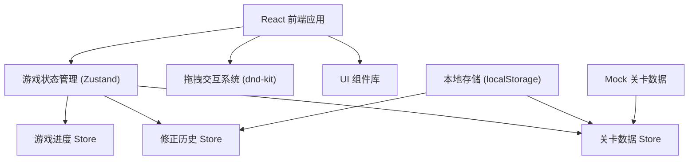

## 1. 架构设计



## 2. 技术描述
- **前端框架**: React@18 + TypeScript + Vite
- **状态管理**: Zustand（轻量级，适合游戏状态）
- **拖拽库**: @dnd-kit/core + @dnd-kit/sortable
- **样式方案**: TailwindCSS@3 + CSS 变量
- **图标方案**: 自定义 SVG 音符图标 + Lucide React
- **动画方案**: Framer Motion
- **数据持久化**: localStorage（存储游戏进度和修正历史）
- **构建工具**: Vite

## 3. 路由定义
| 路由 | 用途 |
|-------|---------|
| / | 首页 - 关卡选择 |
| /game/:levelId | 游戏页面 - 拖拽排班 |
| /result/:levelId | 结果页面 - 评分与反馈 |
| /teacher/history | 教师面板 - 修正历史 |

## 4. 数据模型

### 4.1 核心数据类型

```typescript
// 音符类型
type NoteType = 'quarter' | 'eighth' | 'sixteenth' | 'half' | 'whole' | 'dotted-quarter' | 'dotted-eighth' | 'rest-quarter' | 'rest-eighth' | 'rest-half';

// 音符卡片
interface NoteCard {
  id: string;
  type: NoteType;
  duration: number; // 时值（以四分音符为1拍）
  name: string;
  hasDot?: boolean;
  isRest?: boolean;
}

// 工位槽
interface WorkSlot {
  id: string;
  measureIndex: number;
  slotIndex: number;
  assignedNote: NoteCard | null;
  isFixed: boolean; // 预置固定音符
}

// 小节
interface Measure {
  id: string;
  index: number;
  slots: WorkSlot[];
  targetBeats: number; // 目标拍数
  currentBeats: number;
}

// 关卡配置
interface Level {
  id: string;
  name: string;
  difficulty: 'easy' | 'medium' | 'hard';
  timeSignature: { numerator: number; denominator: number };
  measures: Measure[];
  notePool: NoteCard[];
  perfectScore: number;
}

// 放置验证结果
interface ValidationResult {
  isValid: boolean;
  errorType?: 'dot-misplaced' | 'rest-missed' | 'measure-overflow' | 'wrong-duration' | 'slot-occupied';
  errorMessage: string;
  affectedElement?: string; // 具体哪个元素有问题
}

// 操作记录
interface ActionRecord {
  id: string;
  timestamp: number;
  type: 'place' | 'remove' | 'swap';
  noteId: string;
  slotId: string;
  validation: ValidationResult;
}

// 人工修正记录
interface CorrectionRecord {
  id: string;
  timestamp: number;
  levelId: string;
  originalScore: number;
  newScore: number;
  reason: string;
  teacherName: string;
  changes: Array<{
    slotId: string;
    oldNote: NoteCard | null;
    newNote: NoteCard | null;
    justification: string;
  }>;
}

// 游戏状态
interface GameState {
  currentLevel: Level | null;
  currentScore: number;
  accuracy: number;
  actionHistory: ActionRecord[];
  isComplete: boolean;
}
```

### 4.2 验证规则核心逻辑

1. **附点误放检测**：检查附点音符是否放置在会导致时值计算错误的位置
2. **休止符漏算检测**：检查小节内是否遗漏了必要的休止符来填满节拍
3. **小节超拍检测**：实时计算小节内总时值，超过目标拍数立即提示
4. **工位占用检测**：防止音符重叠放置

### 4.3 增量加载机制

- 音符卡池优先加载（页面加载完成即显示）
- 节拍轨和工位延迟 300ms 后逐节滑入加载
- 已放置的音符在工位加载完成后自动还原，不被覆盖
