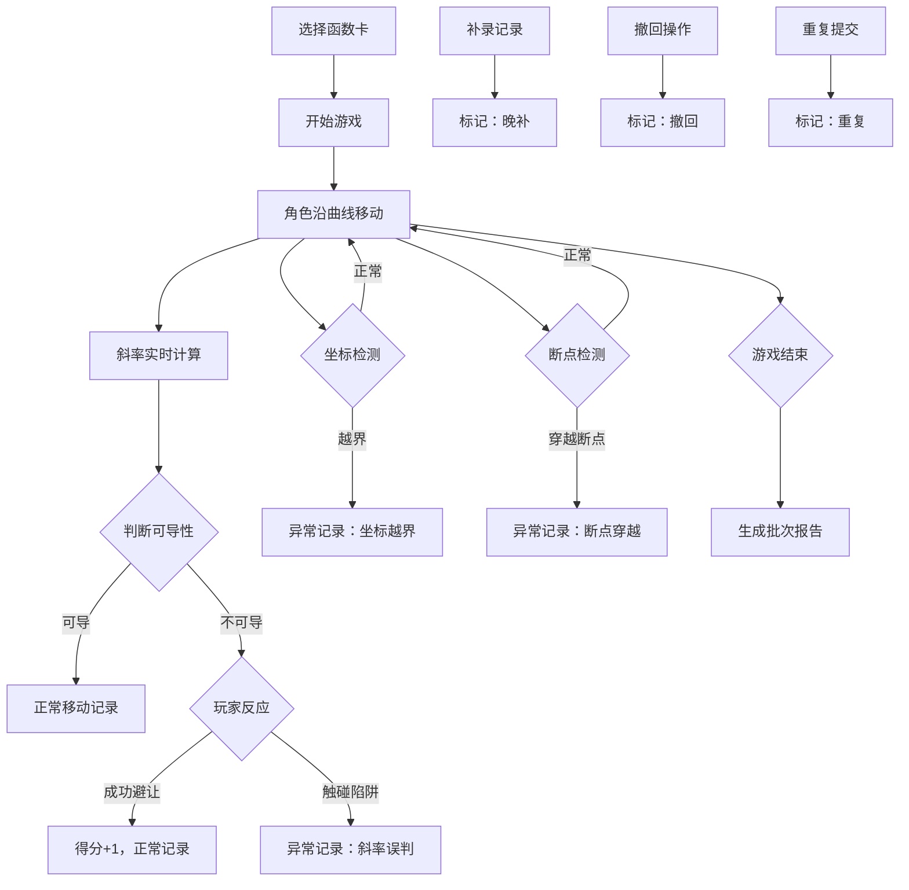

## 1. 产品概述

"函数怪兽躲避战"是一款将数学函数图像与躲避游戏结合的教育类游戏，玩家控制角色沿函数曲线移动，通过判断斜率避开不可导点陷阱，在操作中体验数学取舍的乐趣。

- 核心目标：让玩家在游戏中直观理解函数的连续性、可导性和斜率概念
- 目标用户：高中生、大学生及数学爱好者
- 产品价值：将抽象的微积分概念转化为可操作的游戏体验

## 2. 核心功能

### 2.1 用户角色

| 角色 | 注册方式 | 核心权限 |
|------|----------|----------|
| 玩家 | 无需注册，本地记录 | 游戏游玩、查看记录、生成报告 |

### 2.2 功能模块

1. **游戏主界面**：函数曲线渲染、角色移动控制、斜率实时提示、障碍显示
2. **函数卡系统**：函数卡片库、难度选择、函数预览
3. **记录系统**：游戏过程记录、缺字段补录、晚补标记、备注修改
4. **异常清单**：坐标越界、斜率误判、断点穿越等异常记录
5. **报告系统**：按批次生成游戏报告、历史报告查看

### 2.3 页面详情

| 页面名称 | 模块名称 | 功能描述 |
|----------|----------|----------|
| 游戏主界面 | 曲线渲染模块 | 实时绘制函数图像，标记不可导点、断点等障碍 |
| 游戏主界面 | 角色控制模块 | 键盘/鼠标控制角色沿曲线移动，支持速度调节 |
| 游戏主界面 | 斜率反馈模块 | 实时显示当前点斜率，给出可导性提示 |
| 游戏主界面 | 碰撞检测模块 | 判断角色是否触碰不可导陷阱，计算得分 |
| 函数卡页面 | 函数卡片列表 | 展示可用函数卡片，显示难度、类型、描述 |
| 函数卡页面 | 函数详情弹窗 | 显示函数表达式、定义域、间断点信息 |
| 记录页面 | 游戏记录列表 | 显示历史游戏记录，支持补录、修改备注 |
| 记录页面 | 异常清单 | 单独列出坐标越界、斜率误判、断点穿越记录 |
| 报告页面 | 批次报告生成 | 按时间段生成游戏报告，支持导出 |
| 报告页面 | 报告预览 | 展示批次报告详情，包含统计数据和异常分析 |

## 3. 核心流程

玩家选择函数卡开始游戏，角色沿曲线自动前进，玩家通过左右键控制移动速度，根据斜率提示判断前方是否有不可导陷阱，选择减速避让或加速通过。游戏过程中所有操作（正常移动、补录、撤回、重复提交）都会被记录，异常情况单独进入异常清单。游戏结束后可生成批次报告。

## 4. 用户界面设计

### 4.1 设计风格

- 主色调：深蓝色 (#0F172A) 背景，霓虹青色 (#06B6D4) 曲线，警示红色 (#EF4444) 陷阱
- 辅助色：金色 (#F59E0B) 标记可导点，紫色 (#8B5CF6) 标记异常记录
- 按钮风格：3D 悬浮按钮，圆角 8px，霓虹发光效果
- 字体：展示字体使用 "Orbitron"（科技感），正文字体使用 "Noto Sans SC"
- 布局风格：暗黑科技风，左侧游戏区，右侧信息面板，底部状态栏
- 图标风格：线性图标，霓虹描边效果，与数学函数相关的几何图形

### 4.2 页面设计概述

| 页面名称 | 模块名称 | UI 元素 |
|----------|----------|---------|
| 游戏主界面 | 游戏画布 | 深色网格背景，霓虹曲线，发光角色粒子，红色陷阱标记 |
| 游戏主界面 | 信息面板 | 半透明玻璃态卡片，实时显示斜率、坐标、得分、生命值 |
| 游戏主界面 | 控制区 | 方向键图标，速度滑块，暂停/继续按钮 |
| 函数卡页面 | 卡片列表 | 3D 翻转卡片，正面函数图像，背面详情信息 |
| 函数卡页面 | 分类标签 | 线性函数、二次函数、分段函数、三角函数 |
| 记录页面 | 记录表格 | 斑马纹表格，异常记录红色高亮，晚补记录橙色标记 |
| 记录页面 | 操作按钮 | 补录、编辑备注、确认异常、标记撤回 |
| 报告页面 | 报告卡片 | 批次号、时间段、统计图表、异常分析 |
| 报告页面 | 导出按钮 | 支持 PDF/JSON 格式导出 |

### 4.3 响应式

- 桌面端：左右分栏布局，游戏区占 70%，信息面板占 30%
- 平板端：上下布局，游戏区在上，信息面板在下
- 移动端：单列布局，虚拟摇杆控制，信息面板可折叠

### 4.4 动效设计

- 角色移动：粒子拖尾效果，速度越快拖尾越长
- 碰撞陷阱：红色冲击波扩散，屏幕震动
- 成功避让：金色光环扩散，得分数字弹跳
- 曲线绘制：从左到右渐现动画，霓虹流光效果
- 页面切换：平滑淡入淡出，元素依次入场
