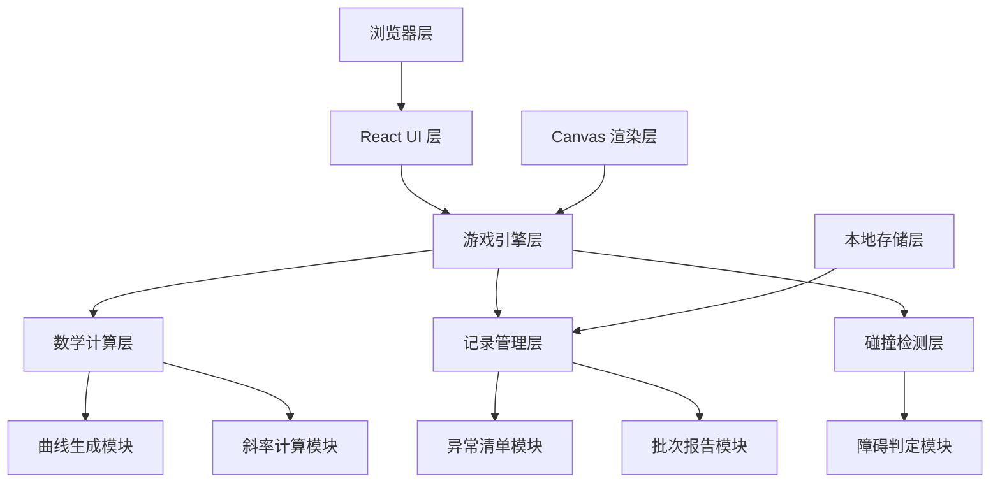

## 1. 架构设计



## 2. 技术描述

- 前端：React@18 + TypeScript + Vite
- 样式：TailwindCSS@3 + CSS 变量
- 图表渲染：Canvas 2D API
- 数学计算：math.js + 自定义求导算法
- 状态管理：React Context + useReducer
- 数据存储：localStorage + IndexedDB
- 导出功能：jsPDF（PDF 导出）+ 原生 JSON 导出

## 3. 路由定义

| 路由 | 页面 | 描述 |
|------|------|------|
| / | 首页 | 游戏入口、函数卡选择 |
| /game | 游戏主界面 | 核心游戏体验 |
| /records | 记录页面 | 游戏记录、异常清单 |
| /reports | 报告页面 | 批次报告生成与查看 |

## 4. 核心数据结构

### 4.1 函数卡 (FunctionCard)

```typescript
interface FunctionCard {
  id: string;
  name: string;
  expression: string;           // 函数表达式
  type: 'linear' | 'quadratic' | 'piecewise' | 'trigonometric';
  difficulty: 'easy' | 'medium' | 'hard';
  domain: [number, number];     // 定义域
  discontinuities: number[];    // 间断点
  nonDifferentiablePoints: number[]; // 不可导点
  traps: Trap[];                // 陷阱配置
  description: string;
}

interface Trap {
  x: number;
  type: 'discontinuity' | 'corner' | 'cusp' | 'verticalTangent';
  radius: number;
}
```

### 4.2 游戏记录 (GameRecord)

```typescript
interface GameRecord {
  id: string;
  batchId: string;              // 批次号
  gameId: string;
  functionCardId: string;
  timestamp: number;
  playerPosition: { x: number; y: number };
  slope: number;
  isDifferentiable: boolean;
  speed: number;
  status: 'normal' | 'pending' | 'exception';
  recordType: 'normal' | 'late' | 'withdrawn' | 'duplicate';
  missingFields: string[];      // 缺字段列表
  notes: string;
  createdAt: number;
  updatedAt: number;
}
```

### 4.3 异常记录 (ExceptionRecord)

```typescript
interface ExceptionRecord {
  id: string;
  recordId: string;
  batchId: string;
  type: 'out_of_bounds' | 'slope_misjudgment' | 'breakpoint_crossing';
  severity: 'low' | 'medium' | 'high';
  description: string;
  position: { x: number; y: number };
  timestamp: number;
  confirmed: boolean;
  confirmedBy?: string;
  confirmedAt?: number;
}
```

### 4.4 批次报告 (BatchReport)

```typescript
interface BatchReport {
  id: string;
  batchId: string;              // 格式: BATCH-YYYYMMDD-HHMMSS
  startTime: number;
  endTime: number;
  totalRecords: number;
  normalRecords: number;
  exceptionRecords: number;
  pendingRecords: number;
  functionCards: string[];
  score: number;
  maxCombo: number;
  exceptions: ExceptionSummary[];
  generatedAt: number;
  generatedBy: string;
}

interface ExceptionSummary {
  type: string;
  count: number;
  severity: string;
}
```

## 5. 核心模块设计

### 5.1 曲线生成模块 (CurveGenerator)

负责根据函数卡生成曲线路径点，支持：
- 正常生成：按均匀步长计算点
- 补录生成：根据历史记录补充缺失点
- 撤回生成：回退到上一个有效状态
- 重复提交检测：检测并标记重复的坐标点

### 5.2 斜率计算模块 (SlopeCalculator)

实时计算当前点的斜率：
- 数值微分法：使用中心差分法计算近似导数
- 可导性判断：检查左右导数是否存在且相等
- 斜率反馈：根据斜率值给出颜色和文字提示

### 5.3 障碍判定模块 (ObstacleDetector)

判定角色是否触碰陷阱：
- 距离检测：计算角色与陷阱中心的距离
- 类型判定：根据陷阱类型给出不同惩罚
- 边界检测：检测坐标是否越界
- 断点检测：检测是否穿越间断点

### 5.4 记录管理模块 (RecordManager)

管理所有游戏记录：
- 正常记录：自动记录每一步操作
- 缺字段检测：检测并标记缺失字段的记录
- 晚补记录：支持手动补录历史记录，标记为"晚补"
- 撤回操作：支持标记记录为"撤回"状态
- 重复提交检测：检测重复提交的记录

### 5.5 异常清单模块 (ExceptionManager)

独立管理异常记录：
- 坐标越界：角色移动超出定义域
- 斜率误判：玩家误判可导性导致碰撞
- 断点穿越：角色穿越函数间断点
- 待确认状态：异常记录需手动确认

### 5.6 批次报告模块 (ReportGenerator)

按批次生成报告：
- 批次号生成：BATCH-YYYYMMDD-HHMMSS 格式
- 统计分析：正常/异常/待确认记录统计
- 异常分析：按类型和严重程度分析
- 导出功能：支持 PDF 和 JSON 格式

## 6. 状态管理

使用 React Context + useReducer 管理全局状态：

```typescript
interface GameState {
  currentScreen: 'home' | 'game' | 'records' | 'reports';
  selectedFunctionCard: FunctionCard | null;
  gameStatus: 'idle' | 'playing' | 'paused' | 'ended';
  player: PlayerState;
  records: GameRecord[];
  exceptions: ExceptionRecord[];
  reports: BatchReport[];
  currentBatchId: string;
  score: number;
  lives: number;
  combo: number;
}
```

## 7. 本地存储方案

- localStorage：存储用户偏好设置、当前批次信息
- IndexedDB：存储大量游戏记录、异常记录、报告数据
- 数据定期清理：支持按批次删除历史数据

## 8. 性能优化

- Canvas 离屏渲染：曲线预渲染到离屏 Canvas
- 帧率控制：使用 requestAnimationFrame 控制游戏循环
- 内存管理：及时释放不再使用的对象和事件监听
- 虚拟滚动：记录列表使用虚拟滚动优化性能
