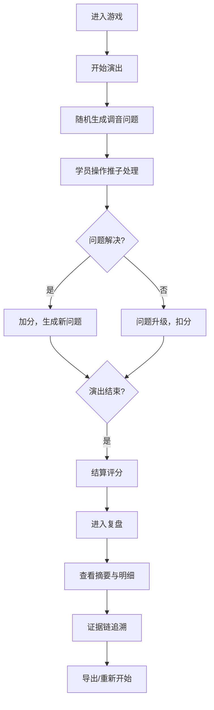

# PRD - 混音台救场夜

## 1. 产品概述

"混音台救场夜"是一款面向Livehouse新人调音师的浏览器端培训游戏，通过模拟演出现场的调音问题（啸叫、返听失衡、主输出爆峰），帮助新人在无风险环境下练习应急处理能力，同时建立标准化的问题交接与复盘机制。

## 2. 核心功能

### 2.1 用户角色
| 角色 | 注册方式 | 核心权限 |
|------|----------|----------|
| 学员 | 无需注册 | 进行游戏、查看复盘、导出报告 |
| 导师 | 无需注册 | 查看学员操作记录、使用样例指导 |

### 2.2 功能模块
1. **游戏主界面**：混音台控制区、事件提示区、状态监控区
2. **游戏控制**：开始、暂停、重开、结束结算
3. **智能交接助手**：自动归类线索（声道条、返听请求、啸叫点）
4. **证据链系统**：记录增益过高、返听漏改、主输出爆峰等关键事件
5. **复盘系统**：摘要-明细联动、操作回溯、事件时间线
6. **样例引导**：预置可运行样例与操作说明

### 2.3 页面详情
| 页面名称 | 模块名称 | 功能描述 |
|----------|----------|----------|
| 游戏主界面 | 混音台控制区 | 8路声道推子、主输出推子、返听控制、电平显示 |
| 游戏主界面 | 事件提示区 | 实时显示演出问题、歌手返听请求、风险预警 |
| 游戏主界面 | 状态监控区 | 主输出电平表、啸叫检测、演出进度、分数显示 |
| 复盘界面 | 摘要面板 | 问题统计、关键失误、处理效率 |
| 复盘界面 | 明细时间线 | 推子操作记录、事件发生记录、风险提示记录 |
| 复盘界面 | 证据链展示 | 增益过高、返听漏改、主输出爆峰的完整证据 |
| 交接面板 | 线索归类 | 自动将声道条、返听请求、啸叫点归为同一事件 |

## 3. 核心流程

## 4. 用户界面设计

### 4.1 设计风格
- **主色调**：深灰/黑色背景（#1a1a2e）+ 霓虹绿（#00ff88）+ 警示红（#ff4757）+ 信息蓝（#3742fa）
- **按钮风格**：圆角方形，霓虹发光效果，按压有反馈动画
- **字体**：Orbitron（数字显示）+ Noto Sans SC（中文界面）
- **布局风格**：模块化卡片布局，混音台区域采用真实调音台的横向推子排列
- **视觉元素**：LED电平指示灯、VU表动画、啸叫时的红色频闪

### 4.2 页面设计概述
| 页面名称 | 模块名称 | UI元素 |
|----------|----------|--------|
| 游戏主界面 | 混音台控制区 | 垂直推子、LED电平条、旋钮控件、通道标签 |
| 游戏主界面 | 事件提示区 | 滚动消息列表、颜色编码（红=紧急、黄=警告、蓝=请求） |
| 游戏主界面 | 状态监控区 | 大型VU表、倒计时、分数显示、控制按钮 |
| 复盘界面 | 时间线 | 可点击时间节点、颜色区分事件类型、悬停显示详情 |
| 复盘界面 | 证据面板 | 快照式证据卡片、前后对比、操作链展示 |

### 4.3 响应式
- 桌面端优先（1280px以上）：完整混音台布局
- 平板端（768-1280px）：简化为4路声道，垂直布局
- 移动端（768px以下）：核心控制区，简化视图

## 5. 游戏规则与评分

### 5.1 问题类型
| 问题类型 | 触发条件 | 处理方式 | 扣分/加分 |
|----------|----------|----------|-----------|
| 啸叫 | 某声道增益过高+特定频段 | 降低对应声道增益/拉低主输出 | 未处理：-20分/秒 |
| 返听失衡 | 歌手请求调整返听 | 调整对应返听通道 | 漏改：-15分 |
| 音量失衡 | 某声道过高/过低 | 调整对应推子 | 持续3秒：-10分 |
| 主输出爆峰 | 主输出超过0dB | 降低主输出/关键声道 | 爆峰：-30分/次 |

### 5.2 证据链记录
- 增益过高：记录"设置增益值→持续时长→触发啸叫→处理动作"完整链条
- 返听漏改：记录"歌手请求→请求时间→超时未处理→影响评估"
- 主输出爆峰：记录"爆峰前电平→爆峰时刻→爆峰后操作→恢复时间"
