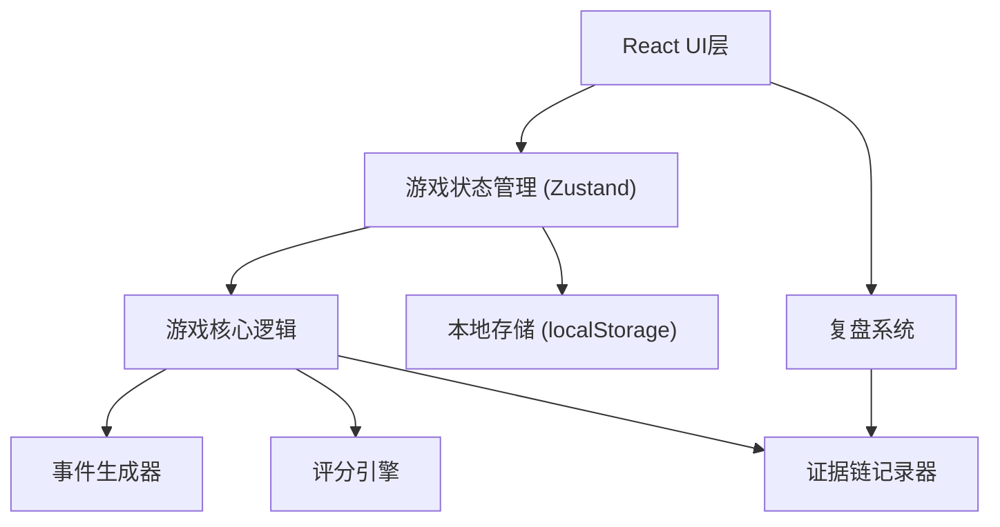

# 技术架构 - 混音台救场夜

## 1. 架构设计



## 2. 技术说明

- **前端框架**：React@18 + TypeScript
- **构建工具**：Vite@5
- **样式方案**：TailwindCSS@3 + CSS Modules
- **状态管理**：Zustand (轻量级状态管理)
- **动画库**：Framer Motion (推子动画、过渡效果)
- **图标**：Lucide React
- **数据持久化**：localStorage (保存游戏记录与复盘数据)

## 3. 目录结构

```
src/
├── components/
│   ├── mixer/          # 混音台组件
│   │   ├── ChannelFader.tsx
│   │   ├── MasterFader.tsx
│   │   ├── LevelMeter.tsx
│   │   └── MixerBoard.tsx
│   ├── game/           # 游戏控制
│   │   ├── GameControls.tsx
│   │   ├── EventLog.tsx
│   │   └── StatusPanel.tsx
│   ├── review/         # 复盘系统
│   │   ├── ReviewPanel.tsx
│   │   ├── Timeline.tsx
│   │   └── EvidenceCard.tsx
│   └── assistant/      # 交接助手
│       └── ClueOrganizer.tsx
├── store/              # 状态管理
│   └── useGameStore.ts
├── engine/             # 游戏引擎
│   ├── eventGenerator.ts
│   ├── scoringEngine.ts
│   └── evidenceRecorder.ts
├── types/              # 类型定义
│   └── index.ts
├── utils/              # 工具函数
├── data/               # 样例数据
│   └── sampleGame.ts
└── App.tsx
```

## 4. 核心数据类型

```typescript
// 声道状态
interface Channel {
  id: number;
  name: string;
  type: 'vocal' | 'guitar' | 'bass' | 'drum' | 'keys';
  level: number; // 0-100
  pan: number; // -50 to 50
  mute: boolean;
  solo: boolean;
}

// 游戏事件
interface GameEvent {
  id: string;
  type: 'feedback' | 'monitor_request' | 'imbalance' | 'clipping';
  severity: 'warning' | 'critical';
  timestamp: number;
  channelId?: number;
  description: string;
  resolved: boolean;
  resolvedAt?: number;
}

// 操作记录
interface ActionLog {
  id: string;
  type: 'fader_move' | 'mute' | 'solo' | 'master_adjust';
  channelId?: number;
  fromValue: number;
  toValue: number;
  timestamp: number;
}

// 证据链
interface EvidenceChain {
  id: string;
  eventType: string;
  startTime: number;
  endTime?: number;
  actions: ActionLog[];
  events: GameEvent[];
  conclusion: 'resolved' | 'missed' | 'partial';
}

// 游戏状态
interface GameState {
  status: 'idle' | 'playing' | 'paused' | 'ended';
  score: number;
  timeElapsed: number;
  channels: Channel[];
  masterLevel: number;
  events: GameEvent[];
  actionLogs: ActionLog[];
  evidenceChains: EvidenceChain[];
}
```

## 5. 核心算法

### 5.1 事件生成器
- 基于时间的随机事件生成，难度随时间递增
- 事件类型权重：音量失衡40%，返听请求30%，啸叫20%，主输出爆峰10%
- 事件连锁机制：增益过高可能触发啸叫，啸叫可能引发歌手返听请求

### 5.2 评分引擎
- 实时计算分数，每秒更新
- 处理速度加分：<2秒 +10分，<5秒 +5分，>10秒不加分
- 连锁失误扣分：同一问题连续出现3次以上额外扣分

### 5.3 线索归类算法
- 基于时间窗口（±3秒）自动关联相关事件
- 基于声道ID关联同一通道的问题
- 因果关系推断：高增益→啸叫→返听请求的自动关联
