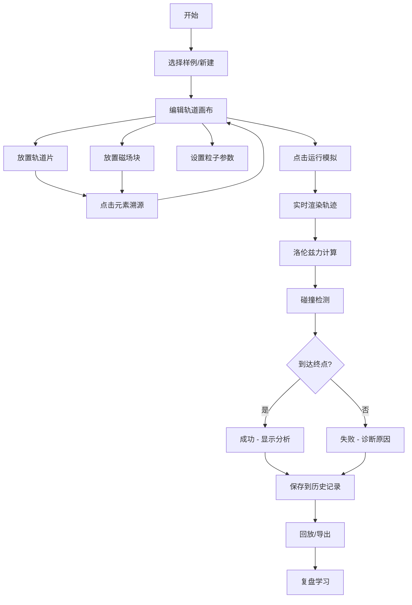

## 1. 产品概述

"粒子加速器拼轨"是一款面向物理科普教育的互动小游戏，专为培训和课堂教学设计。学生通过拖拽轨道片和磁场块构建粒子加速器路径，引导带电粒子安全通过磁场区域而不碰撞管壁，从而直观理解洛伦兹力、磁场方向与粒子运动轨迹的关系。

- 核心目的：通过交互式游戏化方式教授电磁学基础知识，让抽象的物理公式变得可感知、可操作
- 目标用户：中学生、大学物理入门学生、科普馆访客、物理教师
- 市场价值：填补物理教学中"磁场-粒子互动"可视化教育工具的空白，提供可追溯、可复盘的教学辅助工具

## 2. 核心 Features

### 2.1 用户角色

| 角色 | 注册方式 | 核心权限 |
|------|----------|----------|
| 学生用户 | 无需注册，本地使用 | 编辑轨道、运行模拟、查看分析、导入导出 |
| 教师用户 | 无需注册，本地使用 | 所有学生权限 + 创建自定义关卡 + 管理样例库 |

### 2.2 Feature 模块

1. **轨道编辑页面**：拖拽式轨道拼接、磁场块放置、粒子参数设置
2. **模拟运行页面**：粒子运动实时模拟、洛伦兹力可视化、碰撞检测反馈
3. **结果分析页面**：成败原因诊断、物理原理讲解、轨迹数据展示
4. **历史记录页面**：对局记录列表、回放功能、数据导出
5. **样例库页面**：预置错误样例关卡、典型物理场景展示

### 2.3 页面详情

| 页面名称 | 模块名称 | Feature 描述 |
|----------|----------|--------------|
| 轨道编辑页 | 工具栏 | 提供轨道片（直线、弯道、分支）、磁场块（方向可调）、粒子源、终点靶 |
| 轨道编辑页 | 画布区域 | 网格对齐拖拽放置，支持旋转、删除，点击元素可溯源到工具栏 |
| 轨道编辑页 | 参数面板 | 设置粒子种类（质子/电子/α粒子）、初始能量、磁场强度 |
| 模拟运行页 | 实时模拟 | Canvas 渲染粒子轨迹，动态显示洛伦兹力矢量、速度矢量 |
| 模拟运行页 | 状态反馈 | 实时显示当前位置、速度、受力、能量数值 |
| 结果分析页 | 成败诊断 | 自动识别失败原因：磁场方向错误/能量过高/轨道断开/碰撞管壁 |
| 结果分析页 | 物理讲解 | 对应失败原因给出洛伦兹力公式 F=qv×B 的具体分析 |
| 历史记录页 | 记录列表 | 显示时间戳、关卡名、成败、关键参数，支持搜索筛选 |
| 历史记录页 | 回放功能 | 逐帧回放粒子运动过程，可暂停、快进、调速 |
| 历史记录页 | 导出功能 | 导出 JSON 格式完整数据，包含轨道配置、物理参数、轨迹坐标 |
| 样例库页 | 错误样例 | 预置3个典型错误场景：磁场方向错误、能量过高、轨道断开 |
| 样例库页 | 正确样例 | 预置2个正确场景：圆周运动、螺旋运动 |

## 3. 核心流程

用户从样例库选择关卡或从零开始 → 在画布上拖拽放置轨道片和磁场块 → 点击元素可追溯到工具栏来源 → 设置粒子参数 → 点击运行模拟 → 观察粒子在磁场中的运动轨迹 → 碰撞或到达终点后显示结果 → 查看原因分析和物理解释 → 保存记录到历史 → 可随时回放或导出数据。

## 4. 用户界面设计

### 4.1 设计风格

- **主色调**：深空蓝 (#0A1628) 作为背景，代表宇宙和物理的深邃感
- **强调色**：粒子轨迹用等离子蓝 (#00D4FF)，磁场线用磁场紫 (#9D4EDD)，警告用高能红 (#FF4D6D)
- **辅助色**：轨道片用科技灰 (#4A5568)，选中状态用霓虹绿 (#39FF14)
- **按钮风格**：微立体圆角按钮，悬停时有发光效果，按下有凹陷反馈
- **字体选择**：展示字体用 Orbitron（科技感无衬线），正文字体用 JetBrains Mono（等宽易读）
- **布局风格**：三栏布局（左工具栏 + 中间画布 + 右参数面板），深色模式为主
- **图标风格**：线性科技风图标，使用 SVG 矢量图形

### 4.2 页面设计概述

| 页面名称 | 模块名称 | UI 元素 |
|----------|----------|----------|
| 轨道编辑页 | 工具栏 | 垂直排列元素卡片，拖拽时显示预览虚影，发光边框 |
| 轨道编辑页 | 画布 | 网格背景，磁吸对齐，放置元素后显示连接线 |
| 轨道编辑页 | 参数面板 | 滑块控制，实时数值显示，单位标注 |
| 模拟运行页 | 轨迹渲染 | 粒子拖尾效果，力矢量箭头动画，磁场线可视化 |
| 模拟运行页 | 数据面板 | 实时更新的物理量仪表盘，数字滚动动画 |
| 结果分析页 | 诊断卡片 | 带图标的原因说明，公式高亮显示 |
| 历史记录页 | 记录卡片 | 缩略轨迹预览，时间戳，成败标识 |
| 样例库页 | 样例卡片 | 封面图+标题+描述，悬停放大效果 |

### 4.3 响应式

- 桌面端优先设计，三栏布局，画布区域自适应
- 平板端折叠工具栏为可展开侧边栏
- 移动端单列布局，画布全屏，工具栏浮层显示
- 所有交互元素支持触摸拖拽，最小触控尺寸 48px

### 4.4 视觉动效

- 页面加载：元素依次淡入，画布网格线逐步绘制
- 拖拽交互：元素跟随鼠标，磁吸吸附时有轻微弹跳
- 粒子模拟：轨迹带发光拖尾，洛伦兹力矢量动态伸长缩短
- 碰撞效果：红色冲击波扩散，屏幕轻微震动
- 成功效果：粒子到达终点时金色粒子爆炸，庆祝动画
