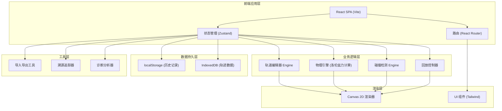
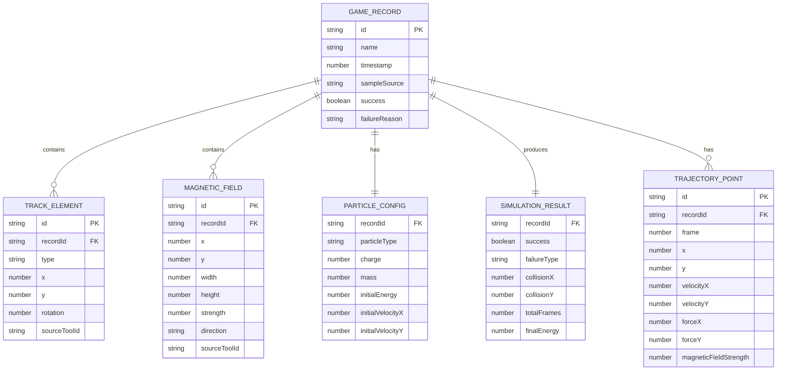

## 1. 架构设计



## 2. 技术描述

- **前端框架**: React@18.2.0 + TypeScript
- **构建工具**: Vite@5.0.0
- **样式方案**: TailwindCSS@3.4.0
- **状态管理**: Zustand@4.4.0 (轻量级，支持时间旅行便于回放)
- **路由管理**: React Router@6.20.0
- **渲染引擎**: HTML5 Canvas 2D (粒子轨迹、磁场可视化)
- **动画库**: framer-motion@10.16.0 (UI交互动画)
- **图标库**: lucide-react@0.294.0 (科技风线性图标)
- **数据持久化**: localStorage (配置和记录元数据) + IndexedDB (大量轨迹点数据)
- **物理计算**: 自研简化物理引擎，实现洛伦兹力 F = q(v × B) 矢量运算

## 3. 路由定义

| 路由 | 页面 | 主要组件 |
|------|------|----------|
| `/` | 首页/样例库 | `SampleLibrary.tsx` - 展示样例卡片，选择进入 |
| `/editor` | 轨道编辑器 | `TrackEditor.tsx` - 三栏布局：工具栏+画布+参数面板 |
| `/simulation` | 模拟运行 | `SimulationView.tsx` - 实时渲染粒子运动 |
| `/analysis` | 结果分析 | `AnalysisView.tsx` - 成败诊断、物理讲解 |
| `/history` | 历史记录 | `HistoryView.tsx` - 记录列表、回放、导出 |
| `/replay/:id` | 复盘回放 | `ReplayView.tsx` - 逐帧回放，数据展示 |

## 4. 数据模型

### 4.1 核心数据结构



### 4.2 TypeScript 类型定义

```typescript
// 轨道元素类型
type TrackElementType = 'straight' | 'curve-left' | 'curve-right' | 'start' | 'end';

interface TrackElement {
  id: string;
  type: TrackElementType;
  x: number;
  y: number;
  rotation: number;
  sourceToolId: string;
}

// 磁场块
interface MagneticField {
  id: string;
  x: number;
  y: number;
  width: number;
  height: number;
  strength: number;
  direction: 'into' | 'outof' | 'left' | 'right' | 'up' | 'down';
  sourceToolId: string;
}

// 粒子配置
type ParticleType = 'proton' | 'electron' | 'alpha';

interface ParticleConfig {
  type: ParticleType;
  charge: number;
  mass: number;
  initialEnergy: number;
  initialVelocity: { x: number; y: number };
}

// 轨迹点
interface TrajectoryPoint {
  frame: number;
  x: number;
  y: number;
  velocity: { x: number; y: number };
  force: { x: number; y: number };
  magneticField: { x: number; y: number; strength: number };
}

// 游戏记录
interface GameRecord {
  id: string;
  name: string;
  timestamp: number;
  sampleSource: string | null;
  trackElements: TrackElement[];
  magneticFields: MagneticField[];
  particleConfig: ParticleConfig;
  trajectory: TrajectoryPoint[];
  result: {
    success: boolean;
    failureType: 'collision' | 'wrong-magnetic' | 'high-energy' | 'broken-track' | null;
    failureReason: string | null;
    collisionPoint: { x: number; y: number } | null;
    totalFrames: number;
    finalEnergy: number;
  };
}

// 诊断结果
interface DiagnosisResult {
  type: string;
  severity: 'error' | 'warning' | 'info';
  title: string;
  description: string;
  formula: string;
  explanation: string;
  suggestion: string;
  relatedPoint: { x: number; y: number } | null;
}
```

### 4.3 导入导出格式

```json
{
  "version": "1.0.0",
  "exportTime": 1700000000000,
  "record": {
    "id": "rec_abc123",
    "name": "磁场方向错误样例",
    "timestamp": 1700000000000,
    "sampleSource": "sample-wrong-magnetic",
    "trackElements": [...],
    "magneticFields": [...],
    "particleConfig": {...},
    "trajectory": [...],
    "result": {...}
  },
  "checksum": "sha256:abc123..."
}
```

## 5. 核心算法

### 5.1 洛伦兹力计算

```
F = q * (v × B)

其中:
- F: 洛伦兹力矢量
- q: 粒子电荷量
- v: 粒子速度矢量
- B: 磁场强度矢量

二维简化:
如果磁场方向垂直纸面向里(into)，则:
  Fx = q * vy * B
  Fy = -q * vx * B

如果磁场方向垂直纸面向外(outof)，则:
  Fx = -q * vy * B
  Fy = q * vx * B
```

### 5.2 碰撞检测

- **轨道碰撞**: 粒子位置与轨道边界多边形进行点-in-多边形检测
- **管壁碰撞**: 计算粒子到轨道中心线的距离，超过轨道宽度的一半即判定碰撞
- **终点检测**: 粒子进入终点靶区域且速度方向正确则判定成功

### 5.3 失败原因诊断

| 失败类型 | 诊断条件 |
|----------|----------|
| 磁场方向错误 | 粒子进入磁场后偏转方向与预期相反，且受力计算验证 B 方向反转 |
| 能量过高 | 粒子速度 v > v_max，偏转半径 r = mv/(qB) > 轨道半径，飞出轨道 |
| 轨道断开 | 粒子运动路径中存在不连续的轨道段，无轨道约束区域 |
| 碰撞管壁 | 粒子到轨道中心线距离 > 轨道宽度/2 |

## 6. 项目目录结构

```
src/
├── components/          # UI 组件
│   ├── layout/         # 布局组件
│   ├── editor/         # 编辑器相关
│   ├── simulation/     # 模拟器相关
│   ├── analysis/       # 分析页面
│   ├── history/        # 历史记录
│   └── common/         # 通用组件
├── store/              # Zustand 状态管理
│   ├── useEditorStore.ts
│   ├── useSimulationStore.ts
│   └── useHistoryStore.ts
├── engine/             # 核心引擎
│   ├── physics/        # 物理计算
│   ├── collision/      # 碰撞检测
│   └── renderer/       # Canvas 渲染
├── hooks/              # 自定义 Hooks
├── types/              # TypeScript 类型
├── utils/              # 工具函数
│   ├── importExport.ts
│   ├── diagnosis.ts
│   └── traceability.ts
├── samples/            # 预置样例数据
├── pages/              # 页面组件
├── App.tsx
└── main.tsx
```

## 7. 数据一致性保障

- **时间戳机制**: 所有操作记录使用单调递增的 `performance.now()` 时间戳
- **溯源 ID**: 每个放置的元素都携带 `sourceToolId`，指向工具栏来源
- **校验和**: 导出数据包含 SHA-256 校验和，导入时验证数据完整性
- **版本号**: 数据格式包含版本号，支持向后兼容
- **幂等操作**: 历史记录一旦写入不可修改，新操作创建新记录
