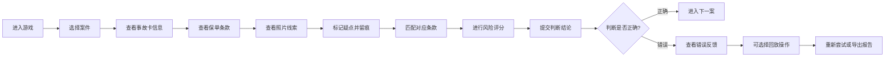
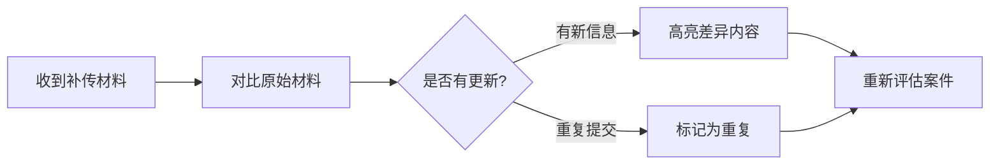

## 1. 产品概述
"保险理赔侦探局"是一款面向保险新人培训的推理游戏，玩家扮演理赔侦探，根据事故卡、保单条款和照片线索判断赔案是否需要补证。通过游戏化方式培训新人识别免责条款漏看、旧损当新损、材料矛盾等常见风险点。

### 1.1 产品目标
- 培训新人掌握理赔核查的核心逻辑
- 通过沉浸式游戏体验提升学习效果
- 提供完整的错误反馈和回放机制
- 生成可导出的核查报告作为学习记录

## 2. 核心功能

### 2.1 用户角色
| 角色 | 注册方式 | 核心权限 |
|------|----------|----------|
| 培训学员 | 无需注册，直接进入 | 游戏体验、查看报告、回放学习 |

### 2.2 功能模块
1. **主菜单**：开始游戏、查看规则、历史记录
2. **案件大厅**：选择待核查的赔案
3. **侦探工作台**：查看事故卡、保单条款、照片线索
4. **线索分析**：标记疑点、匹配条款、风险评分
5. **结果反馈**：规则说明、失败提示、错误回放
6. **报告导出**：生成完整核查报告，包含所有判断依据和错误点

### 2.3 页面详情
| 页面名称 | 模块名称 | 功能描述 |
|---------|----------|----------|
| 主菜单 | 导航区 | 游戏logo、开始按钮、规则说明入口、历史记录入口 |
| 案件大厅 | 案件列表 | 展示所有赔案卡片，显示案件状态、难度等级 |
| 侦探工作台 | 三栏布局 | 左：事故卡主信息；中：保单条款；右：照片线索 |
| 侦探工作台 | 标记面板 | 可标记疑点位置，添加判断备注 |
| 侦探工作台 | 操作栏 | 线索选择、条款匹配、风险评分、提交判断 |
| 结果反馈 | 对比面板 | 玩家判断 vs 正确答案对比 |
| 结果反馈 | 规则讲解 | 每条判断的规则依据和错误原因 |
| 结果反馈 | 回放功能 | 按时间线回放玩家操作过程 |
| 材料更新 | 差异提示 | 高亮显示补传材料与原材料的差异，标记重复提交 |
| 报告导出 | PDF预览 | 展示完整报告内容，支持下载 |

## 3. 核心流程

### 3.1 游戏主流程

### 3.2 材料补传流程

## 4. 用户界面设计

### 4.1 设计风格
- **设计方向**：侦探推理风格，深色主题配合黄色/橙色警探灯效果，营造悬疑推理氛围
- **主色调**：深海军蓝 `#0f172a` 作为背景，琥珀金 `#f59e0b` 作为强调色
- **辅助色**：朱砂红 `#dc2626` 标记风险点，翡翠绿 `#10b981` 标记正确项
- **字体**：标题使用 "Noto Serif SC" 衬线字体体现侦探档案感，正文使用 "Noto Sans SC" 无衬线确保可读性
- **按钮风格**：圆角6px，带微妙阴影，hover时有发光效果
- **布局风格**：卡片式布局，文件袋纹理边框，模拟真实卷宗效果
- **图标**：使用lucide图标，侦探主题图标（放大镜、文件夹、印章等）

### 4.2 页面设计概述
| 页面名称 | 模块名称 | UI元素 |
|---------|----------|--------|
| 主菜单 | Hero区 | 大标题"保险理赔侦探局"，复古打字机效果动画，探案氛围背景 |
| 主菜单 | 菜单按钮 | 开始调查、案件规则、探案记录三个主要按钮，悬停有翻页效果 |
| 案件大厅 | 案件卡片 | 卷宗封面样式，显示案件编号、类型、难度标签，点击展开动画 |
| 侦探工作台 | 三栏布局 | 三份"档案夹"并排，可拖拽调整宽度，点击展开有翻页动画 |
| 侦探工作台 | 标记工具 | 荧光笔、印章、便签三种标记工具，选中后光标变为对应样式 |
| 侦探工作台 | 风险评分 | 0-100分滑块，颜色从绿到红渐变，实时显示风险等级 |
| 结果反馈 | 错误对比 | 左右分栏对比玩家判断与正确答案，错误点用红色盖章动画 |
| 结果反馈 | 时间线回放 | 垂直时间线，每条操作可点击回放对应界面状态 |
| 报告导出 | 报告预览 | 模拟正式公文格式，带骑缝章效果，可一键下载 |

### 4.3 响应式
- 桌面端优先设计，三栏布局并排展示
- 平板端改为标签页切换，左右滑动切换不同材料
- 移动端垂直堆叠，底部导航栏快速切换视图
- 所有触摸元素最小44x44px，确保触屏操作友好

### 4.4 动效设计
- 页面加载：卷宗逐一从左侧滑入，带轻微的纸张飘落效果
- 标记操作：荧光笔标记有渐入动画，印章有"啪"的盖章动画
- 错误反馈：错误项先抖动3次，再变红并显示错误原因
- 回放功能：时间线进度条匀速前进，界面状态平滑过渡
- 材料更新：新增内容有黄色高亮闪烁动画，重复内容有灰色淡化效果
