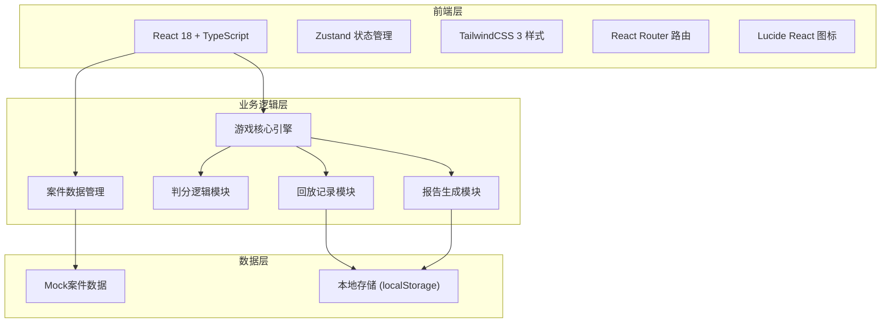
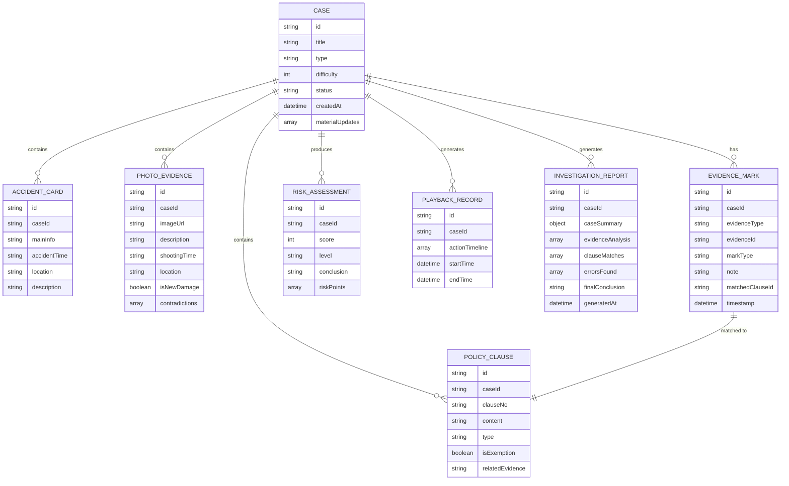

## 1. 架构设计


## 2. 技术描述
- **前端**：React@18 + TypeScript + TailwindCSS@3 + Vite
- **初始化工具**：vite-init react-ts 模板
- **状态管理**：Zustand
- **路由**：react-router-dom
- **图标**：lucide-react
- **后端**：无（纯前端应用，使用Mock数据）
- **数据持久化**：localStorage 存储游戏进度和历史记录
- **PDF导出**：html2canvas + jspdf

## 3. 路由定义
| 路由 | 用途 |
|------|------|
| / | 主菜单页面 |
| /cases | 案件大厅页面 |
| /case/:id | 侦探工作台（案件详情） |
| /result/:id | 结果反馈页面 |
| /report/:id | 报告导出页面 |
| /history | 历史记录页面 |
| /rules | 游戏规则页面 |

## 4. 数据模型

### 4.1 实体关系图


### 4.2 核心类型定义
```typescript
// 案件类型
interface Case {
  id: string;
  title: string;
  type: 'vehicle' | 'property' | 'liability' | 'health';
  difficulty: 1 | 2 | 3 | 4 | 5;
  status: 'pending' | 'in_progress' | 'completed' | 'passed' | 'failed';
  accidentCard: AccidentCard;
  policyClauses: PolicyClause[];
  photoEvidence: PhotoEvidence[];
  materialUpdates: MaterialUpdate[];
  correctAnswer: CorrectAnswer;
}

// 事故卡
interface AccidentCard {
  id: string;
  caseId: string;
  mainInfo: string;
  accidentTime: string;
  location: string;
  description: string;
  reporter: string;
  claimAmount: number;
}

// 保单条款
interface PolicyClause {
  id: string;
  caseId: string;
  clauseNo: string;
  content: string;
  type: 'coverage' | 'exemption' | 'definition';
  isExemption: boolean;
  relatedEvidenceIds: string[];
}

// 照片证据
interface PhotoEvidence {
  id: string;
  caseId: string;
  imageUrl: string;
  description: string;
  shootingTime: string;
  shootingLocation: string;
  isNewDamage: boolean | null;
  contradictions: string[];
  version: number;
  isUpdate: boolean;
  updateNote: string;
}

// 材料更新记录
interface MaterialUpdate {
  id: string;
  caseId: string;
  updateTime: string;
  updatedItems: UpdatedItem[];
}

interface UpdatedItem {
  type: 'clause' | 'photo' | 'accident';
  itemId: string;
  changeType: 'new' | 'modified' | 'duplicate';
  diffContent: string;
}

// 玩家标记
interface EvidenceMark {
  id: string;
  caseId: string;
  evidenceType: 'accident' | 'clause' | 'photo';
  evidenceId: string;
  markType: 'suspicious' | 'contradiction' | 'exemption' | 'old_damage';
  note: string;
  matchedClauseId?: string;
  timestamp: number;
}

// 风险评估
interface RiskAssessment {
  caseId: string;
  score: number;
  level: 'low' | 'medium' | 'high' | 'critical';
  conclusion: 'approve' | 'reject' | 'supplement';
  supplementReasons: string[];
  riskPoints: string[];
}

// 回放记录
interface PlaybackRecord {
  caseId: string;
  actionTimeline: ActionItem[];
  startTime: number;
  endTime: number;
}

interface ActionItem {
  timestamp: number;
  actionType: string;
  payload: any;
  snapshot: any;
}

// 正确答案
interface CorrectAnswer {
  requiredMarks: RequiredMark[];
  riskScore: number;
  conclusion: 'approve' | 'reject' | 'supplement';
  supplementReasons: string[];
  commonMistakes: CommonMistake[];
}

interface RequiredMark {
  evidenceType: 'accident' | 'clause' | 'photo';
  evidenceId: string;
  markType: string;
  explanation: string;
}

interface CommonMistake {
  mistakeType: string;
  description: string;
  consequence: string;
  ruleBasis: string;
}

// 调查报告
interface InvestigationReport {
  id: string;
  caseId: string;
  caseSummary: CaseSummary;
  evidenceAnalysis: EvidenceAnalysis[];
  clauseMatches: ClauseMatch[];
  errorsFound: MistakeItem[];
  riskAssessment: RiskAssessment;
  playerPerformance: PlayerPerformance;
  finalConclusion: string;
  generatedAt: number;
}

interface CaseSummary {
  title: string;
  accidentTime: string;
  location: string;
  claimAmount: number;
}

interface EvidenceAnalysis {
  evidenceType: string;
  evidenceId: string;
  description: string;
  playerMark: string;
  correctMark: string;
  isCorrect: boolean;
}

interface ClauseMatch {
  clauseId: string;
  clauseNo: string;
  playerMatched: boolean;
  shouldMatch: boolean;
  explanation: string;
}

interface MistakeItem {
  type: string;
  description: string;
  ruleBasis: string;
  severity: 'minor' | 'major' | 'critical';
}

interface PlayerPerformance {
  totalPoints: number;
  earnedPoints: number;
  accuracy: number;
  timeSpent: number;
  strengths: string[];
  improvements: string[];
}
```

## 5. 核心模块说明

### 5.1 游戏核心引擎 (GameEngine)
负责：
- 案件加载和状态管理
- 操作合法性校验
- 标记和条款匹配逻辑
- 风险评分计算
- 答案对比和判分

### 5.2 回放记录模块 (PlaybackManager)
负责：
- 操作时间线记录
- 界面状态快照
- 按时间线回放
- 关键节点跳转

### 5.3 报告生成模块 (ReportGenerator)
负责：
- 收集玩家所有操作
- 对比正确答案生成错误分析
- 格式化报告内容
- 导出PDF功能

### 5.4 材料更新对比模块 (MaterialDiffManager)
负责：
- 新旧材料对比
- 差异内容识别
- 重复提交检测
- 差异高亮标记
