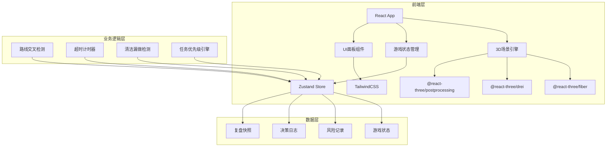
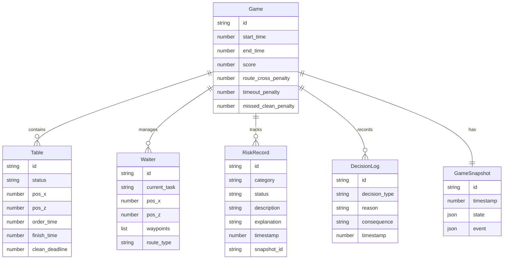

## 1. 架构设计

## 2. 技术说明

- 前端：React@18 + TailwindCSS@3 + Vite
- 3D渲染：three + @react-three/fiber + @react-three/drei + @react-three/postprocessing
- 状态管理：Zustand（轻量级，适合游戏实时状态）
- 初始化工具：Vite
- 后端：无（纯前端，数据存localStorage）
- 数据库：无（游戏数据全部在内存+localStorage中持久化）

## 3. 路由定义

| 路由 | 用途 |
|------|------|
| / | 游戏主界面，3D场景+状态面板+任务面板 |
| /records | 记录管理页面，三态记录列表 |
| /replay/:gameId | 复盘回放页面，时间轴+决策回溯 |

## 4. 数据模型

### 4.1 核心数据模型

### 4.2 状态定义

**桌位状态流转**：
- `idle` → `ordered`（下单）→ `serving`（出餐中）→ `eating`（用餐中）→ `needs_clearing`（待收台）→ `clearing`（收台中）→ `idle`

**风险类别枚举**：
- `route_cross`：路线交叉
- `delivery_timeout`：出餐超时
- `missed_cleaning`：清洁漏做

**记录状态枚举**：
- `processed`：已处理
- `pending`：待确认
- `returned`：退回补材料

**决策类型枚举**：
- `path_planning`：路径规划
- `task_priority`：任务优先级
- `time_pressure`：时间压力

### 4.3 决策解释模板

每条风险记录必须附带一句业务可理解的解释，格式为：

- 路径规划类：`"选择[A路线]而非[B路线]，因为[原因]，导致[后果]"`
- 任务优先级类：`"优先处理[任务A]而非[任务B]，因为[原因]，影响[后果]"`
- 时间压力类：`"剩余[时间]时选择[决策]，因为[原因]，代价是[后果]"`
