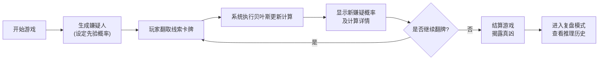

## 1. 产品概述

贝叶斯侦探牌是一款基于浏览器的卡牌教学游戏，通过侦探破案的游戏形式帮助统计学学生直观理解贝叶斯更新原理。学生通过翻取线索卡牌，观察嫌疑概率的动态变化，深入掌握贝叶斯定理在实际推理中的应用。

- 核心目标：让抽象的贝叶斯定理变得具象可玩，通过互动体验理解概率更新机制
- 目标用户：统计学课程的教师和学生
- 价值主张：将数学公式转化为游戏体验，降低学习门槛，提升学习趣味性

## 2. 核心特征

### 2.1 用户角色

| 角色 | 注册方式 | 核心权限 |
|------|----------|----------|
| 学生玩家 | 无需注册，直接使用 | 进行游戏、查看概率更新、复盘推理过程 |
| 授课教师 | 无需注册，直接使用 | 演示贝叶斯更新过程、调整游戏参数 |

### 2.2 功能模块

1. **游戏主界面**：嫌疑人卡牌区、线索卡牌区、概率显示面板、控制按钮
2. **概率详情面板**：贝叶斯计算明细、先验/后验概率对比、证据链展示
3. **游戏控制系统**：开始游戏、暂停游戏、重新开始、结算游戏
4. **复盘系统**：推理历史回放、每步决策解释、概率变化轨迹

### 2.3 页面详情

| 页面名称 | 模块名称 | 功能描述 |
|---------|---------|---------|
| 游戏主页面 | 嫌疑人卡牌区 | 展示3-5名嫌疑人，每人显示当前嫌疑概率、头像、简介 |
| 游戏主页面 | 线索卡牌堆 | 背面朝上的线索卡牌堆，点击翻开新线索 |
| 游戏主页面 | 概率详情面板 | 展开查看贝叶斯计算公式、条件概率、证据链明细 |
| 游戏主页面 | 控制栏 | 开始/暂停/重开/结算按钮，游戏进度指示 |
| 复盘页面 | 推理历史时间线 | 按顺序展示每条线索及其对概率的影响 |
| 复盘页面 | 决策解释区 | 用人话解释每次概率调整的理由，而非代码枚举 |
| 复盘页面 | 概率变化图表 | 可视化展示各嫌疑人概率随线索的变化曲线 |

## 3. 核心流程

游戏开始 → 生成嫌疑人（设定先验概率）→ 玩家翻取线索卡牌 → 系统计算贝叶斯更新 → 显示新嫌疑概率及计算详情 → 玩家继续翻牌或结算 → 揭露真凶 → 进入复盘模式查看完整推理过程

## 4. 用户界面设计

### 4.1 设计风格

- **主色调**：深紫色(#2D1B69)作为主色，配合金色(#D4AF37)点缀，营造侦探推理的神秘感
- **辅助色**：深红(#B33951)表示高嫌疑，墨绿(#2E7D32)表示低嫌疑
- **按钮风格**：圆角矩形，带轻微悬浮效果和按压动画
- **字体**：标题使用Lora（优雅衬线字体），正文使用Roboto Mono（等宽字体便于数字阅读）
- **布局风格**：卡片式布局，嫌疑人卡牌采用立体效果，线索牌有翻牌动画
- **图标风格**：使用侦探主题emoji（🔍、🃏、🕵️、📊）和线性图标结合

### 4.2 页面设计概述

| 页面名称 | 模块名称 | UI元素 |
|---------|---------|--------|
| 游戏主页面 | 嫌疑人卡牌区 | 3-5张立体卡片，头像、姓名、嫌疑概率条、概率数值，高嫌疑卡片发光 |
| 游戏主页面 | 线索卡牌堆 | 牌堆堆叠效果，点击后有3D翻转动画，翻开后显示线索内容和条件概率 |
| 游戏主页面 | 概率详情面板 | 可展开侧边栏，显示公式、计算步骤、证据链时间线 |
| 游戏主页面 | 控制栏 | 固定在顶部，半透明背景，按钮有状态变化（禁用/激活） |
| 复盘页面 | 推理时间线 | 垂直时间轴，每条线索对应节点，点击展开详情 |
| 复盘页面 | 概率图表 | SVG绘制的折线图，不同颜色代表不同嫌疑人 |

### 4.3 响应式设计

- 采用桌面优先设计，同时适配平板设备
- 移动端：嫌疑人卡牌改为垂直排列，线索牌缩小尺寸
- 触摸优化：增大点击区域，卡片翻牌支持滑动手势

### 4.4 动效设计

- 线索卡牌翻牌：3D旋转效果（rotateY），过渡时间0.6秒
- 概率更新：数字滚动动画，进度条平滑过渡
- 嫌疑人高亮：高嫌疑卡牌有呼吸发光效果
- 证据链添加：新证据从右侧滑入，带有淡入效果
- 页面切换：复盘模式采用淡入淡出过渡
