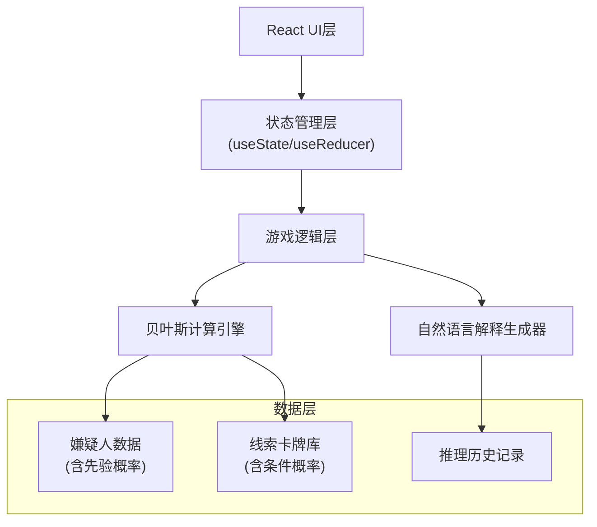

## 1. 架构设计



## 2. 技术选型

- **前端框架**：React@18 + TypeScript + Vite
- **样式方案**：TailwindCSS@3 + CSS Modules
- **图表可视化**：Recharts（React生态图表库）
- **动画方案**：CSS Transitions + Framer Motion（卡牌翻转动画）
- **状态管理**：React Hooks（useState/useReducer）+ Context API
- **构建工具**：Vite@5
- **包管理器**：npm

## 3. 路由定义

| 路由 | 用途 |
|------|------|
| / | 游戏主页面（包含游戏和复盘两个视图状态） |

*采用单页应用设计，通过状态切换实现游戏模式和复盘模式的切换，无需多路由跳转。*

## 4. 数据模型

### 4.1 核心类型定义

```typescript
// 嫌疑人
interface Suspect {
  id: string;
  name: string;
  avatar: string;
  description: string;
  priorProbability: number;  // 先验概率
  currentProbability: number; // 当前概率
  isGuilty: boolean;         // 是否为真凶
}

// 线索卡牌
interface Clue {
  id: string;
  title: string;
  description: string;
  type: 'incriminating' | 'exonerating' | 'neutral';
  // 条件概率: P(线索|有罪) 和 P(线索|无罪)
  likelihoodGuilty: number;
  likelihoodInnocent: number;
  // 用于标记是否与已有证据重复
  relatedClueIds?: string[];
}

// 推理步骤（用于复盘）
interface InferenceStep {
  stepNumber: number;
  clue: Clue;
  timestamp: number;
  // 更新前的概率
  priorProbabilities: Record<string, number>;
  // 更新后的概率
  posteriorProbabilities: Record<string, number>;
  // 贝叶斯计算详情
  calculationDetails: BayesCalculation[];
  // 自然语言解释
  explanation: string;
  // 是否为重复证据（影响归一化）
  isDuplicateEvidence: boolean;
}

// 贝叶斯计算详情
interface BayesCalculation {
  suspectId: string;
  suspectName: string;
  prior: number;
  likelihood: number;
  numerator: number;
  denominator: number;
  posterior: number;
  formula: string;
}

// 游戏状态
type GameStatus = 'idle' | 'playing' | 'paused' | 'ended';

interface GameState {
  status: GameStatus;
  suspects: Suspect[];
  clueDeck: Clue[];
  drawnClues: Clue[];
  inferenceHistory: InferenceStep[];
  currentStep: number;
  isReplayMode: boolean;
}
```

### 4.2 贝叶斯计算逻辑

**核心公式**：
```
P(A|B) = P(B|A) * P(A) / P(B)

其中：
- P(A)：先验概率（嫌疑人有罪的初始概率）
- P(B|A)：似然度（如果是真凶，出现该线索的概率）
- P(B)：证据概率（所有嫌疑人出现该线索的加权平均）
- P(A|B)：后验概率（看到线索后，嫌疑人有罪的概率）
```

**特殊处理规则**：
1. **证据重复处理**：如果新线索与已有线索相关，跳过归一化步骤，按顺序累积
2. **条件概率反用**：当线索为"洗清嫌疑"类型时，使用 P(线索|无罪) 进行反向计算
3. **先后顺序保留**：所有计算结果保留时间戳，复盘时按原始顺序展示

## 5. 核心模块设计

### 5.1 贝叶斯计算引擎 (`/src/utils/bayesEngine.ts`)

- `calculatePosterior()`：执行单次贝叶斯更新
- `handleDuplicateEvidence()`：处理重复证据的特殊逻辑
- `generateCalculationDetails()`：生成计算明细用于展示
- `checkEvidenceConsistency()`：检查线索与嫌疑人的一致性

### 5.2 自然语言解释生成器 (`/src/utils/explanationGenerator.ts`)

- `generateExplanation()`：根据计算结果生成人话解释
- `explainProbabilityChange()`：解释概率上升/下降的原因
- `explainEvidenceConflict()`：解释证据不一致时的处理

### 5.3 游戏状态管理 (`/src/hooks/useGameState.ts`)

- `startGame()`：初始化游戏，生成嫌疑人和线索
- `drawClue()`：翻取线索并更新概率
- `pauseGame()`/`resumeGame()`：暂停/继续
- `endGame()`：结算并进入复盘
- `resetGame()`：重新开始

### 5.4 UI 组件结构

```
src/components/
├── GameBoard.tsx        # 游戏主面板
├── SuspectCard.tsx      # 嫌疑人卡片
├── ClueCard.tsx         # 线索卡牌（含翻转动画）
├── ProbabilityPanel.tsx # 概率详情面板
├── ControlBar.tsx       # 控制按钮栏
├── ReplayView.tsx       # 复盘视图
├── Timeline.tsx         # 推理时间线
└── ProbabilityChart.tsx # 概率变化图表
```

## 6. Mock 数据设计

### 嫌疑人预设（3-5人）
```
- 管家：先验概率 25%，有动机（欠债）
- 女仆：先验概率 20%，有机会
- 男主人：先验概率 30%，遗产受益人
- 访客：先验概率 25%，与受害者有纠纷
```

### 线索卡牌库（10-15张）
- ** incriminating 型（增加嫌疑）**：
  - 沾血的手套：在管家衣柜发现 → P(线索|真凶)=0.8, P(线索|无罪)=0.1
  - 遗嘱修改：男主人最近被修改为受益人 → P(线索|真凶)=0.7, P(线索|无罪)=0.05
- ** exonerating 型（降低嫌疑）**：
  - 不在场证明：女仆有3名证人 → P(线索|真凶)=0.05, P(线索|无罪)=0.9
  - 伤口分析：与访客惯用手不符 → P(线索|真凶)=0.1, P(线索|无罪)=0.85
- ** neutral 型（混合影响）**：
  - 模糊监控：看不清面部，但身高匹配某两人
