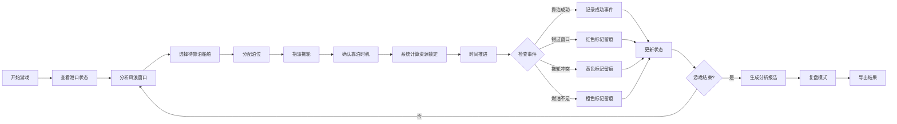

## 1. 产品概述
"港口风浪靠泊赛"是面向航运培训班的教学型调度模拟游戏。玩家在动态变化的风浪窗口和拖轮资源约束下，合理安排船舶靠泊作业，通过每一步决策的连锁反应理解港口调度的复杂性。游戏强调决策可追溯、结果可解释、过程可复盘，为课堂培训提供沉浸式的实操演练环境。

## 2. 核心特性

### 2.1 用户角色
| 角色 | 注册方式 | 核心权限 |
|------|----------|----------|
| 学员玩家 | 无需注册，直接进入 | 进行游戏操作、查看决策分析、导出个人成绩单 |
| 培训讲师 | 无需注册，演示模式 | 加载预设案例、查看全班统计、导出教学报告 |

### 2.2 功能模块
1. **游戏主界面**: 港口概览、时间轴调度、资源状态面板
2. **调度操作台**: 船舶选择、泊位分配、拖轮指派、靠泊时机确认
3. **实时状态监控**: 风浪变化曲线、拖轮使用甘特图、泊位占用时序
4. **决策分析中心**: 每步决策影响链、历史事件留痕、因果关系可视化
5. **复盘系统**: 时间轴回放、决策对比、关键节点标注
6. **数据导入导出**: 场景数据导入、游戏结果导出、审计日志导出

### 2.3 页面详情
| 页面名称 | 模块名称 | 功能描述 |
|---------|---------|----------|
| 游戏首页 | 港口概览看板 | 显示当前所有船舶、泊位、拖轮的状态概览 |
| 游戏首页 | 风浪预报区 | 未来时间段的风浪等级预测，标识可作业窗口 |
| 游戏首页 | 时间轴调度条 | 可视化时间推进、已排计划、待安排事项 |
| 调度操作 | 船舶等待队列 | 显示待靠泊船舶的详细信息和优先级 |
| 调度操作 | 泊位状态矩阵 | 各泊位的占用情况、适配船型、装卸能力 |
| 调度操作 | 拖轮资源池 | 可用拖轮列表、当前状态、预计释放时间 |
| 决策分析 | 决策影响链 | 展示当前决策如何影响后续资源和时间窗口 |
| 决策分析 | 事件历史留痕 | 按时间顺序记录所有关键事件，错过窗口单独标记 |
| 决策分析 | 因果关系图 | 可视化显示资源冲突、时间错过的连锁原因 |
| 复盘系统 | 时间轴回放 | 可暂停、快进、后退查看任意时刻的完整状态 |
| 复盘系统 | 决策对比 | 对比实际决策与最优/备选方案的差异 |
| 复盘系统 | 关键节点标注 | 自动或手动标注关键决策点并添加说明 |
| 数据管理 | 场景导入 | 导入船舶/泊位/拖轮/天气数据，坏数据精确定位 |
| 数据管理 | 结果导出 | 导出包含完整溯源链的可复查结果文件 |

## 3. 核心流程

玩家进入游戏后，首先查看当前港口状态和未来风浪预报，然后从等待队列中选择船舶，分配合适的泊位，指派足够的拖轮资源，在可用的风浪窗口内安排靠泊。每次操作后系统实时计算资源占用、时间锁定，并预判后续影响。当出现错过窗口、资源冲突、燃油不足等问题时，系统按优先级记录但不互相掩盖。游戏结束后生成完整的决策分析报告，支持复盘回溯每个决策的来龙去脉。

## 4. 用户界面设计

### 4.1 设计风格
- **主色调**: 深海蓝(#0A2463)作为主色，代表航运与海洋；警示红(#D62828)标记错过窗口；资源黄(#F77F00)标记拖轮冲突；燃油橙(#FCBF49)标记能源问题
- **按钮风格**: 立体按压式按钮，圆角8px，悬停时有浮起阴影效果，禁用状态采用灰度和降低透明度
- **字体**: 标题采用"Playfair Display"衬线字体体现专业感；正文采用"JetBrains Mono"等宽字体保证数据表格的可读性；时间数字采用"Orbitron"增强科技感
- **布局风格**: 三栏式布局，左侧船舶队列、中间港口调度区、右侧实时监控。采用卡片式容器，重要数据卡片带有细微边框和阴影层次感
- **图标风格**: 采用线性风格SVG图标，船舶用简化侧视图，风浪用波浪线，拖轮用拖钩图标，所有图标统一2px描边

### 4.2 页面设计概览
| 页面名称 | 模块名称 | UI元素 |
|---------|---------|--------|
| 游戏首页 | 港口概览 | 深蓝渐变背景、港口俯视图、动态船舶位置标记、实时时钟数字显示 |
| 游戏首页 | 风浪预报区 | 折线图可视化风浪等级、绿色区间标记可作业窗口、红色区域标记禁航 |
| 游戏首页 | 时间轴调度条 | 横向时间轴、已完成段灰色、进行中蓝色、计划段虚线、事件标记点 |
| 调度操作 | 船舶等待队列 | 卡片式列表、优先级标签、ETA倒计时、靠泊需求详情 |
| 调度操作 | 泊位状态矩阵 | 网格布局、占用状态色块、适配船型图标、预计空闲时间 |
| 调度操作 | 拖轮资源池 | 甘特图式时间线、可用性色标、拖拽指派交互 |
| 决策分析 | 决策影响链 | 有向图可视化、节点可展开查看详情、连线粗细表示影响程度 |
| 决策分析 | 事件历史留痕 | 时间流列表、不同事件类型不同颜色边框、错过窗口置顶显示 |
| 复盘系统 | 时间轴回放 | 播放控制栏、进度滑块、关键节点书签、倍速控制 |
| 数据管理 | 坏数据提示 | 弹出式对话框、显示来源文件名、原始行号、触发数据原文 |

### 4.3 响应式
采用桌面优先设计，主操作区最小支持1280px宽度。平板设备自适应调整为上下布局，手机端简化为关键信息展示模式。所有拖拽操作在触屏设备上支持长按触发。

### 4.4 数据可视化指导
- **风浪曲线图**: 面积图填充，Y轴风浪等级0-10，X轴未来24小时，绿色半透明覆盖可作业区域(风浪<3级)
- **拖轮甘特图**: 每艘拖轮一行，时间轴横向，作业段蓝色块，锁定段黄色虚线块，空闲段白色
- **泊位时序图**: 堆叠条形图，显示不同船舶的占用时间段，颜色区分船舶优先级
- **决策影响链**: 力导向图，节点可点击展开，连接线动画显示影响方向
- **事件留痕列表**: 时间线布局，错过窗口事件使用红色边框和感叹号图标，始终位于列表顶部不被其他事件掩盖
