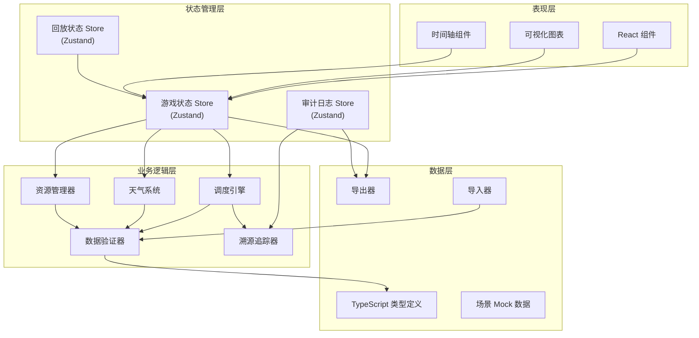
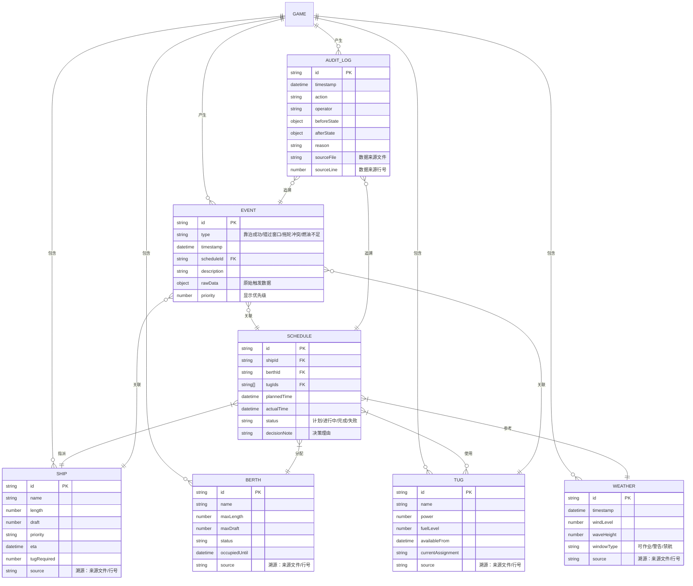

## 1. 架构设计



## 2. 技术描述
- **前端框架**: React@18 + TypeScript@5 + Vite@5
- **状态管理**: Zustand@4 (轻量级、支持时间旅行、适合游戏状态)
- **样式方案**: TailwindCSS@3 + CSS Variables
- **图表可视化**: Recharts@2 (风浪曲线图、甘特图、时序图)
- **图标**: Lucide React (线性风格SVG图标)
- **数据导出**: 原生 JSON + CSV 导出，支持带溯源信息的完整快照
- **后端**: 无 (纯前端应用，所有逻辑在客户端执行)
- **数据库**: 无 (使用 localStorage 持久化游戏进度)

## 3. 路由定义
| 路由 | 用途 |
|------|------|
| / | 游戏主界面 - 包含港口概览、调度操作、实时监控 |
| /replay | 复盘模式 - 时间轴回放、决策对比分析 |
| /import | 数据导入 - 场景数据上传、坏数据检查 |
| /export | 结果导出 - 生成可复查的完整报告 |

## 4. 数据模型

### 4.1 核心实体关系



### 4.2 TypeScript 类型定义

```typescript
// 基础实体类型
interface Ship {
  id: string;
  name: string;
  length: number;
  draft: number;
  priority: 'high' | 'medium' | 'low';
  eta: Date;
  tugRequired: number;
  source: DataSource;
}

interface Berth {
  id: string;
  name: string;
  maxLength: number;
  maxDraft: number;
  status: 'available' | 'occupied' | 'maintenance';
  occupiedUntil: Date | null;
  source: DataSource;
}

interface Tug {
  id: string;
  name: string;
  power: number;
  fuelLevel: number;
  availableFrom: Date;
  currentAssignment: string | null;
  source: DataSource;
}

interface Weather {
  id: string;
  timestamp: Date;
  windLevel: number;
  waveHeight: number;
  windowType: 'operable' | 'warning' | 'restricted';
  source: DataSource;
}

// 溯源信息 - 所有数据都携带来源
interface DataSource {
  file: string;
  line: number;
  rawContent: string;
  importTimestamp: Date;
}

// 调度计划
interface Schedule {
  id: string;
  shipId: string;
  berthId: string;
  tugIds: string[];
  plannedTime: Date;
  actualTime: Date | null;
  status: 'planned' | 'in_progress' | 'completed' | 'failed';
  decisionNote: string;
  createdAt: Date;
}

// 事件类型 - 按优先级排序，错过窗口优先级最高
type EventType = 
  | 'window_missed'    // 错过窗口 - 优先级1（最高，不被掩盖）
  | 'tug_conflict'     // 拖轮冲突 - 优先级2
  | 'fuel_insufficient' // 燃油不足 - 优先级3
  | 'berthing_success'  // 靠泊成功 - 优先级4
  | 'resource_locked'   // 资源锁定 - 优先级5
  | 'weather_changed';  // 天气变化 - 优先级6

interface GameEvent {
  id: string;
  type: EventType;
  timestamp: Date;
  scheduleId: string | null;
  shipId: string | null;
  tugId: string | null;
  description: string;
  rawData: Record<string, unknown>;
  priority: number;
  resolved: boolean;
}

// 审计日志 - 不可变记录
interface AuditLog {
  id: string;
  timestamp: Date;
  action: string;
  operator: string;
  beforeState: GameState | null;
  afterState: GameState | null;
  reason: string;
  source: DataSource | null;
}

// 游戏状态
interface GameState {
  currentTime: Date;
  ships: Ship[];
  berths: Berth[];
  tugs: Tug[];
  weatherForecast: Weather[];
  schedules: Schedule[];
  events: GameEvent[];
  auditLogs: AuditLog[];
  score: number;
  isGameOver: boolean;
}

// 导出数据结构 - 包含完整溯源链
interface ExportData {
  gameId: string;
  exportedAt: Date;
  finalState: GameState;
  timelineSnapshots: Array<{
    timestamp: Date;
    state: GameState;
    events: GameEvent[];
  }>;
  dataSources: Record<string, DataSource[]>;
  analysisReport: {
    missedWindows: GameEvent[];
    tugConflicts: GameEvent[];
    fuelIssues: GameEvent[];
    decisionChain: Array<{
      time: Date;
      action: string;
      impact: string;
      alternatives: string[];
    }>;
  };
}

// 导入验证错误
interface ImportError {
  file: string;
  line: number;
  rawContent: string;
  errorType: 'missing_field' | 'invalid_value' | 'conflict' | 'format_error';
  message: string;
  suggestion: string;
}
```

## 5. 核心业务规则

### 5.1 调度引擎规则
1. **靠泊窗口验证**: 计划靠泊时间必须落在可作业天气窗口内（风浪<3级）
2. **泊位适配验证**: 船舶长度 ≤ 泊位最大长度，船舶吃水 ≤ 泊位最大吃水
3. **拖轮资源验证**: 
   - 指派拖轮总功率 ≥ 船舶需求
   - 拖轮在计划时间内必须可用
   - 拖轮燃油量 ≥ 作业预计消耗
4. **资源锁定机制**: 确认调度后，泊位和拖轮在作业时间段内被锁定，不可重复分配
5. **错过窗口检测**: 当实际时间推进超过计划靠泊时间的天气窗口时，立即触发 `window_missed` 事件，红色标记并置顶显示

### 5.2 事件优先级规则
事件按以下优先级处理和显示，高优先级事件不被低优先级掩盖：
1. `window_missed` (错过窗口) - 始终置顶，红色边框
2. `tug_conflict` (拖轮冲突) - 黄色标记，次高位置
3. `fuel_insufficient` (燃油不足) - 橙色标记
4. `berthing_success` (靠泊成功) - 绿色标记
5. `resource_locked` (资源锁定) - 蓝色标记
6. `weather_changed` (天气变化) - 灰色标记

### 5.3 数据溯源规则
1. 所有导入数据（船舶、泊位、拖轮、天气）必须携带 `DataSource` 信息
2. 每个 `GameEvent` 必须关联触发它的原始数据
3. 审计日志记录每次状态变更前后的完整快照
4. 导出数据包含所有数据来源信息，支持追溯到原始文件行号

### 5.4 坏数据处理规则
1. 导入时逐行验证，发现错误不立即终止，收集所有错误后统一报告
2. 错误信息必须包含：文件名、行号、原始内容、错误类型、修复建议
3. 允许用户选择性导入正确数据，或修复错误后重新导入
4. 游戏运行中检测到数据异常时，暂停并显示溯源信息，不静默失败

## 6. 文件结构

```
src/
├── types/              # 类型定义
│   └── game.ts         # 核心数据类型
├── store/              # 状态管理
│   ├── useGameStore.ts # 游戏主状态
│   ├── useAuditStore.ts # 审计日志
│   └── useReplayStore.ts # 回放状态
├── engine/             # 业务引擎
│   ├── scheduler.ts    # 调度引擎
│   ├── weather.ts      # 天气系统
│   ├── resource.ts     # 资源管理器
│   └── validator.ts    # 数据验证器
├── trace/              # 溯源系统
│   ├── auditor.ts      # 审计记录器
│   └── sourceTracker.ts # 数据源追踪
├── components/         # UI组件
│   ├── PortOverview/   # 港口概览
│   ├── SchedulePanel/  # 调度面板
│   ├── Timeline/       # 时间轴
│   ├── EventLog/       # 事件留痕
│   ├── WeatherChart/   # 天气图表
│   ├── ResourceGantt/  # 资源甘特图
│   ├── ReplayPlayer/   # 回放控制器
│   ├── ImportPanel/    # 导入面板
│   └── ExportPanel/    # 导出面板
├── data/               # 数据
│   └── mockScenario.ts # 预设场景数据
├── utils/              # 工具函数
│   ├── exporter.ts     # 导出工具
│   ├── importer.ts     # 导入工具
│   └── time.ts         # 时间处理
└── App.tsx             # 应用入口
```
