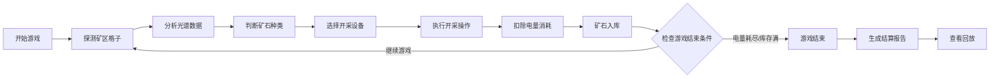

# 光谱采矿经营赛 - 产品需求文档 (PRD)

## 1. 产品概述
"光谱采矿经营赛"是一款地质科普类采矿经营小游戏，玩家通过分析光谱线索判断矿石种类，合理安排开采设备和资源调度，在有限电量和库存空间内完成采矿任务。

- **核心目标**：通过游戏化方式学习地质光谱分析知识，体验资源调度和经营决策的乐趣
- **目标用户**：地质科普课程学生、对采矿/经营类游戏感兴趣的玩家
- **核心价值**：寓教于乐，将光谱识别、资源管理等知识融入游戏体验

---

## 2. 核心功能

### 2.1 用户角色
| 角色 | 注册方式 | 核心权限 |
|------|----------|----------|
| 玩家 | 无需注册，直接游戏 | 完整游戏体验、查看历史记录、导出游戏数据 |

### 2.2 功能模块
1. **游戏主界面**：矿区格子地图、光谱分析仪、设备面板、状态栏
2. **光谱识别系统**：矿石光谱对比、置信度显示、误判反馈
3. **资源调度系统**：电量管理、设备选择、开采策略
4. **库存管理系统**：矿石分类存放、容量限制、结算机制
5. **结果反馈系统**：详细结算报告、失败原因分析、数据可视化
6. **回放系统**：完整操作回放、关键节点标记、导出功能

### 2.3 页面详情
| 页面名称 | 模块名称 | 功能描述 |
|----------|----------|----------|
| 游戏主界面 | 矿区地图 | 6x6格子矿区，显示已探测/已开采/待开采状态 |
| 游戏主界面 | 光谱分析 | 显示当前矿石光谱曲线，提供参考光谱对比 |
| 游戏主界面 | 设备面板 | 选择开采设备（钻机、扫描仪、运输机等） |
| 游戏主界面 | 状态栏 | 显示剩余电量、库存容量、当前分数 |
| 结算页面 | 详细报告 | 分项目展示得分/扣分，解释失败原因 |
| 结算页面 | 数据可视化 | 柱状图展示各类矿石产量、折线图展示电量消耗趋势 |
| 回放页面 | 操作回放 | 按时间轴回放所有操作，支持暂停/快进 |

---

## 3. 核心流程

### 3.1 游戏主流程

### 3.2 关键决策点
1. **光谱识别决策**：玩家需对比光谱曲线判断矿石类型，误判将导致扣分
2. **设备选择决策**：不同设备消耗电量不同，开采效率不同
3. **资源调度决策**：平衡电量使用和开采收益
4. **库存管理决策**：合理分类存放矿石，避免混放扣分

---

## 4. 用户界面设计

### 4.1 设计风格
- **主题色调**：深科技风格，以深蓝色(#0a1628)为主色调，配合青色(#00d4ff)和橙色(#ff6b35)作为强调色
- **视觉风格**：工业科技风，模拟真实采矿控制台界面
- **字体选择**：使用等宽字体（如 JetBrains Mono）营造技术感
- **按钮风格**：带发光效果的科技感按钮，圆角适中
- **图标风格**：线性图标，统一24px尺寸

### 4.2 页面设计概览
| 页面名称 | 模块名称 | UI元素 |
|----------|----------|--------|
| 游戏主界面 | 矿区地图 | 6x6网格，悬停高亮，状态动画 |
| 游戏主界面 | 光谱分析 | SVG绘制光谱曲线，可缩放对比 |
| 游戏主界面 | 设备面板 | 卡片式布局，选中状态高亮 |
| 结算页面 | 报告区域 | 分段折叠面板，详细文字说明 |
| 结算页面 | 图表区域 | 响应式柱状图/折线图，数据筛选同步 |
| 回放页面 | 时间轴 | 可拖动进度条，关键事件标记 |

### 4.3 响应式设计
- **桌面优先**：针对1200px以上宽度优化
- **平板适配**：1024px时调整面板布局
- **移动适配**：768px以下使用垂直布局
- **触摸优化**：按钮最小尺寸48px，支持手势缩放光谱图

### 4.4 交互细节
- **光谱分析**：鼠标悬停显示波峰数值，点击标记可疑点
- **矿区格子**：点击探测、右键开采、悬停显示预览
- **设备选择**：拖拽设备到矿区格子执行操作
- **动画效果**：开采时的震动动画、电量减少的渐变效果

---

## 5. 游戏规则与反馈机制

### 5.1 核心规则
1. **光谱识别规则**：每种矿石有独特光谱曲线，玩家需根据参考光谱判断
2. **电量系统**：初始电量100单位，不同操作消耗不同电量
3. **库存系统**：初始容量50单位，矿石需按类型存放
4. **评分规则**：正确识别+开采得分，误判/混放/电量耗尽扣分

### 5.2 失败提示机制
| 失败类型 | 影响说明 |
|----------|----------|
| **光谱误判** | 错误识别矿石类型，该次开采收益减半，扣除10分 |
| **电量耗尽** | 无法继续操作，游戏提前结束，剩余未开采矿石不计分 |
| **库存混放** | 不同类型矿石混放，该格库存价值减半，占用双倍空间 |

### 5.3 数据一致性保证
- 筛选条件同时应用于屏幕显示和导出数据
- 图表数据与表格数据保持同步
- 回放数据与实际操作记录1:1对应

---

## 6. 版本与来源追踪
- 所有矿石光谱数据标注来源（地质数据库/教材）
- 游戏规则版本号显示在设置页面
- 导出报告包含游戏版本、配置参数等元数据
