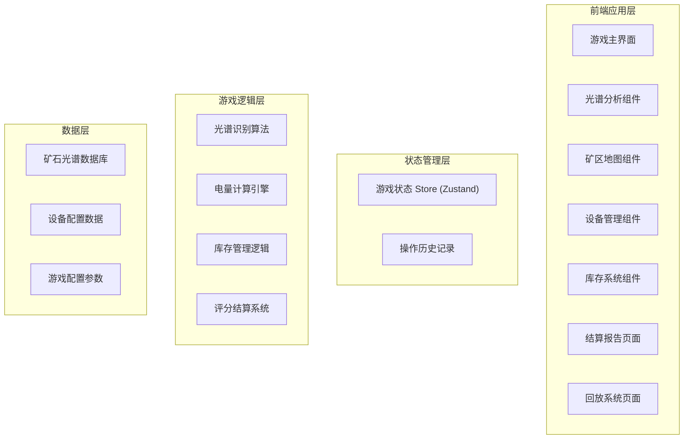

# 光谱采矿经营赛 - 技术架构文档

## 1. 架构设计



---

## 2. 技术栈说明

### 2.1 前端技术
- **框架**：React 18 + TypeScript
- **构建工具**：Vite 5
- **状态管理**：Zustand（轻量级状态管理）
- **样式方案**：Tailwind CSS 3
- **图表库**：Recharts（数据可视化）
- **图标**：Lucide React
- **动画**：Framer Motion

### 2.2 项目配置
- **代码规范**：ESLint + Prettier
- **类型安全**：TypeScript strict mode
- **包管理**：npm

---

## 3. 目录结构

```
src/
├── components/           # 组件目录
│   ├── game/            # 游戏核心组件
│   │   ├── MineGrid.tsx        # 矿区地图
│   │   ├── SpectrumAnalyzer.tsx # 光谱分析仪
│   │   ├── EquipmentPanel.tsx   # 设备面板
│   │   ├── StatusBar.tsx        # 状态栏
│   │   └── Inventory.tsx        # 库存系统
│   ├── report/          # 结算报告组件
│   │   ├── ScoreReport.tsx      # 分数报告
│   │   ├── DataCharts.tsx       # 数据图表
│   │   └── ExportPanel.tsx      # 导出面板
│   └── replay/          # 回放组件
│       ├── ReplayTimeline.tsx   # 回放时间轴
│       └── ReplayControls.tsx   # 回放控制
├── store/               # 状态管理
│   └── useGameStore.ts  # 游戏状态Store
├── logic/               # 游戏逻辑
│   ├── spectrum.ts      # 光谱识别算法
│   ├── scoring.ts       # 评分系统
│   └── inventory.ts     # 库存管理逻辑
├── data/                # 游戏数据
│   ├── minerals.ts      # 矿石数据（含来源标注）
│   ├── equipment.ts     # 设备配置
│   └── config.ts        # 游戏配置
├── types/               # 类型定义
│   └── index.ts         # 全局类型
├── hooks/               # 自定义Hooks
│   ├── useGameLoop.ts   # 游戏循环
│   └── useReplay.ts     # 回放逻辑
├── utils/               # 工具函数
│   └── export.ts        # 数据导出工具
├── App.tsx              # 主应用组件
├── main.tsx             # 入口文件
└── index.css            # 全局样式
```

---

## 4. 路由定义

| 路由 | 页面 | 说明 |
|------|------|------|
| `/` | 游戏主界面 | 包含矿区地图、光谱分析、设备选择等 |
| `/report` | 结算报告页 | 显示游戏结果、详细分析、图表 |
| `/replay` | 回放页面 | 操作历史回放、时间轴控制 |

---

## 5. 数据模型

### 5.1 核心数据类型

```typescript
// 矿石类型
interface Mineral {
  id: string;
  name: string;
  nameCn: string;
  spectrum: number[];      // 光谱数据点
  value: number;           // 单位价值
  source: string;          // 数据来源
  version: string;         // 数据版本
}

// 设备类型
interface Equipment {
  id: string;
  name: string;
  type: 'scanner' | 'drill' | 'transport';
  powerCost: number;       // 电量消耗
  efficiency: number;      // 效率系数
  icon: string;
}

// 矿区格子
interface MineCell {
  id: string;
  x: number;
  y: number;
  status: 'unknown' | 'scanned' | 'mined';
  mineral: Mineral | null;
  mineralType: string | null;
  playerGuess: string | null;
  isCorrect: boolean | null;
}

// 库存项
interface InventoryItem {
  mineralId: string;
  quantity: number;
  isMixed: boolean;        // 是否混放
}

// 游戏状态
interface GameState {
  phase: 'playing' | 'ended';
  power: number;           // 剩余电量
  maxPower: number;
  score: number;
  mineGrid: MineCell[][];
  inventory: InventoryItem[];
  inventoryCapacity: number;
  currentInventory: number;
  selectedEquipment: string | null;
  selectedCell: string | null;
  operationHistory: OperationRecord[];
  gameStartTime: number;
  gameEndTime: number | null;
}

// 操作记录
interface OperationRecord {
  timestamp: number;
  type: 'scan' | 'guess' | 'mine' | 'inventory';
  cellId: string;
  equipment: string;
  powerCost: number;
  result: any;
}
```

### 5.2 光谱数据结构
- 每种矿石包含20个光谱数据点（波长400-700nm区间）
- 数据来源标注：如"USGS矿物光谱数据库 v2023"
- 版本号管理，便于后续更新追踪

---

## 6. 核心算法说明

### 6.1 光谱识别算法
```typescript
// 计算两条光谱曲线的相似度
function calculateSpectrumSimilarity(
  spectrum1: number[], 
  spectrum2: number[]
): number {
  // 使用余弦相似度计算
  const dotProduct = spectrum1.reduce((sum, val, i) => 
    sum + val * spectrum2[i], 0);
  const norm1 = Math.sqrt(spectrum1.reduce((sum, val) => 
    sum + val * val, 0));
  const norm2 = Math.sqrt(spectrum2.reduce((sum, val) => 
    sum + val * val, 0));
  return dotProduct / (norm1 * norm2);
}
```

### 6.2 评分系统
- 正确识别并开采：矿石价值 × 设备效率 × 10分
- 光谱误判：-10分，矿石收益减半
- 库存混放：该批矿石价值 × 0.5，占用双倍空间
- 电量耗尽：游戏结束，额外-20分

### 6.3 数据导出一致性
- 所有筛选条件存储在URL参数中
- 屏幕显示与导出使用同一数据源
- 导出函数接收当前筛选状态作为参数

---

## 7. 版本与来源管理

### 7.1 游戏版本
- 显示位置：设置面板右下角
- 格式：v1.0.0（语义化版本）

### 7.2 数据来源标注
- 矿石数据：在光谱分析面板显示来源信息
- 规则版本：在结算报告页脚标注规则版本号
- 导出数据：在导出文件头包含所有版本元数据
