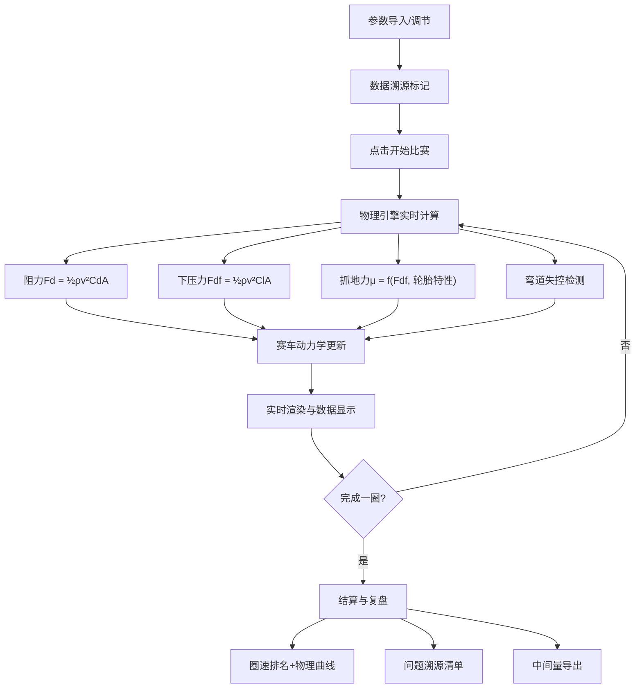

## 1. 产品概述

风洞赛车调参赛是一款面向物理兴趣班的教学工具，通过调节赛车翼片角度、风速等参数，让学生直观理解空气动力学中的阻力与下压力概念。核心价值在于将抽象的物理公式转化为可交互、可观察的圈速变化，同时保留完整的中间数据便于教学复盘和问题溯源。

## 2. 核心功能

### 2.1 用户角色

| 角色 | 注册方式 | 核心权限 |
|------|----------|----------|
| 教师/学生 | 无需注册，浏览器直接使用 | 调节参数、开始/暂停/重开比赛、查看结算与复盘、导入数据、查看诊断报告 |

### 2.2 功能模块

1. **参数调节面板**：翼片角度滑杆、风速滑杆、赛车基础参数导入
2. **赛道渲染区**：Canvas实时渲染赛车行驶轨迹、速度、抓地力状态
3. **实时数据面板**：当前速度、阻力值、下压力值、抓地力、圈速计时
4. **游戏控制区**：开始、暂停、重开、结算按钮
5. **数据导入区**：支持导入赛车参数、翼片配置、风速数据，区分原始材料和处理结果
6. **问题诊断系统**：自动检测阻力过大、抓地不足、弯道失控等问题，溯源触发来源
7. **结算复盘区**：显示最终圈速、各段时间、关键中间量、问题汇总

### 2.3 页面详情

| 页面名称 | 模块名称 | 功能描述 |
|---------|----------|----------|
| 主界面 | 参数调节面板 | 翼片角度(-15°~+15°)、风速(0~200km/h)实时调节，滑块联动物理计算 |
| 主界面 | 赛道渲染区 | 8字形赛道，实时显示赛车位置、速度向量、下压力可视化、漂移轨迹 |
| 主界面 | 实时数据面板 | 显示当前速度v、阻力Fd、下压力Fdf、抓地力μ、瞬时功率、圈数计时 |
| 主界面 | 游戏控制区 | 开始/暂停/重开/结算按钮，状态指示灯 |
| 主界面 | 数据导入区 | 三档独立导入（赛车、翼片、风速），显示材料来源、导入时间、原始值vs处理值 |
| 主界面 | 问题诊断区 | 实时告警列表，显示问题类型、触发位置、触发材料、建议调整方向 |
| 主界面 | 结算复盘区 | 最终圈速、分段计时、关键物理量曲线、问题溯源清单、可导出中间数据 |

## 3. 核心流程

用户调节翼片角度和风速参数，点击开始后赛车沿赛道行驶，物理引擎实时计算阻力和下压力对车速和抓地力的影响。系统全程记录每帧的关键物理量，检测异常状态并溯源。完成一圈后自动结算，显示圈速、各段表现、问题分析及完整中间数据供教学复盘。

## 4. 用户界面设计

### 4.1 设计风格
- **主色调**：深空蓝(#0a1628)为主背景，赛博橙(#ff6b35)为强调色，科技青(#00d4ff)为数据色，告警红(#ff4757)为问题色
- **按钮风格**：3D按压感，圆角8px，边框1px，hover时发光效果
- **字体**：标题用Orbitron（赛车科技感），正文用JetBrains Mono（等宽便于数据对齐）
- **布局风格**：三栏式，左为参数面板，中为赛道渲染，右为数据与诊断
- **图标风格**：线性科技风，使用Font Awesome 6，数据可视化用Chart.js

### 4.2 页面设计概述

| 页面名称 | 模块名称 | UI元素 |
|---------|----------|--------|
| 主界面 | 参数调节面板 | 滑块带刻度、实时数值显示、单位标注、锁定按钮 |
| 主界面 | 赛道渲染区 | Canvas画布、网格背景、赛道中心线、路肩标记、赛车精灵、速度向量箭头 |
| 主界面 | 实时数据面板 | 仪表板样式、数值跳动动画、进度条、状态指示灯 |
| 主界面 | 游戏控制区 | 四色按钮组（绿开始/黄暂停/蓝重开/红结算）、计时器显示 |
| 主界面 | 数据导入区 | 三张独立卡片、来源标签、时间戳、原始值/处理值对比表格 |
| 主界面 | 问题诊断区 | 告警列表、问题图标、位置标记、溯源链接、建议卡片 |
| 主界面 | 结算复盘区 | 模态弹窗、圈速大字、分段时间轴、物理量曲线图、数据导出按钮 |

### 4.3 响应性
- 桌面端优先（1280px+），三栏布局
- 平板端（768px~1280px）：上下两栏，上为赛道，下为参数和数据
- 移动端（<768px）：单列滚动，赛道自适应宽度，参数面板可折叠

### 4.4 数据可视化设计
- **实时曲线**：速度、阻力、下压力随时间变化的折线图
- **圈速对比**：不同参数设置的圈速柱状图
- **赛道热力图**：赛道上各点的速度分布
- **向量图**：赛车所受合力的可视化箭头
