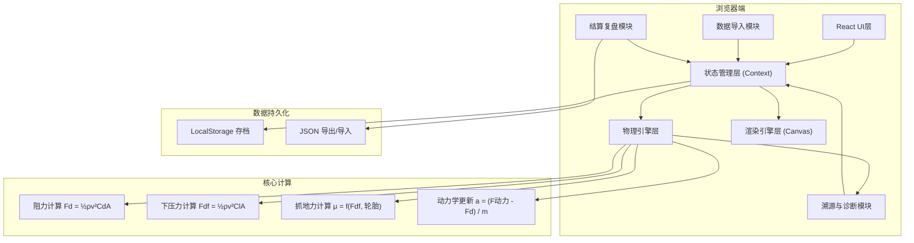
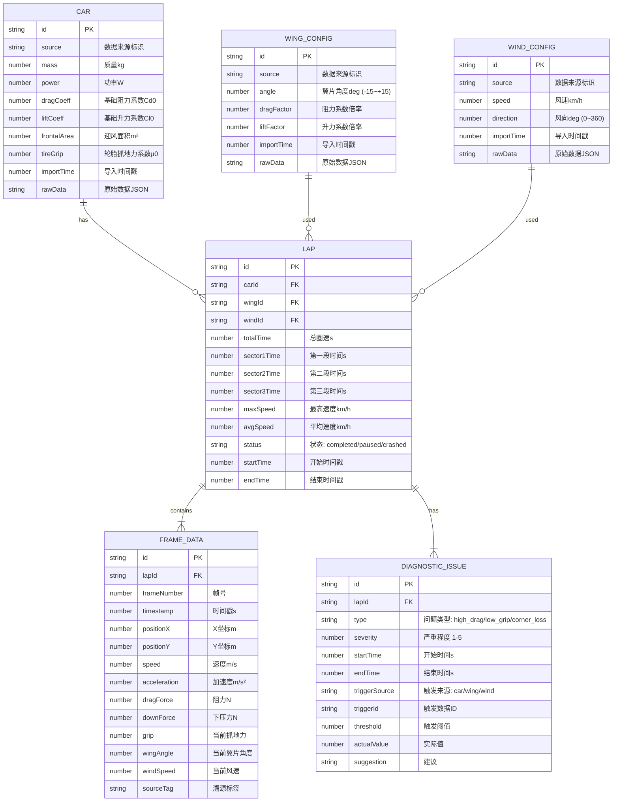

## 1. 架构设计



## 2. 技术描述

- **前端框架**: React@18 + TypeScript@5 + Vite@5
- **样式方案**: TailwindCSS@3.4 + PostCSS
- **状态管理**: React Context + useReducer（轻量级，便于状态回溯）
- **渲染引擎**: HTML5 Canvas 2D（赛道与赛车渲染）
- **图表库**: Chart.js@4.4（物理量曲线、圈速对比）
- **图标库**: Font Awesome@6.5
- **物理引擎**: 自定义实现（空气动力学+赛车动力学）
- **构建工具**: Vite
- **后端**: 无（纯前端应用，所有计算在浏览器完成）
- **数据库**: LocalStorage（本地存档），支持JSON导出

## 3. 路由定义

| 路由 | 用途 |
|------|------|
| / | 主游戏界面（参数调节、赛道、实时数据、控制区） |
| /review | 复盘页面（历史记录、详细物理数据、问题分析） |

## 4. 数据模型

### 4.1 数据模型定义



### 4.2 TypeScript 类型定义

```typescript
// 数据源标记
interface SourceInfo {
  id: string;
  source: string;
  importTime: number;
  rawData: string;
}

// 赛车参数
interface CarParams extends SourceInfo {
  mass: number;           // 质量 kg
  power: number;          // 功率 W
  baseDragCoeff: number;  // 基础阻力系数 Cd0
  baseLiftCoeff: number;  // 基础升力系数 Cl0
  frontalArea: number;    // 迎风面积 m²
  tireGrip: number;       // 轮胎抓地力系数 μ0
}

// 翼片配置
interface WingConfig extends SourceInfo {
  angle: number;          // 翼片角度 -15~+15 deg
  dragFactor: number;     // 阻力系数倍率 (随角度变化)
  liftFactor: number;     // 升力系数倍率 (随角度变化)
}

// 风速配置
interface WindConfig extends SourceInfo {
  speed: number;          // 风速 km/h
  direction: number;      // 风向 0~360 deg
}

// 物理状态
interface PhysicsState {
  speed: number;          // 速度 m/s
  acceleration: number;   // 加速度 m/s²
  dragForce: number;      // 阻力 N
  downForce: number;      // 下压力 N
  grip: number;           // 抓地力
  effectivePower: number; // 有效功率 W
}

// 单帧数据（用于复盘）
interface FrameData {
  frameNumber: number;
  timestamp: number;
  position: { x: number; y: number };
  heading: number;
  physics: PhysicsState;
  params: {
    wingAngle: number;
    windSpeed: number;
    windDirection: number;
  };
  sourceTag: string;
}

// 诊断问题
interface DiagnosticIssue {
  id: string;
  type: 'high_drag' | 'low_grip' | 'corner_loss';
  severity: 1 | 2 | 3 | 4 | 5;
  startTime: number;
  endTime: number;
  triggerSource: 'car' | 'wing' | 'wind';
  triggerId: string;
  threshold: number;
  actualValue: number;
  suggestion: string;
  frames: number[];
}

// 圈速记录
interface LapRecord {
  id: string;
  carId: string;
  wingId: string;
  windId: string;
  totalTime: number;
  sectorTimes: [number, number, number];
  maxSpeed: number;
  avgSpeed: number;
  status: 'running' | 'paused' | 'completed' | 'crashed';
  startTime: number;
  endTime: number;
  frameData: FrameData[];
  issues: DiagnosticIssue[];
}

// 游戏状态
type GameStatus = 'idle' | 'running' | 'paused' | 'finished';
```

## 5. 核心模块设计

### 5.1 物理引擎模块 (src/physics/)

- `aerodynamics.ts` - 空气动力学计算（阻力、下压力）
- `dynamics.ts` - 赛车动力学（加速度、速度、位置更新）
- `grip.ts` - 抓地力计算
- `constants.ts` - 物理常量（空气密度ρ等）

### 5.2 渲染引擎模块 (src/renderer/)

- `TrackRenderer.ts` - 赛道渲染
- `CarRenderer.ts` - 赛车渲染
- `DataOverlay.ts` - 数据叠加层（速度向量、抓地力指示）

### 5.3 状态管理 (src/store/)

- `GameContext.tsx` - 游戏状态上下文
- `gameReducer.ts` - 状态更新逻辑
- `middleware.ts` - 数据溯源中间件

### 5.4 诊断模块 (src/diagnostics/)

- `detectors.ts` - 问题检测（阻力过大、抓地不足、弯道失控）
- `suggestions.ts` - 建议生成
- `sourcer.ts` - 问题溯源

### 5.5 UI组件 (src/components/)

- `ControlPanel.tsx` - 参数调节面板
- `GameControls.tsx` - 游戏控制按钮
- `DataDisplay.tsx` - 实时数据显示
- `DataImport.tsx` - 数据导入组件
- `DiagnosticsPanel.tsx` - 诊断面板
- `ResultsModal.tsx` - 结算弹窗
- `ReviewPanel.tsx` - 复盘面板

## 6. 物理常量与阈值

```typescript
// 空气密度 kg/m³
export const AIR_DENSITY = 1.225;

// 诊断阈值
export const THRESHOLDS = {
  HIGH_DRAG: 5000,          // 阻力过大阈值 N
  LOW_GRIP: 0.6,            // 抓地不足阈值
  CORNER_SPEED_LIMIT: 0.85, // 弯道速度上限（相对于抓地力极限）
  SEVERITY_WEIGHTS: {
    high_drag: 1.2,
    low_grip: 1.5,
    corner_loss: 2.0
  }
};

// 翼片角度对气动系数的影响函数
export const wingAngleToFactors = (angle: number) => {
  const dragFactor = 1 + 0.015 * Math.abs(angle) + 0.001 * angle * angle;
  const liftFactor = -0.08 * angle; // 负角度产生下压力
  return { dragFactor, liftFactor };
};
```

## 7. 性能优化

- Canvas 渲染采用 requestAnimationFrame，目标 60fps
- 物理计算与渲染分离，物理步长固定 16ms
- 帧数据采用增量存储，避免内存泄漏
- 复盘时采用虚拟滚动，只渲染可见帧
- 使用 useMemo 和 useCallback 避免不必要重渲染
