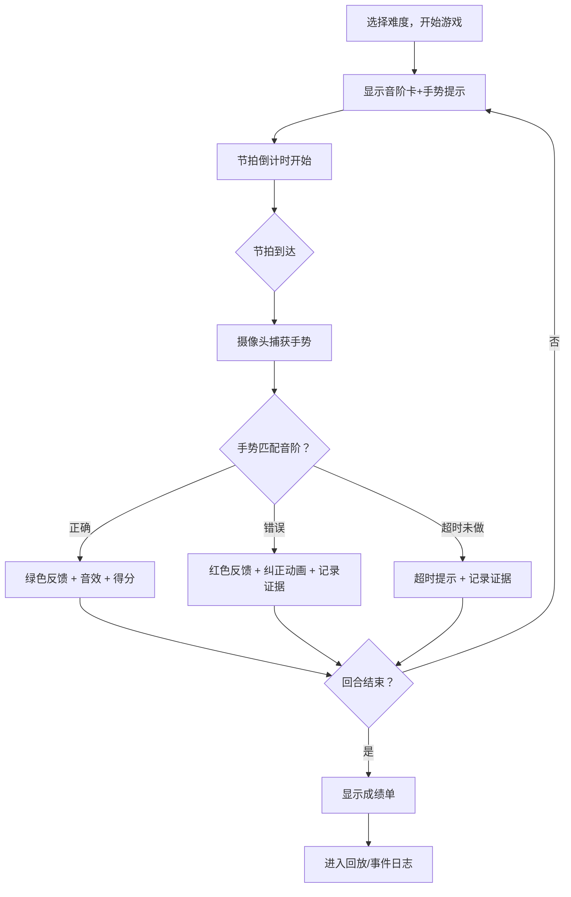
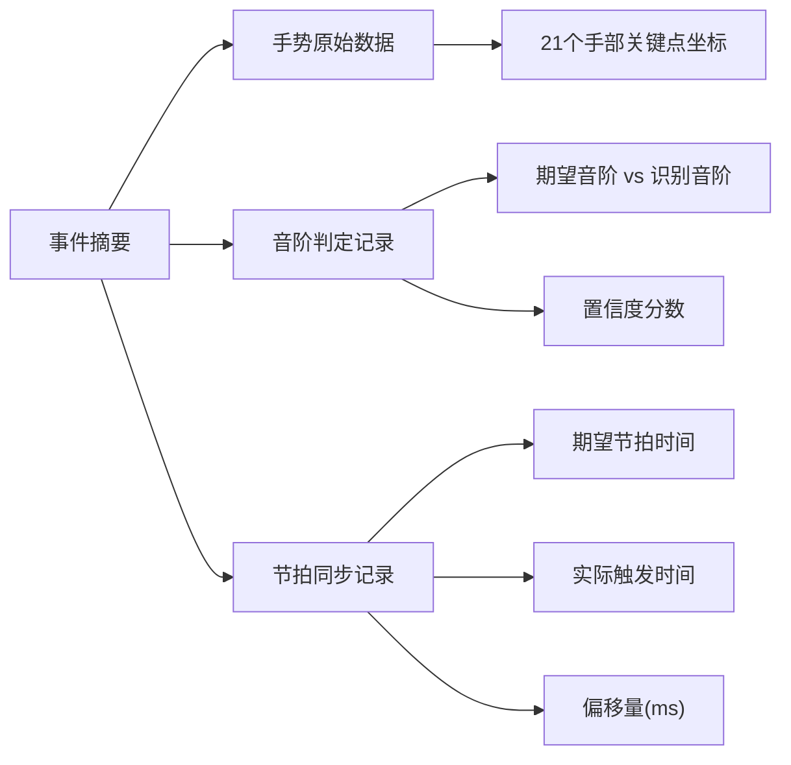

## 1. 产品概述

「手势魔法音阶战」是一款面向儿童音乐课的手势识别小游戏。孩子跟随屏幕上的音阶提示做出对应手势，系统通过摄像头实时识别并判定正误，错了立即纠正，对了给予正向反馈。所有动作反馈、音阶判定、节拍同步事件均保留完整证据链，方便人工复盘手势误识别和节拍延迟问题。

- **目标用户**：5-10 岁儿童（课堂使用）+ 音乐教师（复盘与交接）
- **核心价值**：让音阶学习从"听"变成"做"，错误即刻纠正，全程可追溯

## 2. 核心功能

### 2.1 用户角色

| 角色 | 注册方式 | 核心权限 |
|------|----------|----------|
| 学生 | 无需注册 | 跟随音阶做手势、查看即时反馈、回放自己的表现 |
| 教师 | 无需注册 | 查看全班事件日志、回放任意回合、导出证据链 |

### 2.2 功能模块

1. **游戏主页**：开始游戏、规则说明、难度选择
2. **对战页面**：音阶展示、手势识别、实时反馈、节拍同步
3. **回放页面**：逐帧回放、事件日志查看、证据链追溯

### 2.3 页面详情

| 页面名称 | 模块名称 | 功能说明 |
|----------|----------|----------|
| 游戏主页 | 开始按钮 | 选择难度后开始游戏 |
| 游戏主页 | 规则说明 | 展示7个音阶对应手势图示，简短动画演示 |
| 游戏主页 | 难度选择 | 简单（单音）、普通（连续2音）、困难（连续4音） |
| 对战页面 | 音阶卡展示 | 屏幕中央显示当前音阶符号+手势提示 |
| 对战页面 | 摄像头画面 | 左侧显示实时摄像头画面与手势骨架 |
| 对战页面 | 节拍指示器 | 底部节拍条，提示当前节拍位置 |
| 对战页面 | 即时反馈区 | 正确显示绿色勾+音效，错误显示红色叉+纠正动画 |
| 对战页面 | 得分面板 | 右上角显示当前得分与连击数 |
| 对战页面 | 事件日志浮层 | 可展开查看当前回合所有事件的时间线 |
| 回放页面 | 回放控制器 | 播放/暂停、逐帧前进后退、进度条 |
| 回放页面 | 事件时间线 | 按时间排列所有事件（手势识别、音阶判定、节拍同步） |
| 回放页面 | 证据链面板 | 点击任一事件可查看关联的完整证据（原始手势数据、判定结果、节拍偏移） |

## 3. 核心流程

游戏主流程：教师选择难度 → 学生看到音阶提示 → 节拍到达时做手势 → 系统识别并判定 → 即时反馈 → 回合结束可回放

证据链追溯流程：从摘要点（如"第3回合第2拍判定错误"）→ 查看该事件完整证据（原始手势坐标、匹配音阶、判定逻辑、节拍偏移量）

## 4. 用户界面设计

### 4.1 设计风格

- **主色调**：暖橙 (#FF8C42) + 魔法紫 (#7B2D8E)，儿童友好、充满活力
- **辅色调**：成功绿 (#4CAF50)、错误红 (#FF5252)、背景深蓝 (#1A1A2E)
- **按钮风格**：圆角大按钮（radius 16px），3D 立体感（阴影 + 渐变）
- **字体**：标题使用 Fredoka One（圆润可爱），正文使用 Noto Sans SC
- **布局风格**：卡片式，大图标，宽间距
- **图标/表情**：使用 emoji 风格音阶标识（🎵🎶🎤），手势用简笔画轮廓

### 4.2 页面设计概览

| 页面名称 | 模块名称 | UI 元素 |
|----------|----------|---------|
| 游戏主页 | Hero 区域 | 深蓝渐变背景，标题"手势魔法音阶战"用 Fredoka One + 魔法星星粒子动画 |
| 游戏主页 | 规则说明 | 横向7张音阶卡片，每张显示音名+手势简笔画+对应颜色 |
| 游戏主页 | 难度选择 | 三个大圆角按钮，简单/普通/困难，带 emoji 标识 |
| 对战页面 | 摄像头区域 | 左侧圆角矩形，半透明紫色边框，手部骨架用橙色线条叠加 |
| 对战页面 | 音阶卡 | 中央大卡片，当前音阶符号+手势动画提示，带呼吸光效 |
| 对战页面 | 节拍条 | 底部横向进度条，节拍标记点随节奏闪烁 |
| 对战页面 | 反馈弹窗 | 正确：绿色 ✓ 弹出动画；错误：红色 ✗ + 正确手势闪烁纠正 |
| 回放页面 | 时间线 | 横向时间轴，事件用彩色圆点标记，可拖拽定位 |
| 回放页面 | 证据面板 | 右侧滑出面板，显示选中事件的完整证据链数据 |

### 4.3 响应式设计

- 桌面优先（课堂投影仪/大屏为主）
- 平板适配（教师手持设备查看日志）
- 关键交互元素最小触摸区域 48px

### 4.4 手势映射规则

| 音阶 | 手势名称 | 手势描述 | 颜色标识 |
|------|----------|----------|----------|
| Do (1) | 拳头 | 五指握拳 | 🔴 红色 |
| Re (2) | 竖食指 | 仅伸出食指 | 🟠 橙色 |
| Mi (3) | 剪刀手 | 伸出食指和中指 | 🟡 黄色 |
| Fa (4) | 三指 | 伸出食指、中指、无名指 | 🟢 绿色 |
| Sol (5) | 四指 | 除大拇指外伸出四指 | 🔵 蓝色 |
| La (6) | 五指张开 | 五指全部张开 | 🟣 紫色 |
| Si (7) | 竖大拇指 | 仅伸出大拇指 | 🩷 粉色 |
