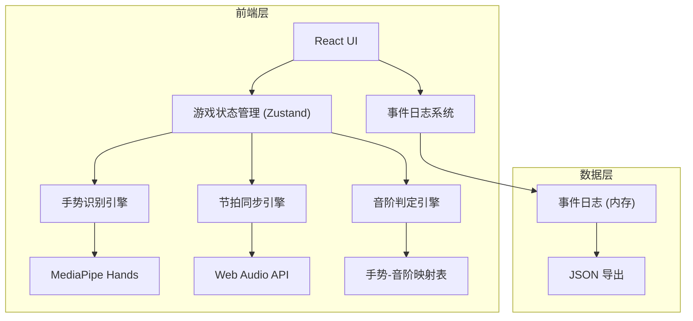

## 1. 架构设计

纯前端应用，无需后端服务。摄像头手势识别使用 MediaPipe Hands，音效使用 Web Audio API，事件日志存储在内存并支持导出。



## 2. 技术说明

- **前端框架**：React@18 + TypeScript + Vite
- **样式方案**：Tailwind CSS@3
- **状态管理**：Zustand
- **手势识别**：MediaPipe Hands（@mediapipe/hands）
- **音频**：Web Audio API（内置音阶音色合成）
- **初始化工具**：vite-init
- **后端**：无
- **数据库**：无（内存存储 + JSON 导出）

## 3. 路由定义

| 路由 | 用途 |
|------|------|
| `/` | 游戏主页：开始游戏、规则说明、难度选择 |
| `/play` | 对战页面：手势识别、音阶交互、节拍同步、即时反馈 |
| `/replay` | 回放页面：逐帧回放、事件时间线、证据链面板 |

## 4. 核心数据结构

### 4.1 事件日志模型

每个事件包含三类关联数据，形成完整证据链：

```typescript
interface GameEvent {
  id: string
  sessionId: string
  roundIndex: number
  beatIndex: number
  timestamp: number

  gesture: {
    landmarks: number[][]       // 21个手部关键点坐标 (x, y, z)
    recognizedGesture: GestureType
    confidence: number          // 0-1 置信度
    rawImageFrame: string       // base64 截图（可选，用于误识别复盘）
  }

  scale: {
    expected: NoteType          // 期望音阶
    actual: NoteType | null     // 识别到的音阶
    isCorrect: boolean
    confidence: number
  }

  beat: {
    expectedTime: number        // 期望触发时间 (ms)
    actualTime: number          // 实际触发时间 (ms)
    offsetMs: number            // 偏移量 (ms)
    isOnBeat: boolean           // 是否在节拍窗口内
  }

  feedback: {
    type: 'correct' | 'wrong' | 'timeout'
    message: string
    correctionHint?: string     // 错误时显示正确手势提示
  }
}

type GestureType = 'fist' | 'index' | 'peace' | 'three' | 'four' | 'open' | 'thumb'
type NoteType = 'Do' | 'Re' | 'Mi' | 'Fa' | 'Sol' | 'La' | 'Si'
```

### 4.2 游戏状态模型

```typescript
interface GameState {
  status: 'idle' | 'playing' | 'paused' | 'finished'
  difficulty: 'easy' | 'normal' | 'hard'
  currentRound: number
  totalRounds: number
  score: number
  combo: number
  maxCombo: number
  bpm: number                  // 节拍速度
  sequence: NoteType[]         // 当前回合的音阶序列
  events: GameEvent[]          // 完整事件日志
}
```

## 5. 核心引擎设计

### 5.1 手势识别引擎

基于 MediaPipe Hands 的 21 个手部关键点，通过手指伸展状态判断手势：

- 每根手指的伸展状态由指尖与指根的 y 坐标差判断
- 7 种手势通过手指伸展组合映射
- 输出：手势类型 + 置信度 + 原始关键点坐标

### 5.2 节拍同步引擎

基于 Web Audio API 的精确定时：

- 使用 `AudioContext.currentTime` 作为主时钟
- 节拍窗口：BPM 对应的拍间隔 ± 200ms
- 每拍触发时记录期望时间，手势触发时记录实际时间
- 输出：期望时间、实际时间、偏移量

### 5.3 音阶判定引擎

组合手势识别结果与节拍同步结果：

- 在节拍窗口内检测到正确手势 → 正确
- 在节拍窗口内检测到错误手势 → 错误（附带纠正提示）
- 节拍窗口内未检测到手势 → 超时
- 所有判定结果写入事件日志，确保证据链完整

## 6. 证据链追溯机制

从摘要到明细的完整链路：

```
事件摘要（"第2回合第3拍判定错误"）
  → 手势原始数据（21关键点坐标 + 截图）
  → 音阶判定记录（期望Sol，实际识别La，置信度0.72）
  → 节拍同步记录（偏移+85ms，在窗口内）
  → 反馈记录（错误，纠正提示：应做五指张开手势）
```

关键设计原则：
1. **不可篡改**：事件写入后只读，不可修改
2. **关联完整**：每个事件同时包含手势/音阶/节拍三类数据
3. **可追溯**：从任意摘要点可还原到完整明细
4. **可导出**：支持 JSON 格式导出全部事件日志
