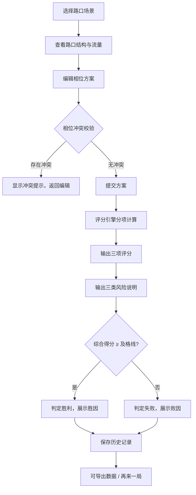

## 1. 产品概述

"交通信号相位赛"是面向城市规划课堂教学与培训的交互式博弈工具。玩家扮演交通工程师，在给定路口条件下调整信号相位方案，兼顾车流通行效率、行人过街等待和公交优先通行三类目标。系统对每个决策给出分项评分与风险说明，让玩家明确知道输赢原因，而非笼统反馈。

- **目标用户**：城市规划专业学生、交通管理培训学员、课程讲师
- **核心价值**：将抽象的信号配时知识转化为可感知的决策博弈，强化"多目标权衡"思维

## 2. 核心功能

### 2.1 用户角色

| 角色 | 进入方式 | 核心权限 |
|------|----------|----------|
| 玩家（学员） | 输入昵称即可开始 | 选路口、编相位、提交方案、查看结果 |
| 讲师 | 输入讲师码 | 查看全班排行榜、导出数据、配置场景参数 |

### 2.2 功能模块

1. **赛场首页**：场景选择、快速开始、历史战绩入口
2. **对局页面**：路口可视化、相位编辑器、流量模拟、实时评分面板
3. **结果页面**：分项评分、风险分项说明、胜败原因、导出与复盘
4. **排行榜与历史**：个人历史、班级排行、数据导出

### 2.3 页面详情

| 页面 | 模块 | 功能描述 |
|------|------|----------|
| 赛场首页 | 场景卡片 | 展示可用路口场景（十字路口、T型路口等），显示难度和车流概况 |
| 赛场首页 | 快速开始 | 选择场景后直接进入对局 |
| 赛场首页 | 历史入口 | 查看过往对局记录 |
| 对局页面 | 路口可视化 | 俯视图展示路口结构、车道、人行横道、公交专用道位置 |
| 对局页面 | 相位编辑器 | 可视化编辑每个相位的绿灯时长、放行方向，实时校验冲突 |
| 对局页面 | 流量模拟面板 | 展示各进口道车流量、行人流量、公交线路频次输入 |
| 对局页面 | 实时评分面板 | 三维评分（车流/行人/公交）实时更新，显示单项风险提示 |
| 对局页面 | 提交方案 | 提交当前相位配置，触发评分引擎计算 |
| 结果页面 | 分项评分 | 车流通行效率分、行人等待分、公交优先分，各自独立显示 |
| 结果页面 | 风险分项说明 | 相位冲突风险、行人等待过久风险、公交优先漏算风险分别列出，附一句话业务解释 |
| 结果页面 | 胜败原因 | 综合得分与阈值对比，逐项说明得分/扣分依据 |
| 结果页面 | 导出与复盘 | 导出当前方案数据，支持查看历史方案对比 |
| 排行榜与历史 | 个人历史 | 时间线展示所有对局，含场景、得分、方案快照 |
| 排行榜与历史 | 班级排行 | 按综合得分排名，支持讲师查看 |
| 排行榜与历史 | 数据导出 | 导出 CSV，字段与历史记录一致，重启后数据可查 |

## 3. 核心流程

玩家选择路口场景 → 查看路口结构与流量输入 → 逐相位编辑绿灯时长与放行方向 → 系统实时校验相位冲突 → 提交方案 → 评分引擎分项计算（车流/行人/公交）→ 输出分项评分与三类风险说明 → 判定胜败并逐项说明原因 → 保存历史记录 → 可导出数据

## 4. 用户界面设计

### 4.1 设计风格

- **主色调**：深蓝灰（#1E293B）+ 交通信号三色系（绿 #22C55E / 黄 #EAB308 / 红 #EF4444）
- **辅助色**：公交蓝（#3B82F6）、行人橙（#F97316）
- **按钮风格**：圆角矩形，主操作用信号绿色实心，危险操作用红色
- **字体**：中文用 Noto Sans SC，数据/数字用 JetBrains Mono
- **布局**：左侧路口可视化 + 右侧编辑面板的双栏布局，顶部评分条
- **图标**：使用 lucide-react 图标库，交通相关用自定义 SVG 补充

### 4.2 页面设计概览

| 页面 | 模块 | UI 元素 |
|------|------|---------|
| 赛场首页 | 场景卡片 | 深色卡片 + 路口缩略图，hover 时信号灯动画闪烁，标签显示难度与车型占比 |
| 赛场首页 | 历史入口 | 底部浮动按钮，点击展开侧栏时间线 |
| 对局页面 | 路口可视化 | Canvas 俯视图，车道灰底，信号灯实时变色，行人蓝色虚线，公交蓝色粗线 |
| 对局页面 | 相位编辑器 | 纵向时间轴，每相位一行，拖拽调整绿灯时长，冲突方向标红闪烁 |
| 对局页面 | 流量模拟面板 | 柱状图显示各进口道 PCU/h，行人图用人形图标，公交用班车图标 + 班次标注 |
| 对局页面 | 实时评分面板 | 三色环形进度条（绿/橙/蓝），鼠标悬停显示单项风险一句话解释 |
| 结果页面 | 分项评分 | 三列卡片，每列一个维度，数字 + 进度条 + 风险等级标签 |
| 结果页面 | 风险分项说明 | 三行列表：相位冲突 / 行人等待 / 公交优先，每行一句业务解释 |
| 结果页面 | 胜败原因 | 顶部横幅（绿底"通过" / 红底"未通过"），下方逐项展开得分/扣分明细 |
| 排行榜与历史 | 个人历史 | 时间线列表，每条含场景缩略图 + 得分雷达图 |
| 排行榜与历史 | 数据导出 | 导出按钮，生成 CSV 文件下载 |

### 4.3 响应式设计

- 桌面优先（1280px+），对局页面双栏布局
- 平板（768px-1279px）路口可视化折叠为顶部小图，编辑面板全宽
- 手机（<768px）单栏纵向排列，路口可视化可全屏查看

### 4.4 业务解释规范

每个评分维度与风险项必须附一句话业务解释，格式为：

- **相位冲突**："相位 A 与相位 B 放行方向重叠，东西直行与南北左转不可同绿"
- **行人等待过久**："北进口行人最长等待达 120 秒，超过规范上限 90 秒"
- **公交优先漏算**："公交 301 路高峰班次间隔 5 分钟，未获绿灯延长补偿"

这些解释文字独立存储，方便后续修改规则时同步更新。
