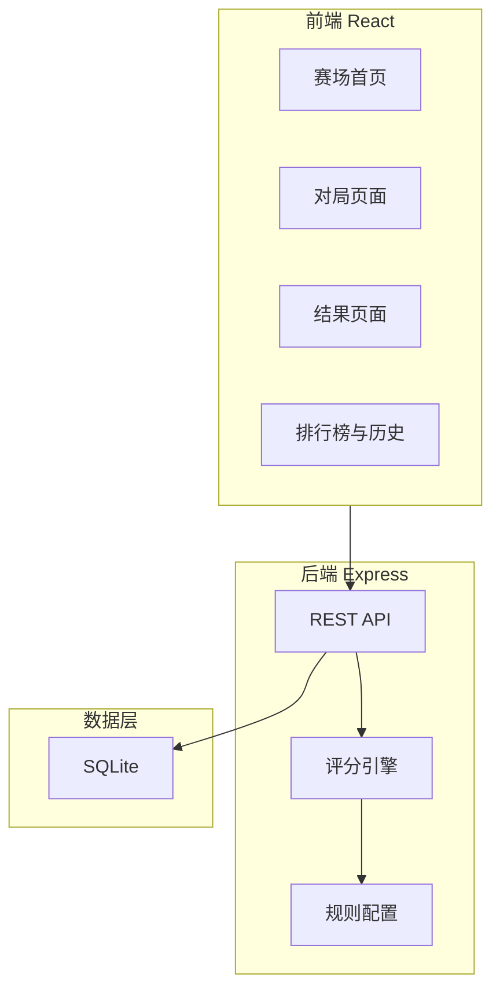
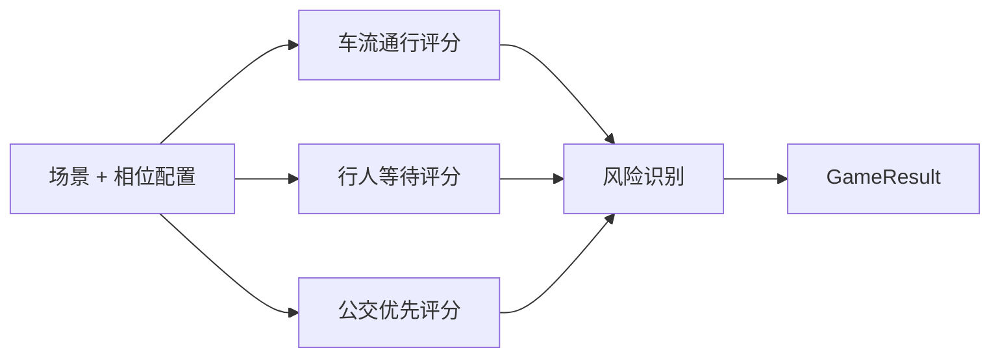
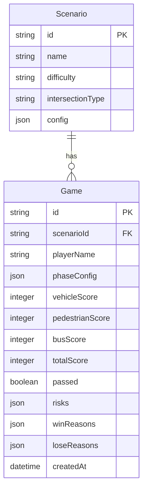

## 1. 架构设计



## 2. 技术说明

- **前端**：React@18 + TypeScript + Tailwind CSS@3 + Vite
- **状态管理**：Zustand
- **初始化工具**：vite-init（react-express-ts 模板）
- **后端**：Express@4 + TypeScript（ESM）
- **数据库**：SQLite（better-sqlite3），文件存储，重启后数据持久化
- **图表**：前端 Canvas 自绘路口可视化 + 轻量柱状图
- **导出**：前端生成 CSV 文件下载，数据源与历史记录同库同字段

## 3. 路由定义

| 路由 | 用途 |
|------|------|
| `/` | 赛场首页，场景选择与历史入口 |
| `/game/:scenarioId` | 对局页面，路口可视化 + 相位编辑 + 评分 |
| `/result/:gameId` | 结果页面，分项评分 + 风险说明 + 胜败原因 |
| `/history` | 个人历史与排行榜 |
| `/leaderboard` | 班级排行榜（讲师视图） |

## 4. API 定义

### 4.1 场景相关

```
GET  /api/scenarios              → Scenario[]
GET  /api/scenarios/:id          → ScenarioDetail
```

### 4.2 对局相关

```
POST /api/games                  → { gameId }          // 开始新对局
GET  /api/games/:id              → GameDetail          // 获取对局详情
PUT  /api/games/:id/phases       → GameDetail          // 更新相位方案
POST /api/games/:id/submit       → GameResult          // 提交并评分
```

### 4.3 历史与导出

```
GET  /api/games/history?player=  → GameSummary[]
GET  /api/games/:id/export       → CSV Stream
GET  /api/leaderboard?scenarioId=→ LeaderboardEntry[]
```

### 4.4 类型定义

```typescript
interface Scenario {
  id: string
  name: string
  difficulty: 'easy' | 'medium' | 'hard'
  intersectionType: 'cross' | 'T' | 'Y'
  approaches: Approach[]
  busRoutes: BusRoute[]
  pedestrianCrossings: PedestrianCrossing[]
}

interface Approach {
  id: string
  direction: 'north' | 'south' | 'east' | 'west'
  lanes: Lane[]
  vehicleFlow: number
  pedestrianFlow: number
}

interface Lane {
  id: string
  type: 'straight' | 'left' | 'right' | 'bus'
  direction: string
}

interface BusRoute {
  id: string
  name: string
  approachId: string
  headwayMinutes: number
  peakHeadwayMinutes: number
}

interface PedestrianCrossing {
  id: string
  approachId: string
  side: 'near' | 'far'
  avgWaitSeconds: number
}

interface PhaseConfig {
  id: string
  greenSeconds: number
  yellowSeconds: number
  redClearanceSeconds: number
  movements: Movement[]
}

interface Movement {
  approachId: string
  laneType: 'straight' | 'left' | 'right' | 'bus'
  pedestrianCrossingId?: string
}

interface GameResult {
  gameId: string
  vehicleScore: number
  pedestrianScore: number
  busScore: number
  totalScore: number
  passed: boolean
  risks: RiskItem[]
  winReasons: string[]
  loseReasons: string[]
}

interface RiskItem {
  category: 'phase_conflict' | 'pedestrian_wait' | 'bus_priority'
  level: 'high' | 'medium' | 'low'
  description: string
  businessExplanation: string
}
```

## 5. 评分引擎设计

评分引擎独立于 API 层，接收场景数据 + 相位配置，输出分项评分与风险项：



### 5.1 车流通行评分

- 计算各进口道饱和度（v/c 比）
- 饱和度 ≤ 0.85 满分，每超 0.1 扣分
- 生成风险项：`phase_conflict`

### 5.2 行人等待评分

- 模拟行人最长等待时间
- 等待 ≤ 90 秒满分，每超 10 秒扣分
- 生成风险项：`pedestrian_wait`

### 5.3 公交优先评分

- 检查高峰线路是否获得绿灯延长
- 班次间隔 ≤ 8 分钟的线路必须有绿灯补偿
- 生成风险项：`bus_priority`

### 5.4 业务解释规则

每类风险的 `businessExplanation` 由规则配置生成，格式固定、参数可配：

- 相位冲突：`"相位 {A} 与相位 {B} 放行方向重叠，{方向1}与{方向2}不可同绿"`
- 行人等待：`"{进口}行人最长等待达 {秒} 秒，超过规范上限 {上限} 秒"`
- 公交优先：`"公交 {线路名} 高峰班次间隔 {间隔} 分钟，未获绿灯延长补偿"`

## 6. 数据模型

### 6.1 数据模型定义



### 6.2 数据定义语言

```sql
CREATE TABLE scenarios (
  id TEXT PRIMARY KEY,
  name TEXT NOT NULL,
  difficulty TEXT NOT NULL CHECK(difficulty IN ('easy','medium','hard')),
  intersection_type TEXT NOT NULL,
  config TEXT NOT NULL
);

CREATE TABLE games (
  id TEXT PRIMARY KEY,
  scenario_id TEXT NOT NULL REFERENCES scenarios(id),
  player_name TEXT NOT NULL,
  phase_config TEXT NOT NULL,
  vehicle_score INTEGER NOT NULL DEFAULT 0,
  pedestrian_score INTEGER NOT NULL DEFAULT 0,
  bus_score INTEGER NOT NULL DEFAULT 0,
  total_score INTEGER NOT NULL DEFAULT 0,
  passed INTEGER NOT NULL DEFAULT 0,
  risks TEXT NOT NULL DEFAULT '[]',
  win_reasons TEXT NOT NULL DEFAULT '[]',
  lose_reasons TEXT NOT NULL DEFAULT '[]',
  created_at TEXT NOT NULL DEFAULT (datetime('now'))
);

CREATE INDEX idx_games_scenario ON games(scenario_id);
CREATE INDEX idx_games_player ON games(player_name);
CREATE INDEX idx_games_created ON games(created_at);
```

## 7. 数据一致性保障

- 所有评分结果写入 SQLite 持久化，重启后通过同一数据库文件恢复
- 导出 CSV 的字段名与 `games` 表列名一一对应，不额外映射
- 历史记录查询直接读取 `games` 表，与导出数据源一致
- 相位配置以 JSON 存储，重放时从 `phase_config` 字段反序列化
